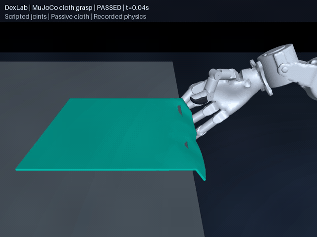

# DexLab

[简体中文](README.md) | [English](README.en.md)

**Robot contact-dynamics experiments built on UniLab: audit models, measure contact behavior, and reproduce grasps.**

DexLab uses reproducible rigid grasping and cloth experiments to study penetration, jitter, slip, and numerical stability. Cases include **OpenArm dual arms with Wuji hands grasping an apple stem and pinching cloth**, plus cloth extension, sag, and collision tests across solvers. Each experiment retains parameter provenance, raw trajectories, independent checks, and failed records.

[Quick start](#run) · [Results](#results) · [Diagnostics](#model-audits-and-diagnostics) · [Research methods](docs/research-focus.md) · [Releases](https://github.com/huangkiki/Dexlab/releases)

## MuJoCo


## SuperDex


Each GIF shows the continuous 14-second approach, pinch, lift, and hold. Only the grasp close-up is shown. The presentation camera follows the recorded apple and is not a control input. Both recordings replay actual physics poses using MuJoCo's renderer. [MuJoCo video](demos/apple-stem-grasp/media/mujoco-sdf.mp4) · [SuperDex video](demos/apple-stem-grasp/media/superdex-sdf.mp4)

## Robot cloth grasp



A Wuji hand pinches, lifts and releases MuJoCo flex cloth through frictional contact. The continuous 9-second recording passes independent checks. Control uses known state and a scripted sequence; robot collisions use convex mesh approximations, without cloth attachment constraints. Bimanual folding has not passed. [Video and physics measurements](demos/cloth-folding/README.md)

## Engines and experiments

| Native profile | Current validation scope |
|---|---|
| MuJoCo 3.11.0 | SDF–SDF stem grasp, flex cloth, and frictional robot cloth grasp |
| SuperDex 1.0.0 FP64 | SDF–SDF stem grasp and experimental triangle shells |
| Newton XPBD / VBD / Style3D / SemiImplicit / Featherstone | Cloth experiments on a pinned upstream version; material and self-contact capabilities documented per solver |
| PhysX / Isaac Sim 5.1 | [Primitive contacts and loaded drives](demos/physx-contact/README.md), plus [54-joint contact-free motion](demos/physx-contact/robot.md), qualified; [SDF hole/support controls](demos/physx-contact/sdf.md) pass, convex-control drift exceeds the limit; PhysX unchanged; apple grasping and cloth remain unqualified |

The cloth benchmark completed **105 frozen held-out episodes: 52 passed the protocol checks and 53 failed, with no timeouts**. Cases cover extension, sag, sphere drape, and folded drop. Nominal materials are not calibrated across solvers; pass counts do not rank physical accuracy. [All results and reproduction](demos/cloth-benchmark/README.md#held-out-results)

Apple SDF grasping is registered and stepped through **UniLab**, with native scenes owned by DexLab. PhysX qualifications use **UniSim's Isaac Sim backend**. Rigid and cloth experiments have separate scores; incomplete and unsupported capabilities remain explicit.

## Grasp details

- The right thumb and index finger pinch the stem; the left arm stays parked. The apple and stem form **one free 0.2 kg rigid body**.
- The apple and both fingertip pads use **SDF collision geometry**. There are no attachment constraints, direct object position drives, or engine source patches.
- Control uses **known object poses, inverse kinematics, and scripted joint targets**. This is not a visual policy or a learned skill; no model API key is needed.
- The engines are tuned separately. MuJoCo uses SDF contact-point search and soft contact constraints with a **0.5 ms** timestep. SuperDex uses surface-sample integration and smooth penalty energy with a **2 ms** timestep. The same SDF geometry does not imply the same contact-force law.

Independent checks cover clearance, two-finger support, penetration, wrist-relative motion, and momentum balance during a continuous three-second hold. Fruit-body contact is allowed during approach. The GIFs show the default scene; stem bending, fracture and hardware accuracy are not validated.

[MuJoCo acceptance](demos/apple-stem-grasp/evidence/sdf-mujoco/summary.json) · [SuperDex acceptance](demos/apple-stem-grasp/evidence/sdf-superdex/summary.json) · [Parameters and engine internals](docs/sdf-backends.md)

## Results

Apple-stem grasping completed **10 frozen paired cases: 20 episodes across both backends**. Mass, horizontal position and yaw were perturbed without retuning the released policies on these cases.

| Configuration | Passed full acceptance | Success rate, 95% Wilson interval |
|---|---:|---:|
| MuJoCo 3.11.0, 0.5 ms | 1 / 10 | 1.8–40.4% |
| SuperDex 1.0.0 FP64, 2 ms | 10 / 10 | 72.2–100% |

These measure separately configured task robustness, **not engine accuracy**. All failures and raw evidence are retained. Six additional timestep episodes completed; MuJoCo at 0.25 ms failed the penetration limit, so refinement did not improve acceptance monotonically. A separate 100-case test set is frozen but has not completed evaluation.

[Protocol, all results and reproduction](docs/benchmark.md) · [Default demo measurements](docs/sdf-backends.md#results-and-limits) · [Diagnostic definitions](docs/jitter.md)

## Run

Linux x86_64; install [uv](https://docs.astral.sh/uv/getting-started/installation/) first.

```bash
git clone https://github.com/huangkiki/Dexlab.git
cd Dexlab
bash scripts/setup.sh
bash demos/apple-stem-grasp/run.sh --backend mujoco
# or
bash demos/apple-stem-grasp/run.sh --backend superdex
```

The viewer opens after SDF preparation and planning; add `--headless` on a server. Both commands step the registered **UniLab task `DexLab-AppleStem-v0`**. DexLab currently owns the native SDF scenes; these have not been replaced by UniSim's built-in backends.

[Installation](docs/installation.md) · [Task API and reproduction](demos/apple-stem-grasp/README.md) · [Autoresearch and issues](docs/autoresearch.md)

## Model audits and diagnostics

Each grasp run exports model-audit JSON. The MuJoCo path records both native source and compiled parameters. Intentional massless coordinate frames are distinguished from errors; the report never silently repairs a model.

```bash
# Recheck model parameters without rerunning physics
.venv/bin/python -m dexlab.model_audit \
  demos/apple-stem-grasp/runs/latest-mujoco-sdf/model-audit.mujoco.json
# Measure jitter and contact interruptions from existing step records
.venv/bin/python -m dexlab.jitter demos/apple-stem-grasp/runs/latest-mujoco-sdf
```

The [model audit](docs/model-audit.md) explains parameters and initial overlaps. [Jitter diagnostics](docs/jitter.md) explain load, missing records and duration bounds. Reports do not establish hardware calibration, and current logs are insufficient for a full-system energy balance.

## Contributing experiments

Submit reproducible problems, parameter experiments and failed trials as an [Issue](https://github.com/huangkiki/Dexlab/issues), including code version, commands, parameter sources, raw records and expected acceptance criteria. Autoresearch handles explicitly queued tasks, preserves failures and never relaxes thresholds to manufacture success. Validated and reviewed changes are automatically merged and released; unresolved problems are fixed or recorded as blockers. [Workflow and release policy](docs/autoresearch.md)

## Acknowledgments

Thanks to [UniLab](https://github.com/unilabsim/UniLab), [Project SuperDex](https://github.com/unilabsim/project_superdex), [MuJoCo](https://github.com/google-deepmind/mujoco), [Newton](https://github.com/newton-physics/newton), [OpenArm](https://github.com/enactic/openarm), and [Wuji](https://github.com/wuji-technology). The SuperDex grasp appears in [Awesome Astra Embodied AI · Case 7](https://github.com/zjwzcx/Awesome-Astra-Embodied-AI#case-7-dexterous-apple-stem-grasp-in-superdex); Astra assisted development and debugging.

Code: [Apache-2.0](LICENSE). Third-party assets retain their own terms; see [asset sources](docs/ASSETS.md).
