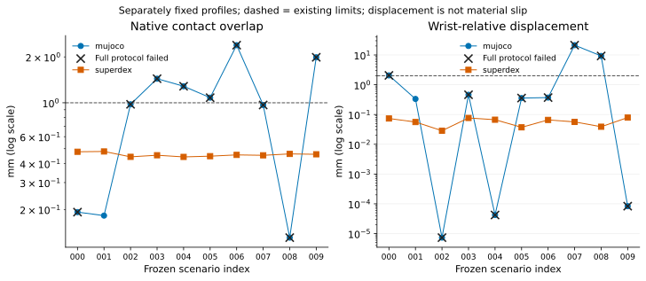
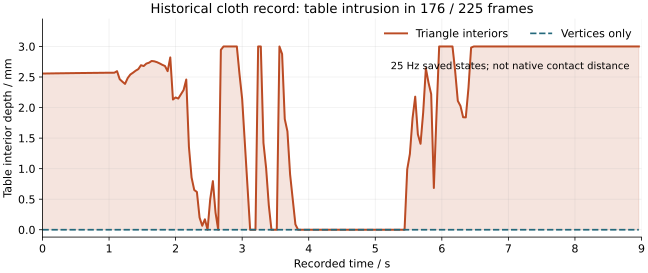
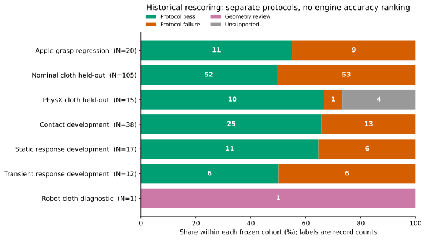
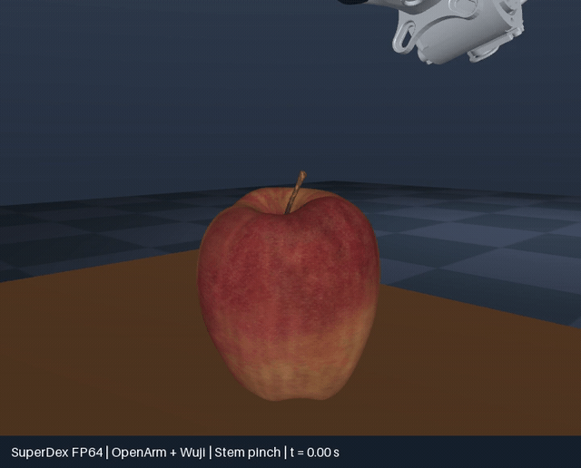
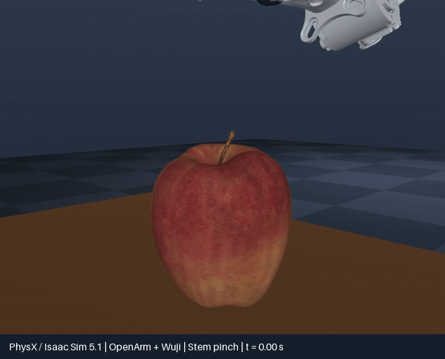
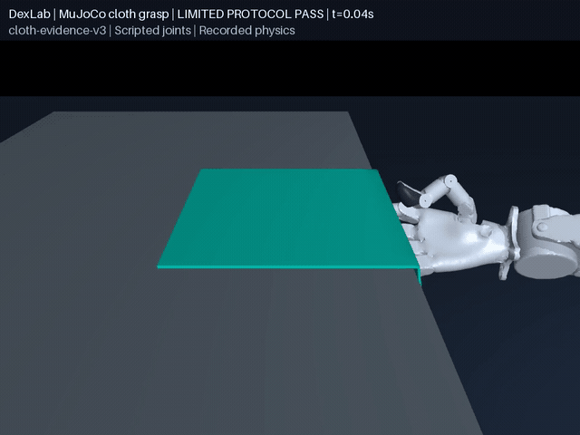

<div align="center">

# DexLab

**Robot contact dynamics: from models and parameters to verifiable experimental findings.**

[Documentation](docs/site/en/index.md) · [简体中文](README.md) · [Experiments](demos/) · [Results and data](docs/evidence/README.md) · [Research issues](https://github.com/huangkiki/Dexlab/issues)

</div>

> Archival infrastructure: local archival now verifies hard memory, CPU and disk I/O limits before starting. Failures retain sources and receipts. Success, timeout and isolated OOM checks passed; both historical backend archives passed bounded offline readback. [Execution limits](docs/remote-research.md#hard-bounds-for-local-archival)

DexLab uses **UniLab** to organize rigid grasping, cloth and basic contact experiments. We study how collision geometry, contact laws, solvers and drives affect **penetration, slip, jitter and computational cost**, connecting every finding to raw records, independent scoring, parameter provenance and failures.

## Local execution and autonomous delivery

Experiments now prefer a qualified local host, with measured headroom, enforced cgroup limits and zero experiment swap. Priority review precedes each task; interrupted jobs resume from verified handles. Remote execution is optional. [Execution and recovery protocol](docs/autoresearch.md#local-first-execution-and-recovery).

## Dexterous task roadmap

The [research evidence ledger](docs/dexterity-ledger.md) covers38 paper identities and19 repository entrypoints, distinguishing targeted source audits, abstract screening and unverified runtimes. Conclusions: independently score native task success; distinguish targets, estimated effort and tactile proxies from measured data; exclude custom-engine and historical profiles from latest-stable comparisons. Optional replay #52 and tactile-history #53 have dependencies and budgets.

Current implementations focus on holding and contact diagnostics. The [six-layer research map](docs/dexterity-roadmap.md) connects ManiSkill, grasp evaluation, tactile sensing, data generation and embodiment research to concrete experiments. [Native ManiSkill tasks #47](https://github.com/huangkiki/Dexlab/issues/47) and [in-hand rotation #48](https://github.com/huangkiki/Dexlab/issues/48) are planned, **not implemented or supported yet**.

## Current findings

| Research question | Evidence | Conclusion and boundary |
|---|---|---|
| Can dynamics lift an apple by its stem? | Default cases pass; historical ten-scene regression: MuJoCo **1/10**, SuperDex **10/10** | Fixed-configuration robustness, **not a physical-accuracy ranking** |
| Is the cloth grasp physically valid? | New 9 s development case passes pinch, lift, release and sampled geometry checks; strain 3.52% | Self penetration 1.492 mm is near its limit; one case only, historical failures retained |
| How do materials and contacts affect outcomes? | Retained stretch, drape, sliding, loading and transient successes/failures | Cross-engine measured material/drive calibration is incomplete |
| Does this establish hardware performance? | No formal calibration and independent measured test set | Measured error and sim-to-real capability are unknown |

Plots below are **historical evidence under their original pinned versions**. New batches require latest-stable qualification [#41](https://github.com/huangkiki/Dexlab/issues/41). [Genesis #42](https://github.com/huangkiki/Dexlab/issues/42) is planned, without runtime results yet.

## Key experimental results

### Apple stem: robustness and where failures occur

Ten frozen scenes vary mass, horizontal position and orientation: twenty runs, without retuning for these cases.

| Historical configuration | Complete acceptance | 95% Wilson interval |
|---|---:|---:|
| MuJoCo 3.11.0 · 0.5 ms | 1 / 10 | 1.8–40.4% |
| SuperDex 1.0.0 FP64 · 2 ms | 10 / 10 | 72.2–100% |



Crosses denote complete-acceptance failure. Native contact overlap and independent surface intrusion are different quantities; **wrist displacement is not material slip**. Timesteps, friction and drives differ, preventing an engine-quality ranking. PhysX has a separate development case outside this held-out cohort.

[Protocol and failures](docs/benchmark.md) · [Definitions and rescoring](docs/evidence/README.md) · [Raw-data provenance](docs/evidence/cohorts.json)

### Cloth: a plausible-looking grasp still fails geometry checks



The original continuous nine-second record intersects the table in 176 of 225 saved frames. The diagnostic covers zero-thickness triangles, not continuous finite-thickness separation. **A scoring fix is not a physics fix**; full pinch, lift and release remain under [#32](https://github.com/huangkiki/Dexlab/issues/32).

[Old/new scores and coverage](demos/cloth-folding/SCORING.md)

<details>
<summary><strong>All outcomes from seven complete historical cohorts</strong></summary>



Each row uses a different task/protocol. Keep failures, unsupported outcomes and development/held-out splits; do not collapse them into an engine score. [Technical report](docs/evidence/README.md)

</details>

**Cloth repair candidate (MuJoCo 3.14):** the complete 9 s pinch, lift and release passes the current protocol: maximum strain **3.52%**, lift **123.92 mm**, and zero final hand/cloth force. No table/robot/floor midsurface intrusion is detected in 225 saved frames. Self penetration **1.492 mm** is close to the 1.5 mm limit, so robustness is not established. Official engines remain unchanged; material and control parameters are uncalibrated. [Metrics, plots, continuous video and failed controls](demos/cloth-folding/SETTLING.md).


**Portable historical evidence:** the missing 105 cloth records and one robot-cloth record reproduce all 106 record objects exactly with the frozen historical scorer, retaining failures. Public projections explicitly record deployment-metadata redaction and original/public hashes; historical reproduction is not a pass under the latest protocol. [Download and reproduction](docs/evidence/PUBLIC-ARCHIVE.md).

## Continuous close-up demonstrations

<table>
<tr><th>MuJoCo · default development case</th><th>SuperDex FP64 · default development case</th></tr>
<tr><td></td><td></td></tr>
<tr><th>PhysX · separate development case</th><th>Robot cloth · single-case protocol pass</th></tr>
<tr><td></td><td></td></tr>
</table>

Apple GIFs continuously show fourteen seconds of approach, closing, lifting and holding. The display camera serves playback only. [MuJoCo video](demos/apple-stem-grasp/media/mujoco-sdf.mp4) · [SuperDex video](demos/apple-stem-grasp/media/superdex-sdf.mp4) · [PhysX report](demos/physx-contact/apple.md) · [Cloth report](demos/cloth-folding/SETTLING.md)

## Method and engine differences

OpenArm dual arms with Wuji hands: the right thumb/index pinch while the left arm is parked. Apple and stem form a **0.2 kg free rigid body**; apple and both pads use SDF collision geometry. There is no object attachment, object-position drive or engine patch. Control uses **known poses, IK and scripted joint targets**, not a visual policy or learned skill.

| Historical backend | Contact implementation | Step | Disclosed approximations |
|---|---|---:|---|
| MuJoCo | SDF contact search + soft constraints | 0.5 ms | SDF discretization, contact points and constraint settings |
| SuperDex FP64 | Surface-sampling integration + smooth penalty energy | 2 ms | Sampling density, smoothing and penalty response |
| PhysX | Native SDF contacts + TGS | 1 ms | SDF resolution, discrete contacts and torsional radius |

The hold window is 11–14 s, checking lift, two-pad support, penetration, wrist displacement and momentum balance. Fruit contact is allowed during approach. Matching source surfaces do not imply matching discrete geometry or contact laws. Stem bending and fracture are not modeled.

[Parameter provenance and implementation](docs/sdf-backends.md) · [Benchmark design](docs/site/en/benchmark.md) · [Model audit](docs/model-audit.md)

## Experiment code and documentation

| Experiment | Code | Detailed report |
|---|---|---|
| Apple stem grasp | [apple-stem-grasp](demos/apple-stem-grasp/) | [Run and score](demos/apple-stem-grasp/README.md) |
| Robot cloth grasp | [cloth-folding](demos/cloth-folding/) | [Repair and failed controls](demos/cloth-folding/SETTLING.md) |
| Contact, drives and transients | [contact-benchmark](demos/contact-benchmark/) | [Results](demos/contact-benchmark/README.md) |
| Multi-solver cloth | [cloth-benchmark](demos/cloth-benchmark/) | [Materials and held-out cases](demos/cloth-benchmark/README.md) |
| PhysX contact and cloth | [physx-contact](demos/physx-contact/) | [Capabilities and limits](demos/physx-contact/README.md) |

**[Documentation source](docs/site/en/index.md) · [中文文档](docs/site/zh/index.md)**. The site maintains getting started, experiments, results, engine methods, benchmarks and contribution guidance. Both languages use a strict Sphinx build; deployment configuration is included. An online address will be announced after deployment verification.

## Latest-stable qualification

Latest-stable runtime qualification is in progress: [inventory, GPU probe and limits](docs/engine-qualification.md). Device smoke does not establish grasp success or enable formal benchmark dispatch.

The six-device contact contrast completed: four of six configurations passed and two failed. Smaller timesteps alone did not reduce intrusion under default soft contact; see the per-configuration report above. This is not apple grasp qualification.

The current cloth candidate passes **397 unit tests**; its MuJoCo 3.14 single-case result is above. Published [v0.18.2](https://github.com/huangkiki/Dexlab/releases/tag/v0.18.2) completed both 14 s apple-grasp gates and official-package provenance admission. Current-source paired regression, provenance admission and commit identity are recorded in each delivery PR and Release. Historical sphere-drape failures remain separate.

## Quick reproduction

On Linux x86_64, install [uv](https://docs.astral.sh/uv/getting-started/installation/) and reproduce the original pinned demo:

```bash
git clone https://github.com/huangkiki/Dexlab.git
cd Dexlab
bash scripts/setup.sh
bash demos/apple-stem-grasp/run.sh --backend mujoco
# Or --backend superdex; add --headless without a display
```

No model API key is needed. The window opens after SDF preparation and planning. UniLab registers and steps the task; DexLab owns the native scene. [Installation](docs/installation.md) · [Documentation-only build](docs/site/en/quickstart.md#build-documentation-only)

[UR7e and gripper acquisition preparation](docs/hardware/README.md): protocol, signal provenance, clocks, uncertainty and a read-only log validator. Empty templates and synthetic fixtures are not measurements; no hardware data is accepted yet.

## Contributing and acknowledgments

Submit reproducible problems, parameter studies and failures as [issues](https://github.com/huangkiki/Dexlab/issues). Experiment PRs update findings, plots and bilingual reports; internal-only changes explain when no homepage update is needed. [Development and release workflow](docs/autoresearch.md)

Thanks to [UniLab](https://github.com/unilabsim/UniLab), [Project SuperDex](https://github.com/unilabsim/project_superdex), [MuJoCo](https://github.com/google-deepmind/mujoco), [Newton](https://github.com/newton-physics/newton), [OpenArm](https://github.com/enactic/openarm) and [Wuji](https://github.com/wuji-technology). Documentation organization draws on [RLinf](https://github.com/RLinf/RLinf). The SuperDex grasp appears in [Awesome Astra Embodied AI · Case 7](https://github.com/zjwzcx/Awesome-Astra-Embodied-AI#case-7-dexterous-apple-stem-grasp-in-superdex); Astra assisted development and debugging.

Code: [Apache-2.0](LICENSE). Third-party assets retain their [source terms](docs/ASSETS.md).
