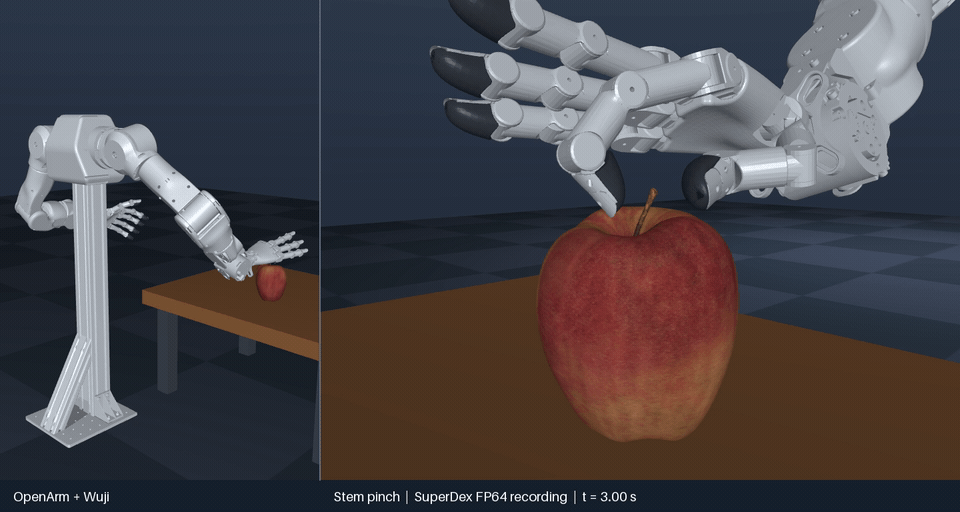

# DexLab

**Dexterous manipulation demos and experiments.**

Task-focused demos for dexterous manipulation, with code, assets, videos, and validation records kept together for each task.

[](demos/apple-stem-grasp/media/stem-focus.mp4)

[Stem close-up](demos/apple-stem-grasp/media/stem-focus.mp4) · [Full 40-second video](demos/apple-stem-grasp/media/demo.mp4) · [High-resolution image](demos/apple-stem-grasp/media/stem-focus.png)

The clip replays **3–14 seconds** of the validated SuperDex recording. A fixed overview appears on the left; the close-up follows the apple to show the fingertip contacts.

## Demos

| Demo | Task | Robot | Physics |
|---|---|---|---|
| [Apple Stem Grasp](demos/apple-stem-grasp/) | Pinch the stem, lift, place, release, and grasp the fruit | OpenArm dual arms + Wuji hands | SuperDex FP64 |

Featured in **Awesome Astra Embodied AI**: [Case 7 — Dexterous Apple-stem Grasp in SuperDex](https://github.com/zjwzcx/Awesome-Astra-Embodied-AI#case-7-dexterous-apple-stem-grasp-in-superdex). The demo uses SuperDex contact dynamics to lift an apple by its narrow stem, with MuJoCo for rendering. Astra assisted with development and debugging.

## Quick start

```bash
git clone https://github.com/huangkiki/Dexlab.git
cd Dexlab
bash scripts/setup.sh
bash demos/apple-stem-grasp/run.sh
```

The installer uses **uv + official SuperDex FP64 wheels from PyPI**. No compiler or SuperDex source download is needed. The installer is validated on Linux x86_64 with [uv](https://docs.astral.sh/uv/getting-started/installation/); Python 3.12 is installed automatically. See [installation](docs/installation.md) for video export and the optional source build.

Setup downloads the versioned robot asset pack (~16 MB) and the apple texture on demand, verifies SHA-256 hashes, and reuses cached files. Large runtime assets are not stored in Git.

The run command opens an interactive simulation window. For a server without a desktop, append `--headless`.

The validated controller uses known object poses, inverse kinematics, and joint targets. No model API or API key is required at runtime.

## Acknowledgments and license

Special thanks to **[UniLab](https://github.com/unilabsim)** and **[Project SuperDex](https://github.com/unilabsim/project_superdex)** for the simulation foundation. Apple Stem Grasp uses SuperDex FP64 contact dynamics and the engine version and robot assets provided through the UniLab repository.

Thanks also to [OpenArm](https://github.com/enactic/openarm) and [Wuji](https://github.com/wuji-technology) for their robot resources.

Project code is licensed under [Apache-2.0](LICENSE). Third-party assets retain their original terms; see [asset provenance](docs/ASSETS.md).
