<div align="center">


斜面滑动失败归因：12个阻抗比对照全部未通过原验收，保留失败与未定位机制。 [报告](docs/incline-diagnosis.zh-CN.md)


手动验收关闭的任务通过[交付证据表](docs/issue-deliveries.json)绑定 PR、合并提交和验收记录；队列只读取已合入主线的记录，并核验当前关闭状态和提交祖先关系。布料资格仍须独立实验，修复依赖识别不等于布料通过。

Genesis 的关节、GPU 与成本报告已统一到实际发布状态，完整证据及未验证范围见[能力审计](demos/contact-benchmark/GENESIS_COST.zh-CN.md)。

# DexLab

**解析评测：** [18例斜面摩擦结果](docs/incline-friction-results.zh-CN.md)：静止漂移受接触参数影响，滑动参考假设出现失败；全部工况和限制保留，无需等待新增真机数据。

**本阶段研究问题：在标准物体抓取中，哪些可测因素决定成败，我们凭什么相信仿真的解释？**

**假期阶段总结：** [我们已经得出的结论、证据边界与下一步](docs/holiday-report.zh-CN.md)。


**研究机器人如何在可信的仿真中完成接触密集操作。**

当前方向：更容易测量与验证的标准物体抓取。[16例夹持力限额实验](docs/force-limit-results.zh-CN.md)中，0.2/0.4 N保持失败、0.8/10 N保持释放通过；±2 mm偏移下结果一致。全部失败与原始记录保留，不代表真机精度。

[中文文档](docs/site/zh/index.md) · [English](README.en.md) · [实验代码](demos/) · [结果与数据](docs/evidence/README.zh-CN.md) · [研究任务](https://github.com/huangkiki/Dexlab/issues)

</div>

当前标准方块任务继续使用原生 FP64 路径：[UniSim 准入边界与未完成范围](docs/unisim-reuse-boundary.zh-CN.md)。适配器版本与精度不匹配已有实测，尚无成对物理等价或删减收益证据。

**合成触觉观测：** 32/64网格不改变原生物理轨迹；重置和脱离清零通过。首批“有深度但零接触力”、第二批回位失败均保留，第三批限定检查通过。[三批结果、公式与成本](docs/synthetic-tactile.zh-CN.md)

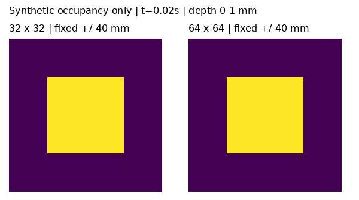


**Genesis 薄布：当前摩擦夹持配置不准入。** 官方 PBD/刚体耦合路径没有切向摩擦；同一步动量误差超标，补偿夹爪重力后，开发位置及两个预登记偏移位置仍保持失败。失败不被重置一致或几何检查通过抵消。[完整判据、所有结果与复现](docs/genesis-cloth.zh-CN.md)

| 检查 | 实测结果 | 结论边界 |
|---|---|---|
| 夹爪实际抬升 / 布料最低高度 | 79.988 mm / 4 mm | 执行器抬起，布料未保持 |
| 同一步动量残差 / 阈值 | 3.2e-5 / 3.3e-7 kg·m/s | 失败；反作用延迟 2 ms |
| 等时长响应 | 36 格 × 2 次重置，20 ms | 显著步长敏感，不代表材料收敛 |
| 连通薄布折叠 | 0°、150°、170°，逐步检查通过 | 有限保存状态，不代表连续碰撞通过 |

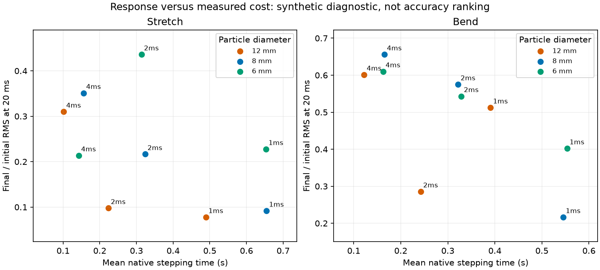

**Newton XPBD 基本接触：** 官方核心 CPU 配置的最大穿透 0.000849 mm、保持期支撑力误差 0.051353%；禁碰撞负对照失去支撑并符合自由落体参考。三段逐步记录及曲线公开；不代表抓梗、SDF 或真机精度。[判据、全部结果与复现](docs/newton-contact.zh-CN.md)


> [技术报告：当前结果与历史失败](docs/site/zh/results.md) 分别列出夹布修复、低速摩擦响应和历史抓梗鲁棒性，附指标、采样范围、成本及复现入口。单场景通过不代表鲁棒性或真机精度。

DexLab 基于 **UniLab** 组织刚体抓取、布料和基础接触实验，研究碰撞几何、接触律、求解器及驱动对**穿透、滑移、抖动与计算成本**的影响。每项结论连接原始记录、独立评分、参数来源与失败案例。


**Genesis 接触诊断：** 水平速度激励后的竖直瞬态随摩擦锥配置明显变化；原失败保留，尚未完成抓取资格。[协议与限制](demos/contact-benchmark/GENESIS_CONE.zh-CN.md)


**先核验模型，再解释改进：** Genesis 默认导入的附加惯量改变了关节响应；显式零附加惯量后，限位参数对照仍保留成功与失败。[完整参数、时序曲线与判据](demos/contact-benchmark/GENESIS_JOINT.zh-CN.md)。

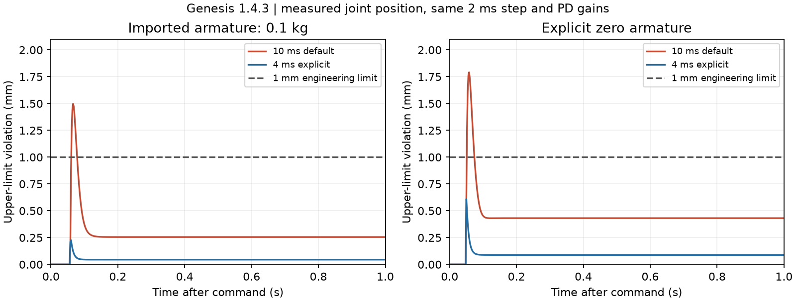

**Genesis 夹持释放：** 基础方块工况加入两次重置及张指负对照；候选接触配置在三个开发步长下满足原 1 mm 穿透标准，保留落桌失败。[协议、结果与限制](demos/contact-benchmark/GENESIS_PINCH.zh-CN.md)。

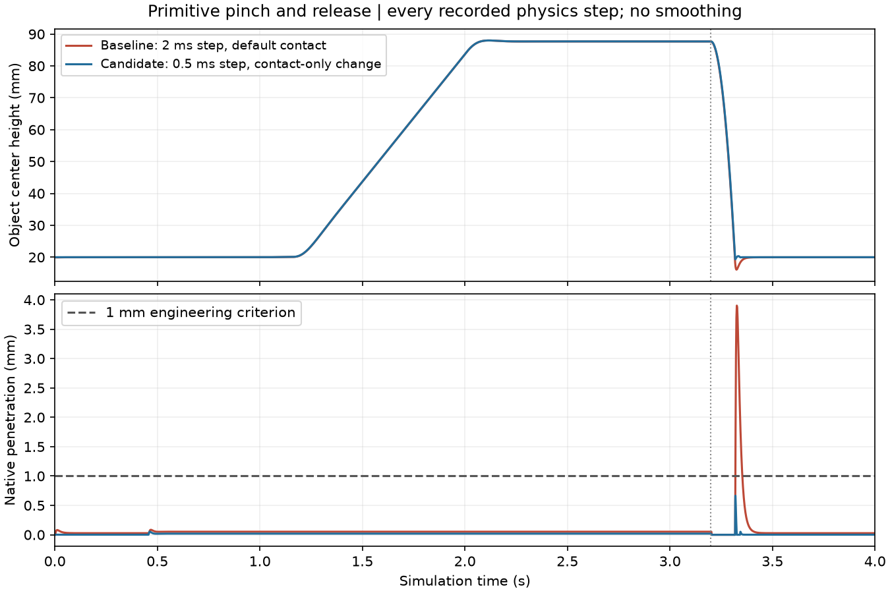

**Genesis 误差／成本：** 三个步长均通过工程判据，但峰值不支持收敛结论；公开步进、观测、写盘及评分分项。[协议与能力审计](demos/contact-benchmark/GENESIS_COST.zh-CN.md)。

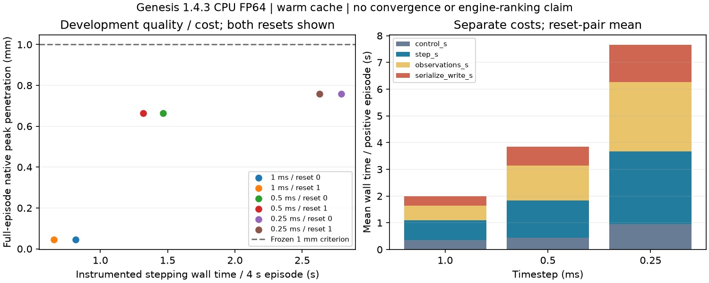

**连续近景：** 以下为 Genesis 实测状态回放，MuJoCo 仅显示、不积分动力学；完整保留夹持、抬升、保持、松开与落桌。30 fps 动图不能替代逐物理步穿透评分。


**Genesis GPU 准入：** 单场景重置、双场景隔离和容量正负对照通过；公开同步计时分项，不据此宣称抓取通过或加速。[协议、耗时与限制](demos/contact-benchmark/GENESIS_GPU.zh-CN.md)。

## 实验依据与当前答案

**目前没有证据证明哪套引擎更符合真实抓取。** 我们先检验声明模型的实现和数值误差，再用实测数据判断物理有效性。抓取成功率仅作配置回归。

| 待检验问题 | 参考与判定依据 | 当前答案 |
|---|---|---|
| 碰撞几何是否符合声明？ | 原生 BOX 类型、40 mm 盒尺寸、解析带符号距离；坐标比较容差 1e-12 m 仅覆盖 FP64 运算 | 原生静态读回通过；一次查询开／关轨迹的状态与接触记录完全一致，详见[几何检查](demos/contact-benchmark/NATIVE_GEOMETRY.zh-CN.md) |
| 名义接触参数能否迁移？ | K=20000 N/m、D=40 Ns/m 的指定合成模型，固定加载与预登记质量／尺寸 | 30 次联合目标均未满足；这是固定映射的局限，不是真实材料误差 |
| 计算更细是否更可靠？ | 固定模型，步长细化，比较参考误差与实际耗时 | 已有响应—成本曲线；细步长不保证所有配置误差下降 |
| 是否符合真实夹持？ | 同装置实测力—位移、滑移和释放行为及测量不确定性 | 缺实测参照，尚不能回答 |

**版本准入：** v0.28.0 的官方 MuJoCo 3.15.0 / SuperDex 1.0.0 FP64 两条完整 14 秒抓取及独立验收通过，491 项测试通过；这属于指定配置回归，不证明材料准确性。历史版本轨迹保留原版本标记。

### SDF 构建路径的负面结果

同一非等边盒体、请求间距与实测位姿下，自动构建和官方预生成 SDF 的729个内部查询最大相差 **0.129771 mm**。完整预生成网格可导出，但不能冒充自动actor的内部网格读回。这个静态负面结果不判断动力学或真机精度，也不改变苹果演示。[协议与独立复核](demos/contact-benchmark/SDF_CONSTRUCTION.zh-CN.md)

## 成对质量与尺寸迁移

三个冻结的名义接触配置，在10组预登记质量/尺寸组合上完成30次运行：原工程检查1/30通过，瞬态目标0/30通过，联合0/30通过。所有结果独立复算，30次实际初态和声明范围内的表示检查完整。**名义场景通过不能证明参数可直接迁移。** 这里未做质量或面积补偿，失败说明固定映射不满足指定合成目标，不能归因成引擎算法错误。内部烘焙与组合律仍有不可观测项。

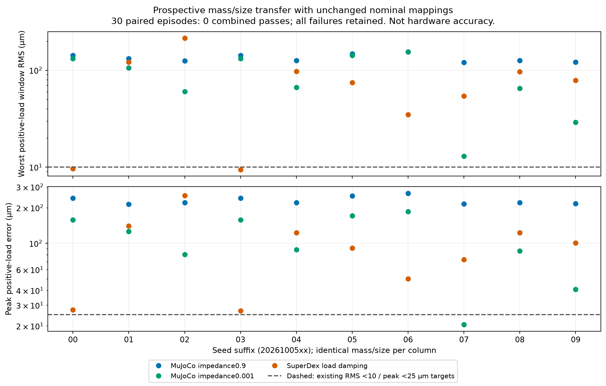

[协议、逐场景失败与复算](demos/contact-benchmark/TRANSFER.zh-CN.md)

**阻尼配对消融：** 固定其余条件的六组实验中，SuperDex 零法向阻尼均无记录到的负力，但两个较小步长的稳定性检查失败；联合原瞬态目标仍为0/6，不能称为完整修复。[全部结果与参照](demos/contact-benchmark/DAMPING_ABLATION.zh-CN.md)

**调参前的模型检查：** 按文档阻尼律及纯法向平移假设，固定系数不能同时精确匹配 2、4、6 N 下的恒定切线阻尼目标。解析失配不等于实测轨迹误差，详见[条件推导与复算](demos/contact-benchmark/DAMPING_REFERENCE.zh-CN.md)。

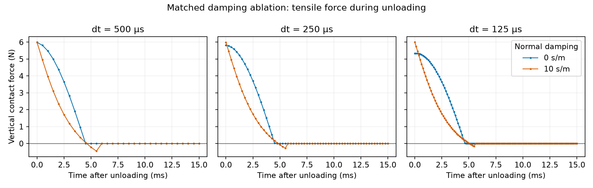

**原生切线辨识：** 默认求解器9组均未达固定动量门禁；仅收紧求解容差后9/9有效，测得2/4/6 N下局部阻尼约20/40/60 Ns/m。步前/步后配对会改变拟合结果；这是局部数值辨识，未完成材料标定。[协议](demos/contact-benchmark/TANGENT_IDENTIFICATION.zh-CN.md)

**外加载荷辨识：** MuJoCo低阻抗9/9有效，高阻抗9/9未在0.4秒内稳定。拟合同时分离状态与外加载荷影响；预测误差很小不代表材料标定完成。[全部结果与失败](demos/contact-benchmark/FEEDTHROUGH.zh-CN.md)

**接触研究结论与标准：** 静态匹配未建立共同动态物性，成对迁移30/30未通过综合目标；局部辨识不覆盖卸载修复。[逐项验收、图表与未完成项](demos/contact-benchmark/CONCLUSIONS.zh-CN.md)

## 当前结论

| 研究问题 | 已有证据 | 结论与限制 |
|---|---|---|
| 指定抓取配置在十组初态扰动下表现如何？ | 历史完整验收：MuJoCo **1/10**、SuperDex **10/10** | 仅描述该集合上的配置结果；接触、驱动与步长不同，不能归因于引擎或证明物理准确性 |
| 夹布开发案例通过了哪些工程检查？ | 新开发案例完成 9 秒夹持、抬升、释放；应变 3.52%，保存帧几何检查通过 | 自接触 1.492 mm 接近上限；仅单场景，历史穿透失败保留 |
| 材料与接触如何影响结果？ | 拉伸、下垂、滑动、加载及瞬态的成功和失败均保留 | 材料和驱动尚未完成跨引擎实测校准 |
| 能否说明真机表现？ | 尚无正式标定集与独立实测测试集 | 实测误差与 sim-to-real 能力未知 |

下面的图表均为**原固定版本的历史证据**。新批次采用官方最新稳定版并重新验收，见 [版本准入 #41](https://github.com/huangkiki/Dexlab/issues/41)；[Genesis #42](https://github.com/huangkiki/Dexlab/issues/42) 已完成限定合成刚体工况验收，薄布另由 #77 跟踪。

标准分为实现一致性、数值收敛性与实测物理有效性；抓取通过不能替代三者。[研究标准](docs/research-focus.zh-CN.md#实验用什么标准判断)


下一项[合成响应—成本协议](demos/contact-benchmark/RESPONSE_COST.zh-CN.md)固定27次重复工况，比较指定参考模型的偏差与开销；27次已完成并独立复算：低阻抗MuJoCo偏差随步长减小下降，SuperDex该配置偏差增大且卸载拉力检查失败；这些是指定合成模型的响应证据，不是真机准确性结论。

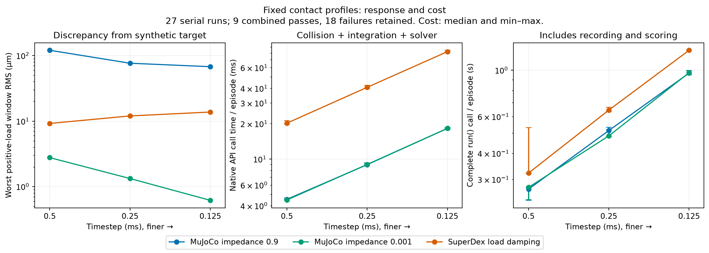

## 关键实验结果

**接触起始瞬态：数值敏感性。** 固定初态的16次开发运行中，MuJoCo相邻步长轨迹差异下降，SuperDex部分差异非单调或增大；后者零摩擦工况仍通过原工程验收，说明“通过”不能证明步长收敛。[协议、全部失败与逐次成本](demos/contact-benchmark/REFINEMENT.zh-CN.md)。另12次容差对照表明，仅收紧停止容差未消除步长敏感性；实测校准仍未完成。

### 苹果梗：成功率与失败发生在哪里

10 个冻结场景改变质量、水平位置与朝向，共 20 次实验，未为这些场景重新调参。

| 历史配置 | 完整验收通过 | 95% Wilson 区间 |
|---|---:|---:|
| MuJoCo 3.11.0 · 0.5 ms | 1 / 10 | 1.8–40.4% |
| SuperDex 1.0.0 FP64 · 2 ms | 10 / 10 | 72.2–100% |

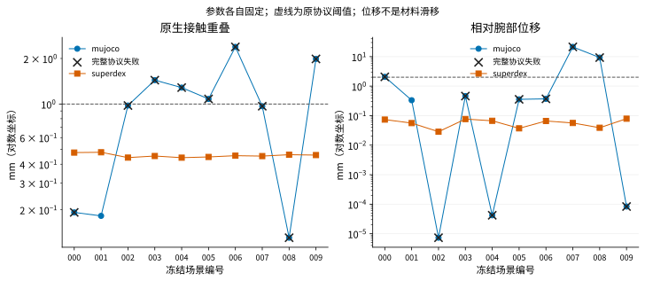

叉号表示完整验收失败。原生接触重叠与独立表面侵入是不同量；**腕部相对位移不是材料滑移**。两套配置的步长、摩擦和驱动不同，不能据此归因引擎优劣。PhysX 目前只有独立开发场景，未进入这组留出测试。

[协议与失败明细](docs/benchmark.zh-CN.md) · [指标定义与复算](docs/evidence/README.zh-CN.md) · [原始数据与来源](docs/evidence/cohorts.json)

### 历史夹布：视觉成功与几何失败

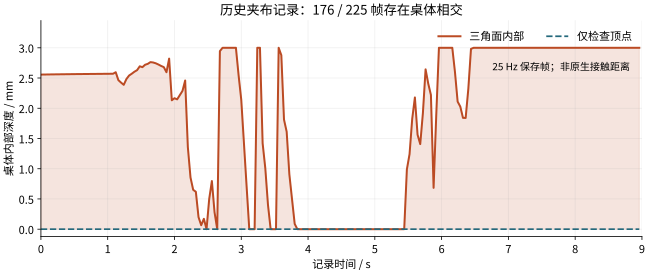

原 9 秒连续记录在 225 个保存帧中有 176 帧桌体相交。检查覆盖零厚度三角面，不能证明有限厚度或帧间无碰撞。**评分修复不等于物理修复**；下方列出 #32 新开发案例的结果，原失败证据保留。

[旧新评分及测量边界](demos/cloth-folding/SCORING.zh-CN.md)

<details>
<summary><strong>展开：七个完整历史批次的全部结局</strong></summary>

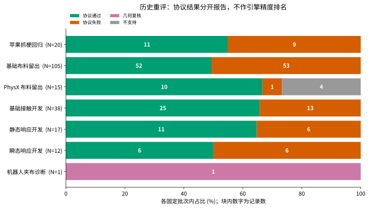

每行对应不同任务与协议，失败和不支持均保留。开发集与留出集分列，不合并成引擎总分。[完整技术报告](docs/evidence/README.zh-CN.md)

</details>

**夹布修复候选（MuJoCo 3.14）：** 完整 9 秒夹持、抬升、释放通过当前协议；最大应变 **3.52%**，抬升 **123.92 mm**，末段手—布力为零。225 个保存帧未检出桌／机器人／地面中面侵入。但自接触穿透 **1.492 mm** 接近 1.5 mm 上限，不能据此宣称稳健性。官方引擎未改；材料与控制参数尚未校准。[指标、曲线、连续录像及全部失败对照](demos/cloth-folding/SETTLING.zh-CN.md)。


**历史证据可独立复算：** 补齐 105 条布料记录和 1 条机器人夹布记录，冻结历史评分器复算的 106 条记录全部字段一致，失败案例保留。公开副本明确记录部署信息脱敏和原始／公开哈希；历史复算不等于最新协议通过。[下载与复算说明](docs/evidence/PUBLIC-ARCHIVE.zh-CN.md)。

## 连续近景演示

<table>
<tr><th>MuJoCo · 默认开发场景</th><th>SuperDex FP64 · 默认开发场景</th></tr>
<tr><td></td><td></td></tr>
<tr><th>PhysX · 独立开发场景</th><th>机器人夹布 · 单场景协议通过</th></tr>
<tr><td></td><td></td></tr>
</table>

苹果动图连续展示 14 秒接近、闭合、抬升与保持。展示相机只用于回放，不参与控制。[MuJoCo 视频](demos/apple-stem-grasp/media/mujoco-sdf.mp4) · [SuperDex 视频](demos/apple-stem-grasp/media/superdex-sdf.mp4) · [PhysX 报告](demos/physx-contact/apple.zh-CN.md) · [夹布报告](demos/cloth-folding/SETTLING.zh-CN.md)

## 实验方法与引擎差别

OpenArm 双臂＋Wuji，右手拇指/食指夹梗、左臂停放。苹果与梗为 **0.2 kg 自由刚体**，苹果及两指腹均使用 SDF；没有物体附着、位置驱动或引擎源码补丁。控制来自**已知位姿、逆运动学与脚本关节目标**，不是视觉策略或学习得到的技能。

| 历史后端 | 接触实现 | 步长 | 需要披露的近似 |
|---|---|---:|---|
| MuJoCo | SDF 接触搜索＋软约束 | 0.5 ms | SDF 离散、接触点与约束参数 |
| SuperDex FP64 | 表面采样积分＋平滑罚能 | 2 ms | 采样密度、平滑与罚响应 |
| PhysX | 原生 SDF 接触＋TGS | 1 ms | SDF 分辨率、接触离散与扭转半径 |

保持窗口为 11–14 s；验收离桌、两指支撑、穿透、相对腕部位移和动量平衡，接近阶段允许果身接触。相同源表面不等于相同离散几何或接触定律，不模拟梗弯曲或断裂。

[参数来源与底层实现](docs/sdf-backends.zh-CN.md) · [基准设计](docs/site/zh/benchmark.md) · [模型审查](docs/model-audit.zh-CN.md)

## 实验代码与文档

| 实验 | 代码 | 详细报告 |
|---|---|---|
| 苹果梗抓取 | [apple-stem-grasp](demos/apple-stem-grasp/) | [运行与验收](demos/apple-stem-grasp/README.zh-CN.md) |
| 机器人夹布 | [cloth-folding](demos/cloth-folding/) | [修复与失败对照](demos/cloth-folding/SETTLING.zh-CN.md) |
| 接触、驱动与瞬态 | [contact-benchmark](demos/contact-benchmark/) | [研究结果](demos/contact-benchmark/README.zh-CN.md) |
| 多求解器布料 | [cloth-benchmark](demos/cloth-benchmark/) | [材料与留出实验](demos/cloth-benchmark/README.zh-CN.md) |
| PhysX 接触与布料 | [physx-contact](demos/physx-contact/) | [能力与限制](demos/physx-contact/README.zh-CN.md) |

**[中文文档站源码](docs/site/zh/index.md) · [English documentation](docs/site/en/index.md)**。文档站维护快速开始、实验目录、结果、引擎原理、benchmark 和开发规范；Sphinx 严格构建并维护两种语言，发布配置已纳入仓库。在线地址需部署验证后公布。


[摩擦响应开发实验](demos/contact-benchmark/FRICTION_RESPONSE.zh-CN.md)：16 次运行通过原平面检查，但低速阻力响应及实际沉降初态不同；包含逐工况曲线与原始记录哈希，不作引擎精度排名。

接触参数诊断：8 组原生记录通过原验收，6 组 MuJoCo 静态参数组合对照符合预期；SuperDex 的组合接触律仍不可直接读回，不据此宣称两引擎材料等价。[结果与复现](demos/contact-benchmark/CONTACT_READBACK.zh-CN.md)。

## 最新稳定版验证

最新稳定版运行准入正在推进：[版本清单、GPU 基础检查及边界](docs/engine-qualification.zh-CN.md)。设备检查不等于抓取成功，也尚未开放正式 benchmark 派发。

六卡基础接触对照已实际完成：六组参数中 4 组通过、2 组失败。默认软接触下仅减小步长并未减少侵入；详见上面的逐配置报告。这不是苹果抓取验收。

当前夹布候选通过 **397 项单测**；MuJoCo 3.14 单场景修复结果见上方。已发布的 [v0.18.2](https://github.com/huangkiki/Dexlab/releases/tag/v0.18.2) 完成双后端 14 秒抓梗及官方包来源准入；每次交付的当前源码双后端回归、来源准入及提交身份记录在对应 PR 与 Release 中。披覆球面的历史失败仍保留，不由夹布通过替代。

## 快速复现

Linux x86_64，安装 [uv](https://docs.astral.sh/uv/getting-started/installation/) 后运行原固定版本演示：

```bash
git clone https://github.com/huangkiki/Dexlab.git
cd Dexlab
bash scripts/setup.sh
bash demos/apple-stem-grasp/run.sh --backend mujoco
# 或 --backend superdex；无显示环境添加 --headless
```

无需模型 API key。SDF 构建与规划完成后打开窗口；运行命令使用 UniLab 注册任务，原生场景由 DexLab 管理。[完整安装](docs/installation.zh-CN.md) · [仅构建文档](docs/site/zh/quickstart.md#仅构建文档)

[UR7e＋夹爪采集准备](docs/hardware/README.zh-CN.md)：采集协议、信号来源、时钟与不确定性，以及只读日志校验器。空模板与合成数据不算实测；尚无已验收真机数据。

## 本机执行与自动交付

实验优先使用通过准入的本机，实测资源余量并强制 cgroup 限额，禁用实验 swap。每次选项先复审优先级，中断任务通过实际句柄恢复；远端作为可选执行位置。[执行与恢复协议](docs/autoresearch.zh-CN.md#本机优先执行与恢复)。

## 灵巧操作任务路线

[新版研究证据账本](docs/dexterity-ledger.zh-CN.md)覆盖38篇论文身份与19个仓库入口，区分定向源码审查、摘要筛选及未验证运行时。关键结论：上游成功指标须独立复核；目标关节值、估算力矩和触觉代理不能当实测量；自定义引擎与历史配置不进入最新稳定版比较。可选动作回放 #52、触觉历史 #53 已设依赖和预算。

当前实现集中于抓持与接触诊断。新增 [六层研究地图](docs/dexterity-roadmap.zh-CN.md) 将 ManiSkill、抓取评测、触觉、数据生成与本体研究映射到具体实验；[ManiSkill 原生任务 #47](https://github.com/huangkiki/Dexlab/issues/47) 与 [手内旋转 #48](https://github.com/huangkiki/Dexlab/issues/48) 已排入计划，**尚未实现，不算已支持**。

## 参与与致谢

请用 [Issue](https://github.com/huangkiki/Dexlab/issues) 提交可复现问题、参数实验或失败案例。实验 PR 同步结论、指标图表与中英报告；无读者影响的内部修改说明理由。[开发与发布流程](docs/autoresearch.zh-CN.md)

感谢 [UniLab](https://github.com/unilabsim/UniLab)、[Project SuperDex](https://github.com/unilabsim/project_superdex)、[MuJoCo](https://github.com/google-deepmind/mujoco)、[Newton](https://github.com/newton-physics/newton)、[OpenArm](https://github.com/enactic/openarm) 和 [Wuji](https://github.com/wuji-technology)。文档组织参考 [RLinf](https://github.com/RLinf/RLinf)。SuperDex 抓梗演示收录于 [Awesome Astra Embodied AI · Case 7](https://github.com/zjwzcx/Awesome-Astra-Embodied-AI#case-7-dexterous-apple-stem-grasp-in-superdex)，Astra 参与开发与调试。

代码：[Apache-2.0](LICENSE)；第三方资产见[来源与许可](docs/ASSETS.zh-CN.md)。

**研究交付可追溯性：** [实际夹布交付与中断恢复审计](docs/autonomous-delivery.zh-CN.md)分别记录实验参照、失败、独立评分、归档和恢复证据；工作流通过不等于物理准确。

**接触起始对照：** 24 个固定配置＋2 次重复全部通过工程检查，但摩擦锥变化的瞬态影响方向并不一致。通过任务检查不等于物性准确。[图表、完整指标与限制](demos/contact-benchmark/CONE_PROTOCOL.zh-CN.md)。

**卸载观测补充：** 原六组阻尼对照已逐接触点复核，未发现被总力掩盖的局部拉力；零阻尼仍不满足全部瞬态要求。[逐点诊断与限制](demos/contact-benchmark/DAMPING_ABLATION.zh-CN.md#逐接触点卸载诊断)。

**验收范围：** 接触机制诊断已有受控修复与否定结果；共同动态材料和真机标定仍未完成。[逐项证据与剩余要求](demos/contact-benchmark/CONCLUSIONS.zh-CN.md#验收决定与剩余工作)。

[刚度与穿透联合评测：27 例中 24 例末态通过，2 例同时满足 1 mm 预算](docs/impact-stiffness-results.zh-CN.md)

[弹性碰撞解析评测：18例末态通过，但接触重叠5–20mm](docs/elastic-impact-results.zh-CN.md)
