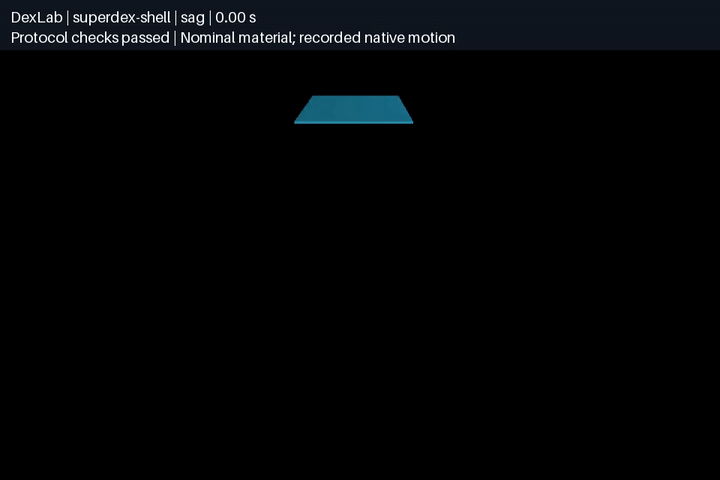

# 布料接触实验

[简体中文](README.zh-CN.md) | [English](README.md)

采用共同的表面网格、面密度、外力和边界条件，记录 MuJoCo flex、SuperDex 实验性薄壳、Newton 布料求解器及可选 PhysX 表面布料的实际运动。MuJoCo/Newton 显式使用面积集中的顶点质量；SuperDex 保留原生薄壳 FEM 惯性，并核对总质量。当前是**名义材料的数值实验**；不同求解器尚未完成材料响应校准，不能据此排名真实物理精度。

## 实验与输入

| 实验 | 边界条件 | 独立测量 |
|---|---|---|
| 拉伸与卸载 | 左边固定，右边施加总计 5 mN 的牵引力；0–0.5 s 加载、0.5–1.5 s 保持、1.5–2 s 卸载、2–3 s 自由恢复 | 端部伸长、边长应变、残余速度 |
| 重力下垂 | 左边固定，水平布片从静止状态受重力作用 | 端部/中心下垂、应变、固定点误差 |
| 球面覆盖 | 自由布片落向半径 60 mm 的固定球和水平地面 | 球面/地面穿透、残余运动、应变 |
| 折叠下落 | 无初始应力的预折叠布片落向平面 | 地面穿透、采样表面自相交 |

默认条带为 200 × 100 mm，9 × 5 个顶点；球面覆盖使用 200 × 200 mm 的正方形。面密度 0.2 kg/m²，碰撞半径 1 mm，时长 3 s，步长 0.5 ms。静止网格、三角形、名义质量、实际位置与速度、逐步外力均写入记录。固定点对应的名义质量与自由运动质量分别报告。

冻结清单 [`benchmarks/cloth-v1.json`](../../benchmarks/cloth-v1.json) 包含 3 个开发场景和 12 个留出场景。留出场景不得用于调参。时间细化采用 0.5/0.25/0.125 ms，空间细化采用 9 × 5 → 17 × 9。条带载荷按边缘梯形积分权重分配，使细化前后总力一致。

## 运行

先完成仓库的 `bash scripts/setup.sh`。MuJoCo 路径使用已有的 3.11.0 wheel：

```bash
.venv/bin/python -m dexlab.cloth_benchmark run \
  --solver mujoco --case dev-extension \
  --output demos/cloth-benchmark/runs/mujoco-extension
```

Newton 是独立的可选依赖，从固定上游提交构建；不安装会替换 MuJoCo 版本的 Newton 扩展依赖：

```bash
uv pip install --python .venv/bin/python \
  -r demos/cloth-benchmark/requirements-newton.txt
.venv/bin/python -m dexlab.cloth_benchmark run \
  --solver newton-xpbd --case dev-sag \
  --output demos/cloth-benchmark/runs/newton-xpbd-sag
```

其他选项为 `superdex-shell`、`newton-vbd`、`newton-semi_implicit`、`newton-featherstone`、`newton-style3d`。SuperDex 使用已安装的官方 1.0.0 FP64 wheel 和实验性三角薄壳接口，没有用四面体软体代替布料；选项存在不等于该配置已经通过全部实验。`--device cpu` 为默认，Newton 可显式选 `cuda:0`。`--dt` 和 `--refine 2` 分别改变时间、网格分辨率；每种配置使用新的输出目录。

所有运行通过 UniLab 注册任务 **`DexLab-Cloth-v0`** 推进：一次 `env.step` 对应一个原生物理步，观测包括实际顶点位置和时间，以及 MuJoCo/Newton 原生速度或 SuperDex 相邻节点位置的后向差分速度（元数据明确标记），动作为以 N 为单位的顶点外力。基准使用预先规定的外力，不是学习策略。场景由 DexLab 管理，尚非 UniSim 内置布料后端。

离线复核：

```bash
.venv/bin/python -m dexlab.cloth_benchmark verify \
  demos/cloth-benchmark/runs/mujoco-extension
```

将完整记录导出为近景 MP4 和 GIF，不推进物理仿真：

```bash
.venv/bin/python demos/cloth-benchmark/src/render.py \
  demos/cloth-benchmark/runs/mujoco-extension
```



完整 3 秒 SuperDex 薄壳开发场景的记录回放。[MP4](media/superdex-shell-sag.mp4) · [媒体来源](media/superdex-shell-sag.json)。展示的是数值下垂实验，不代表材料已校准。

## 开发结果

七种配置均完成四类、每类 3 秒的实验。加入独立表面审计后，**28 次实验中 13 次通过当前协议检查**。这不是材料精度评分，某一配置失败也不代表整个引擎无法完成该实验。

| 原生配置 | 拉伸 | 下垂 | 球面覆盖 | 折叠下落 |
|---|---|---|---|---|
| MuJoCo 3.11.0 flex | 通过 | 表面相交 | 穿透 | 穿透／相交 |
| SuperDex 1.0.0 FP64 shell | 通过 | 通过 | 穿透／相交 | 穿透／相交 |
| Newton XPBD | 通过 | 通过 | 穿透 | 表面相交 |
| Newton VBD | 通过 | 通过 | 穿透 | 穿透／相交 |
| Newton Style3D | 通过 | 通过 | 穿透 | 表面相交 |
| Newton SemiImplicit | 通过 | 通过 | 穿透／相交 | 穿透／相交／速度截断 |
| Newton Featherstone | 通过 | 通过 | 穿透／相交 | 穿透／相交／速度截断 |

已有 20 次球面覆盖细化实验（新增 Featherstone/SuperDex 前的 MuJoCo 与四种 Newton 配置）全部超过原定 1.5 mm 障碍物穿透限制，尚不能声称收敛。完整报告：[开发实验](evidence/development.json)、[细化实验](evidence/refinement.json)。报告保留参数、源码身份、测量值及原始轨迹哈希；大型原始轨迹可在本地重新生成，不包含在这些简报中。

第一版场景清单早于独立表面审计，其限制文字作为冻结输入保持原样，现有验收器已补充该检查。[`cloth-self-contact-v1.json`](../../benchmarks/cloth-self-contact-v1.json) 另含一个开发、三个留出折叠下落场景；它的参考形状已折叠且无初始应力，不是机器人将平布折起的任务。

使用冻结的名义配置，运行全部 15 个留出场景与七种求解器，共 105 次实验：

```bash
.venv/bin/python -m dexlab.cloth_benchmark batch \
  --suite benchmarks/cloth-v1.json benchmarks/cloth-self-contact-v1.json \
  --split test --output demos/cloth-benchmark/runs/heldout
```

批处理在开始前冻结源码和场景哈希，保存逐项命令与日志，失败和超时均计入总数；必须使用新目录。

## 留出结果

冻结配置的首轮 **105 次留出实验已全部完成：52 次通过协议检查、53 次失败，无运行错误或超时**。下表是通过数／场景数，每个场景模拟 3 秒。各实验的参数分布和检查不同，合计数不能用作材料精度排行榜。

| 原生配置 | 拉伸 | 下垂 | 球面覆盖 | 折叠下落 |
|---|---:|---:|---:|---:|
| MuJoCo flex | 4/4 | 0/4 | 0/4 | 0/3 |
| SuperDex shell | 4/4 | 3/4 | 0/4 | 0/3 |
| Newton XPBD | 4/4 | 4/4 | 0/4 | 0/3 |
| Newton VBD | 4/4 | 4/4 | 0/4 | 0/3 |
| Newton Style3D | 4/4 | 4/4 | 0/4 | 1/3 |
| Newton SemiImplicit | 4/4 | 4/4 | 0/4 | 0/3 |
| Newton Featherstone | 4/4 | 4/4 | 0/4 | 0/3 |

全部球面覆盖配置超过原定穿透限制；MuJoCo 下垂场景出现采样表面自相交，SuperDex 有一个下垂场景出现该问题。SemiImplicit 与 Featherstone 的部分覆盖／折叠下落实验触发原生速度截断检查。阈值与失败记录均未修改；通过检查也不代表伸长或下垂响应已与真实材料一致。

[全部 105 次结果](evidence/heldout-v1.json)保留每个场景的参数、原生库来源、指标、失败项与轨迹哈希。以下命令校验轨迹、源码快照和已评分报告的哈希后生成证据包，不重跑物理、不修改原记录；重新计算物理指标仍使用前述 `verify` 命令。

```bash
.venv/bin/python -m dexlab.cloth_report demos/cloth-benchmark/runs/heldout \
  --output demos/cloth-benchmark/runs/heldout-report.json
```

## 后端能力审查

| 配置 | 原生表示 | 当前证据 |
|---|---|---|
| MuJoCo flex | 三角膜与弯曲弹性、flex 接触 | 已运行开发、细化和留出实验 |
| SuperDex shell | 实验性三角薄壳 FEM、表面接触采样与点云自接触 | 已运行官方 FP64 wheel；体积 FEM 属于另一套接口 |
| Newton XPBD | 粒子弹簧与弯曲约束 | 已运行；固定版本的求解器不提供布料自碰撞 |
| Newton VBD / Style3D | 原生三角布料，开启自接触 | 已运行；当前自接触配置在部分压力测试中仍失败 |
| Newton SemiImplicit / Featherstone | 半隐式粒子力；固定版本能力表没有布料自碰撞 | 已运行，接触不稳定结果保留 |
| Newton SolverMuJoCo / Kamino / ImplicitMPM | 固定版本能力表中不是三角布料配置 | 不以其他模型暗中替代这些布料实验 |
| PhysX / Isaac Sim 5.1 | 原生 beta 三角表面、显式世界边界约束、实际节点张量 | [被动布料验收](../physx-contact/cloth.zh-CN.md)；逐节点外力拉伸不支持 |

Newton 的边界依据[固定上游能力表](https://github.com/newton-physics/newton/blob/2dee323416ab34763d8680fa5108a28ea688efff/docs/solvers/index.rst)。SuperDex 的[薄壳参数](https://github.com/unilabsim/project_superdex/blob/f216dace36464d70f224caa4253074ec365ed14f/superdex_physics/libraries/mochi/mochi_physics/include/mochi_physics/mochi_physics_experimental.h)明确了面密度和二维膜参数单位；不声称该参考提交就是 wheel 的精确构建版本。

Isaac Sim 的 [5.0 发布说明](https://docs.isaacsim.omniverse.nvidia.com/5.0.0/overview/release_notes.html)引入了 beta 体积／表面可变形体 schema，而 [5.1 API](https://docs.isaacsim.omniverse.nvidia.com/5.1.0/py/source/extensions/isaacsim.core.prims/docs/index.html)仍列出粒子布料类。现已实际运行原生 beta 表面路径、节点观测、显式世界锚点与碰撞；未采用旧粒子布料路径。固定张量接口缺少逐节点外力施加和原生节点质量读回，均明确披露。

## 参数、证据与边界

- SuperDex 薄壳材料来自官方三维各向同性材料到薄壳的转换，输入为 20 kPa、泊松比 0、厚度 0.5 mm。接触采用表面积分采样和作用半径 2 mm 的点云自碰撞，是离散采样近似，不是三角形连续碰撞检测。报告保留原生非线性求解收敛次数；公开 API 没有节点速度读取接口，因此速度由相邻节点位置差分计算。
- MuJoCo 使用二维 flex 膜/弯曲弹性，名义杨氏模量 20 kPa、泊松比 0、壳厚 0.5 mm；壳厚和碰撞半径不同。Newton 的弹簧、膜和各向异性材料使用各自的原生系数，完整数值写入 `run.json`。这些不是测量得到的布料参数。
- MuJoCo 的 `Newton` 是约束求解算法，不能与 Newton 物理引擎混淆。Newton XPBD 采用弹簧/弯曲约束，VBD、SemiImplicit、Style3D 的材料和积分路径不同。Featherstone 的布料路径采用共享的半隐式粒子核，不能因其有关节刚体求解器就称布料为隐式积分。没有声明各求解器具有相同本构关系。
- 包内代码与原生库校验安装记录的 SHA256；同时记录版本、安装来源、源码哈希和轨迹哈希。源码参考提交与实际安装来源分开保存；本地构建不称为官方 PyPI wheel。
- 验收要求完整时间网格、有限状态、规定载荷、固定点误差 <1 μm，以及球/地面穿透 <1.5 mm。穿透检查包括三角形内部，独立于引擎接触 ID；独立三角形审计按目标 100 Hz 检查零厚度表面相交和三角形退化，排除共享顶点的三角形对，并报告实际采样覆盖。两项检查均不保证排除物理步之间的穿越或有限厚度的自重叠。
- `protocol_checks_passed` 仅表示这些检查通过。它不证明材料已校准、恢复过程已稳态或真实布料准确性。应变、伸长与残余速度完整报告，不用“看起来柔软”代替测量。
- 计时包含外力上传、接触/求解完成和观测回读；初始化与首步 JIT 单独列出。与其他实验并行运行的开发计时不能用于引擎速度排名。
- 原始轨迹含初始状态和每步末状态；发生错误保留已记录部分并返回非零退出码。没有完成的场景不得记为成功。

机器人夹布/折叠是[独立实验](../cloth-folding/README.md)。布料测试与苹果抓梗使用不同物理模型和指标，不合成一个分数。完整求解器资格、自碰撞压力测试、细化研究和留出结果在 [Issue #12](https://github.com/huangkiki/Dexlab/issues/12) 跟踪；真机材料校准需要实测数据。

PhysX 表面布料使用同一场景协议，另报告 15 个留出场景：10 通过、1 相交失败、4 不支持；与上述 105 次历史实验分开统计。[结果与原始证据](../physx-contact/cloth.zh-CN.md)。
