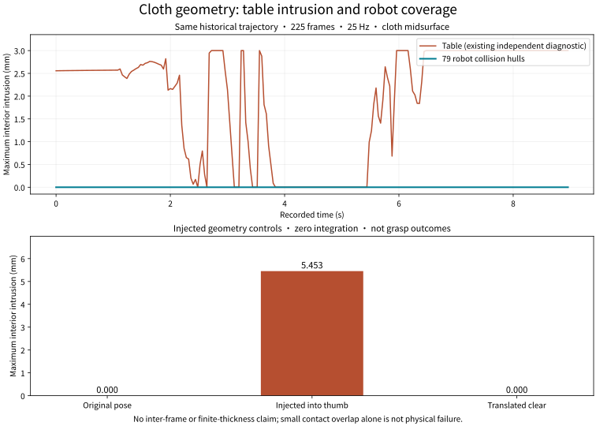

# Cloth versus robot: independent geometry audit

> **Historical diagnostic snapshot:** test counts, next steps and uncommitted/pending-validation statements below describe that diagnostic stage, not current delivery status. See the [current experiment report](SETTLING.md) for the full dynamics repair, later controls and limitations.

[简体中文](ROBOT-CONTACT.zh-CN.md) | [English](ROBOT-CONTACT.md)

**No cloth midsurface intrusion into the 79 robot collision hulls was detected in 225 saved frames. Table intrusion remains present in 176/225 frames; the physics repair is unfinished.** This adds the previously missing cloth/robot diagnostic, not a new successful grasp.



| Check | Coverage | Result |
|---|---|---|
| Cloth midsurface versus robot hulls | Original 225 frames × 288 triangles × 79 robot colliders; conservative bounding-box rejection only | 0 affected frames; maximum interior intrusion 0 mm |
| Cloth midsurface versus table | Existing independent diagnostic of the same trajectory | 176 affected frames; maximum interior depth 3.000 mm |
| Injected thumb-intersection control | Frame 112; robot unchanged; translate the entire cloth so a nearby triangle centroid lies inside the pad hull | Maximum interior intrusion 5.453 mm detected |
| Translated-clear control | Same frame; translate the entire cloth upward by 2 m | 0 mm |

[Historical audit](evidence/robot-contact/historical-v2.json) · [Injected controls](evidence/robot-contact/injected-controls-v2.json) · [Figure provenance](evidence/robot-contact/figures/figure-provenance.json) · [Existing table diagnostic](SCORING.md)

Injected controls modify geometry in an offline copy only: no integration, actuator control or changes to the recording. **They are not new dynamics episodes or successful poses.** Frame 112 is the fixed middle saved frame. The counterexample tests detection, not the frequency of physical penetration.

## Measurement and implementation

1. Load the original compiled `model.mjb`, actual `qpos` and topology from `states.npz`. Require the complete 25 Hz grid, finite values and compiled topology. Target joint angles are not inputs.
2. Reconstruct robot and cloth positions with `mj_kinematics` and `mj_flex`. Do not integrate, generate native contacts or query native contact distance.
3. Read collision-hull vertex indices from the compiled `mesh_graph` and independently reconstruct hull planes. Compiled vertices and `geom_xpos/geom_xmat` avoid applying mesh scaling or centering twice.
4. Inspect the entire cloth against all 79 robot collision meshes, not just pads. For candidate triangles, maximize interior distance with barycentric constraints. A triangle can intersect even when all three vertices lie outside.
5. Record per-frame maxima, witness triangle/geom, intersecting-pair counts and per-geom maxima. Verify input hashes before and after reading. Output must be new and outside the recording.

Ordinary MuJoCo mesh collision uses convex hulls; `maxhullvert` can make them differ from the hull of all render vertices. This diagnostic uses the stored collision-hull indices. Official references: [meshes and transforms](https://mujoco.readthedocs.io/en/3.11.0/XMLreference.html#asset-mesh), [convex-hull layout](https://mujoco.readthedocs.io/en/3.11.0/APIreference/APItypes.html#convex-hulls). Runtime version is MuJoCo 3.11.0; official engine code is unchanged.

**Metric:** find a point in the triangle inside the hull that maximizes its distance to the nearest hull boundary. This is not native contact distance, contact force or the minimum translation needed to separate the objects. `1e-8 m` is a numerical zero tolerance, not a new physical acceptance threshold.

Limits:

- Saved 25 Hz frames only; no separation guarantee between frames.
- Zero-thickness cloth midsurface; no inflation by the 1.2 mm collision radius, shell thickness or margin. Zero intrusion does not establish sufficient clearance.
- Collision hulls only, not detailed render surfaces or SDFs. Table, floor and self-intersection require separate audits.
- Geometry and kinematics share the original model. Independence concerns the intersection algorithm, not robot calibration or a second physics engine.
- Compliant contact permits some overlap; small intrusion alone does not establish physical failure. The table's 3 mm maximum is bounded by its 6 mm thickness, not an upper bound on escape distance.
- Missing meshes, unsupported geometry, corrupt topology and incomplete sampling are errors, not zero-valued measurements.

## Reproduction

Use an environment with the full historical record. `RECORD` contains `model.mjb`, `states.npz` and `summary.json`; the compact Git evidence summaries do not replace those inputs.

```bash
.venv/bin/python -m dexlab.cloth_robot_audit RECORD --output /tmp/robot-audit-new.json
.venv/bin/python demos/cloth-folding/src/probe_robot_audit.py RECORD \
  --frame 112 --output /tmp/robot-controls-new.json
.venv/bin/python demos/cloth-folding/src/plot_robot_audit.py \
  /tmp/robot-audit-new.json \
  demos/cloth-folding/evidence/grasp/verification-cloth-evidence-v2.json \
  /tmp/robot-controls-new.json --output /tmp/robot-figures-new
```

A normal command exit means diagnostic completion, not grasp acceptance. The existing `verify_cloth.py`, physical thresholds and historical reports are unchanged.

Fifteen new tests cover analytic geometry, rotations/translations, outside-vertex counterexamples, limited hull vertices, actual poses, no integration, invalid evidence and output protection. **All 307 unit tests passed.** Both language figures were visually inspected. Review is by the implementation agent only; no independent review or full remote release gate for the current tree is claimed.

The local candidate is not committed, merged or released; [#32](https://github.com/huangkiki/Dexlab/issues/32) remains open. Next: locate the first table-edge intersection during remote settling, validate a repair without engine/controller changes or relaxed acceptance, then complete pinch/lift/release and both backend regressions.
