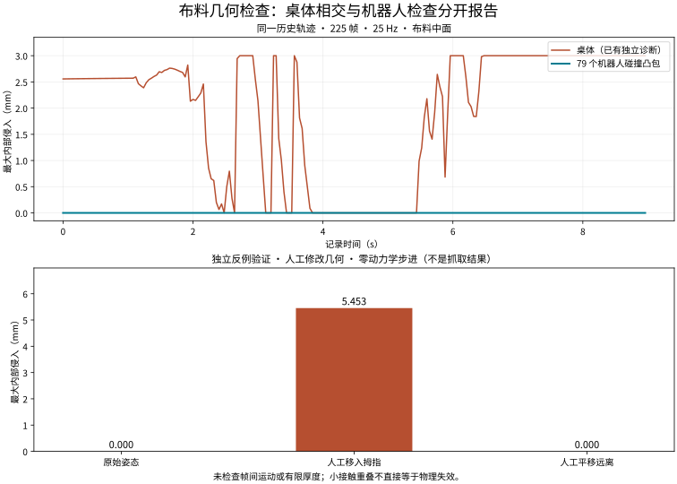

# 布料与机器人：独立几何检查

[简体中文](ROBOT-CONTACT.zh-CN.md) | [English](ROBOT-CONTACT.md)

**历史轨迹的 225 个保存帧中，布料中面未侵入双臂与双手的 79 个碰撞凸包。桌体相交仍为 176/225 帧，物理修复尚未完成。** 本轮补充了原来缺失的布—机器人独立检查，并未重新获得一次成功抓取。



| 检查 | 记录范围 | 结果 |
|---|---|---|
| 布料中面—机器人凸包 | 原始 225 帧 × 288 个三角形 × 79 个机器人碰撞几何；包围盒只作保守排除 | 0 帧内部侵入；最大值 0 mm |
| 布料中面—桌体 | 同一轨迹的既有独立诊断 | 176 帧相交；最大内部深度 3.000 mm |
| 人工移入拇指的反例 | 第 112 帧，固定机器人，仅平移整块布料，使邻近三角形中心进入指腹凸包内部 | 检出 5.453 mm 最大内部侵入 |
| 人工远离的对照 | 同一帧，整块布料向上平移 2 m | 0 mm |

[原始轨迹检查](evidence/robot-contact/historical-v2.json) · [人工对照](evidence/robot-contact/injected-controls-v2.json) · [图表来源](evidence/robot-contact/figures/figure-provenance.json) · [既有桌体诊断](SCORING.zh-CN.md)

人工对照只是离线修改副本中的几何位置；没有积分，没有执行器控制，也没有写回原始记录。**这些对照不是新的动力学实验或成功姿态。** 第 112 帧为固定的轨迹中间帧，反例用于验证检出能力，不用于估计真实穿透频率。

## 测量方法与实现边界

1. 从 `model.mjb` 读取原始编译模型，从 `states.npz` 读取实际 `qpos` 和三角形拓扑。核对完整的 25 Hz 时间网格、有限数值和编译拓扑，不使用目标关节角。
2. 用 `mj_kinematics` 与 `mj_flex` 重建每个保存帧的机器人和布料坐标，不调用积分、原生接触生成或接触距离接口。
3. 读取编译模型 `mesh_graph` 中的碰撞凸包顶点索引，独立重建凸包平面。使用编译后顶点与 `geom_xpos/geom_xmat`，避免重复施加网格缩放或中心化变换。
4. 对整块布料与全部 79 个机器人碰撞网格做检查，不限于指腹。对可能相交的三角形，在重心坐标约束下求最大内部距离；三个顶点都在外部也能检出面片内部侵入。
5. 记录每帧最大值、见证三角形及几何名、相交对数、每个机器人几何的最大值。读取前后核对输入哈希，输出必须位于原始记录之外且不能覆盖已有文件。

普通 MuJoCo 网格碰撞采用凸包；`maxhullvert` 可能使其不同于全部渲染顶点的凸包。本检查使用保存的碰撞凸包索引，不把显示网格直接冒充碰撞模型。官方依据：[网格与坐标变换](https://mujoco.readthedocs.io/en/3.11.0/XMLreference.html#asset-mesh)、[凸包数据结构](https://mujoco.readthedocs.io/en/3.11.0/APIreference/APItypes.html#convex-hulls)。本记录运行版本为 MuJoCo 3.11.0；没有修改官方引擎。

**指标含义：**在三角形内找到一个位于凸包内部的点，使它到最近凸包边界的距离最大。它不是原生接触距离、接触力或把两个物体完全分离所需的最小平移距离。`1e-8 m` 仅用于数值零分类，不是新增物理验收阈值。

边界必须保留：

- 只检查保存的 25 Hz 帧，不能证明帧间无穿透。
- 只检查零厚度布料中面；未按 1.2 mm 碰撞半径、壳厚或 margin 膨胀几何。零内部侵入不证明具有足够表面间隙。
- 使用碰撞凸包，不覆盖详细渲染表面、SDF、桌体、地面或自相交；后几项需分别检查。
- 几何和运动学来自同一模型；独立的是相交算法，不是机器人标定或另一套物理引擎。
- 软接触允许一定重叠；检出微小侵入本身不直接判定物理失败。桌体 3 mm 最大值受 6 mm 桌板厚度限制，不能当作脱离深度上限。
- 缺失网格、未知几何类型、损坏拓扑或时间采样不完整会报错，不能以零值替代。

## 复核

在包含完整历史记录的环境中执行。`RECORD` 表示含 `model.mjb`、`states.npz`、`summary.json` 的记录目录；小型 Git 证据摘要不能替代原始模型和状态。

```bash
.venv/bin/python -m dexlab.cloth_robot_audit RECORD --output /tmp/robot-audit-new.json
.venv/bin/python demos/cloth-folding/src/probe_robot_audit.py RECORD \
  --frame 112 --output /tmp/robot-controls-new.json
.venv/bin/python demos/cloth-folding/src/plot_robot_audit.py \
  /tmp/robot-audit-new.json \
  demos/cloth-folding/evidence/grasp/verification-cloth-evidence-v2.json \
  /tmp/robot-controls-new.json --output /tmp/robot-figures-new
```

这些命令的正常退出仅表示诊断完成，不能当作抓取验收通过。原有 `verify_cloth.py` 和验收阈值未改，历史报告未被覆盖。

新增 15 项测试覆盖解析几何、旋转和平移、全部顶点在外的面片反例、有限凸包顶点、实际关节位置、无积分、损坏输入和不可覆盖输出；完整 **307 项单元测试通过**。两种语言的图表已人工查看。仅完成实现者自审，没有独立审查或当前源码的完整远端发布门禁。

本地候选尚未提交、合并或发布；[#32](https://github.com/huangkiki/Dexlab/issues/32) 保持开放。下一步仍是远端定位沉降期间的首次桌边相交，在不改引擎和控制器、不放宽验收的条件下验证修复，再完成夹持、抬升、释放与双后端回归。
