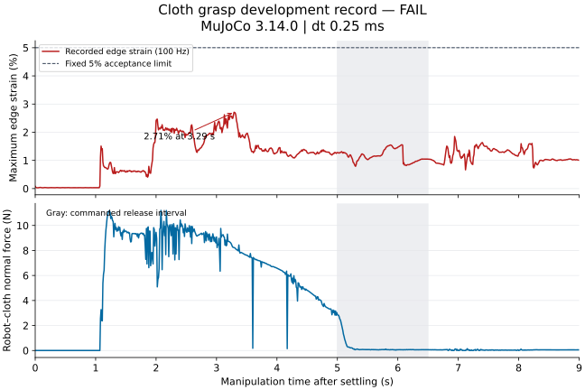

# 布料碰撞与释放排查报告

[English](SETTLING.md) | [简体中文](SETTLING.zh-CN.md)

**当前结论：** 调整地面接触和布边约束时间常数后的完整 9 秒开发案例，通过 v3 原生协议及保存帧几何检查，完成夹持、抬升和完全释放。它是已知状态的脚本控制，材料尚未校准；自接触穿透仅比上限低 **7.95 µm**，不能称为稳健修复或留出集 benchmark。官方引擎与验收阈值未改。


[连续 9 秒视频](media/compliance-grasp.mp4) · [媒体来源](evidence/settling314/compliance-media-provenance.json)


| 指标 | 当前开发案例 | 固定标准 |
|---|---:|---:|
| 全物理步最大边长应变 | 3.5161% | <5% |
| 手／桌／地面／自接触最大原生穿透 | 0.311／0.284／1.100／1.492 mm | 各 <1.5 mm |
| 材料点抬升 | 123.92 mm | >80 mm |
| 保持期双指接触覆盖 | 100% | ≥95% |
| 材料点相对锚点最大距离 | 4.32 mm | <10 mm |
| 最后 0.5 秒最大手—布法向力 | 0 N | <0.001 N |
| 保存帧桌／机器人／地面中面侵入 | 各 0/225 帧 | 仅采样几何结论 |
| 沉降阶段桌体侵入 | 0/4,001 状态 | 仅采样几何结论 |

完成 72,000 个物理步；仿真循环 618.86 秒，含准备和记录的服务总耗时 642.18 秒。该受限资源运行不是引擎吞吐 benchmark。极值逐步扫描，曲线为 100 Hz、几何为 25 Hz，因此图中应变峰值 3.0891% 小于逐步极值；保存帧无侵入不证明连续时间不相交。注入机器人穿透被检出，移开负对照通过。

[原生指标](evidence/settling314/compliance-summary.json) · [独立协议／桌／地面／自接触](evidence/settling314/compliance-protocol-table-self.json) · [机器人审计](evidence/settling314/compliance-robot.json) · [负对照](evidence/settling314/compliance-robot-negative-controls.json) · [沉降审计](evidence/settling314/compliance-settling.json) · [曲线来源](evidence/settling314/compliance-plot-provenance.json)

## 历史对照：阶段修正后仍未完全释放




| 指标 | 修正阶段配置，释放退手 8 cm | 固定标准 |
|---|---:|---:|
| 全物理步最大绝对边长应变 | 2.7121% | <5% |
| 手／桌体／自接触最大原生穿透 | 0.325／0.164／0.407 mm | 均 <1.5 mm |
| 材料点抬升 | 124.90 mm | >80 mm |
| 保持期双指接触覆盖 | 99.33% | ≥95% |
| 材料点相对锚点最大距离 | 6.10 mm | <10 mm |
| 末段最大机器人—布料法向力 | **0.0558 N** | **<0.001 N，失败** |
| 独立桌体／机器人布面侵入 | 0/225 个保存帧 | 报告采样覆盖 |
| 初始化阶段独立桌体侵入 | 0/4,001 个保存状态 | 报告采样覆盖 |

末段指最后 0.5 秒，接触主要来自无名指、小指指腹；连续状态回放确认布料仍搭在它们上面。因此，打开夹持手指不等于完全释放。机器人注入负对照检出刻意侵入，并接受移开的无接触对照。

[协议、桌体与自接触检查](evidence/settling314/phasefixed-protocol-table-self.json) · [机器人几何](evidence/settling314/phasefixed-robot.json) · [机器人负对照](evidence/settling314/phasefixed-robot-negative-controls.json) · [曲线来源](evidence/settling314/phasefixed-plot-provenance.json)

应变／穿透极值扫描每个物理步；力、保持和释放统计及曲线采用 100 Hz 观测，完整抓取的独立几何采用 25 Hz 保存状态。后者检查零厚度中面，不证明有限厚度或步间连续不相交。本次开发运行的服务总耗时约 533 秒，含准备与记录，不能作为纯引擎吞吐速度。

## 改动与失败对照

所有运行使用未修改的官方 MuJoCo 3.14.0。开发候选不是留出集 benchmark。失败全部保留；初态、规划或几何不同的行不能用于引擎精度排名。

| 对照 | 实测结果 | 解释 |
|---|---|---|
| 原始 96 个桌体盒片 | 21.5 ms 首次侵入，三角形 28；前一无侵入样本为 21.0 ms | 失败始于抓取前的被动沉降 |
| 同一实体并集，768 个盒片（X 向 8 倍细分） | 90.5 ms 首次侵入，三角形 22 | 推迟侵入，没有修复 |
| 静止网格节点行与桌边对齐 | 92 ms 首次侵入 | 调整这项离散化仍未修复 |
| 同形 96 个长方体改为凸网格 | 4,001 个沉降样本未检出侵入 | 同一桌体外形选择通用凸体／flex 碰撞路径 |
| 凸网格，抓点 inset 0.3；再改 0.1 | 预抓取失败；随后为抬升路径失败 | 两次都没有完成抓取 |
| 凸网格、inset 0.1、抬升前退让 8 cm | 完整运行，7.55 s 应变 11.0095% 失败 | 保存帧的几何改善，但物理验收仍失败 |
| 操作步长减半至 0.125 ms | 完整运行，应变 21.7683% 失败 | 沉降终态也不同，不是固定初态的收敛对照 |
| 刷新阶段常量，恢复 0.25 ms 操作步长 | 应变 2.7121% 通过，释放失败 | 数值初始化修正，释放净空仍不足 |

[原始侵入时刻](evidence/settling314/baseline-onset.json) · [细分对照](evidence/settling314/partition-x8-onset.json) · [节点对齐对照](evidence/settling314/edge-aligned-onset.json) · [原始完整抓取](evidence/settling314/grasp-verdict.json) · [凸网格完整抓取失败](evidence/settling314/mesh-full-protocol.json)

静态细分倍数 1/2/4/8/16 改善部分侵入起点附近的接触，但仍漏掉深穿透见证三角形；平移移开的负对照均无侵入（[静态证据](evidence/settling314/static-partition.json)）。同形凸网格保留全部八个长方体角点，编译后双向角点最大差异为 1.795 nm（[几何与接触证据](evidence/settling314/mesh-table-control.json)）。改变的是碰撞表示，不是桌体包络或官方引擎。

## 独立几何、初始化与来源

公共审计器验证固定、轴对齐的长方体网格：八个角点、十二个三角面、闭合边、完整长方体表面，以及原生碰撞凸包确实保留全部八角。任意网格包围盒、`maxhullvert=4` 简化凸包、不支持的旋转、运动支撑体、实际间隙和重叠均拒绝。相邻平面最多 1.789 nm 的量化误差在既有 10 nm 几何数值零容差内显式记录，不改变物理阈值。[直接审计实际网格](evidence/settling314/mesh-independent-onset.json)。

[六组原生初始化对照](evidence/settling314/initialization-controls.json)定位了脚本问题：两种编译操作步长在相同沉降步长下，终态仍相差 1.916 mm。只在 forward 前配置参数不能消除此差异；设置阶段参数并用临时数据调用官方 `mj_setConst` 后，终态 qpos、qvel 逐位相同。现在两个阶段切换均刷新模型常量，不重置实时状态。缓存弯曲因子属于预条件器，证据不支持宣称上游物理算子错误或修改引擎源码。

可选记录器覆盖手臂规划、主动速度／时间重置之前的初始化。它复制初态及每一步的 qpos、qvel，不查询接触或修改实时状态。关闭记录器的原生 4,000 步回放，在已测试的原始配置中得到逐位相同的终态（[终态对照](evidence/settling314/native-recording-equivalence.json)）；不据此宣称所有配置都没有记录干扰。

## 参数来源与近似边界

| 参数 | 数值与来源 |
|---|---|
| 布料 | 原演示的 20×20 cm 单层面片，169 个节点，总质量 15 g |
| 材料 | 名义杨氏模量 100 kPa、泊松比 0、厚度 0.5 mm；沿用未校准的演示参数 |
| 碰撞半径 | 1.2 mm，与名义壳厚不同 |
| 桌体 | 原 96 个长方体盒片；可选八角凸网格，同一包络仅有已报告的量化差异 |
| 机器人碰撞 | 现有表面网格作为原生凸碰撞体；夹布不是 SDF/SDF 接触 |
| 接触 | `condim=3`、`solref=(.002,1)`、`solimp=(.99,.999,.001)`；声明的布／手滑动摩擦系数 1、桌体 0.6，实际接触对遵循原生混合规则 |
| 初始化 | 2 秒、CG、100 次迭代、0.5 ms 步长，刷新模型常量 |
| 操作阶段 | Discrete 积分器、Newton、100 次迭代、当前候选 0.125 ms 步长（历史对照 0.25 ms）、容差 1e-8、棱锥摩擦锥 |
| 位置驱动 | 手臂 kp/kv=1000/40、力矩限幅 ±60；手指 15/0.15、限幅 ±1；来自原导出器／演示，不是实测驱动辨识 |
| 控制 | 已知状态 IK、显式夹持先验、平滑关节目标；不使用布料驱动器、焊接、粘附或覆盖状态来夹住布 |

退手对照将开指后净空从 8 cm 增到 16 cm，其失败及后续约束软度对照均保留在下文。

## 复现与复核

使用经准入的官方 3.14 环境（`DEXLAB_MUJOCO_PROFILE=qualification-3.14.0`）、已有机器人导出模型及仓库资源限制。默认 `box` 保留历史失败表示；显式选择候选，并使用数据盘中的新输出目录：

```bash
DEXLAB_MUJOCO_PROFILE=qualification-3.14.0 bash demos/cloth-folding/run.sh \
  --task grasp --table-contact convex-mesh --grasp-inset .1 \
  --pre-lift-retreat .08 --release-retreat .16 --timestep .000125 \
  --floor-time-constant .0005 --edge-time-constant .0005 \
  --record-settling --no-video --output "$RUN_OUTPUT"
```

将 `DEXLAB_PYTHON`、`DEXLAB_ROBOT_MODEL` 分别设置为经准入的解释器和已有模型导出。记录功能可选且有开销，保存初始化模型、完整状态时间网格、拓扑、哈希和引擎标识。Python 异常保留成功前缀和失败状态；进程终止／磁盘错误仍可能留下不完整记录，不属于可恢复日志。

```bash
"$DEXLAB_PYTHON" demos/cloth-folding/src/settling_trace.py "$RUN_OUTPUT/settling" \
  --output "$ANALYSIS_OUTPUT/settling.json"
"$DEXLAB_PYTHON" demos/cloth-folding/src/render_cloth.py "$RUN_OUTPUT" \
  --output "$MEDIA_OUTPUT"
```

分析输出必须放在不可变原始记录之外。侵入起点审计验证哈希和时间网格，检查至首次侵入并报告前一个无侵入样本；检出后不检查剩余帧。不完整记录不能证明通过。分析退出码为零仅表示分析完成，不表示物理验收通过。

## 后续发现：接触覆盖遗漏了地面冲击

16 cm 退手使末段机器人—布料接触力归零，但最大应变仍为 11.5644%，未通过。7.64 秒保存帧的峰值对应**落地冲击**：独立平面距离得到中面穿越 0.694 mm、碰撞半径包络穿透 1.894 mm，与原生地面接触一致。此前接触扫描遗漏了地面；桌体／机器人检查不能证明全部环境几何有效。

`cloth-evidence-v3` 现要求逐步记录地面穿透及其最大值，把既有 1.5 mm 原生穿透限值覆盖到地面，并加入保存帧的独立平面审计。旧记录缺少地面极值，在 v3 下仍属证据不全；保留 v2 报告及其冻结评分源码，不覆盖，也不从稀疏帧伪造逐步极值。新增求解器迭代观测，不改变控制或动力学；达到迭代预算本身不证明求解错误。

下文记录同初态半步长对照，仍属于开发实验，不是留出结果。

[再次复现的六组结果](evidence/settling314/initialization-controls-reproduced.json)记录官方引擎标识、输入、源码和终态哈希。[独立复现脚本](src/probe_phase_initialization.py)显式保留旧阶段顺序，不调用已修正的沉降函数。在资源限制及同一准入配置下运行：

```bash
"$DEXLAB_PYTHON" demos/cloth-folding/src/probe_phase_initialization.py "$RUN_OUTPUT" \
  --output "$PHASE_CONTROL_OUTPUT"
```

[用 v3 复核历史释放轨迹](evidence/settling314/release16-floor-review-v3.json)：独立检出地面侵入，不从 25 Hz 样本推断缺失的逐步地面极值。

## 同初态步长与约束软度对照

0.125ms完整抓取与0.25ms对照的沉降qpos文件、全部规划姿态数组逐位一致，但仍失败：应变12.966%、地面穿透2.612mm、自接触穿透1.738mm。完成72,000步，求解器最多47/100次迭代，没有任何一步用满预算。减半步长在此不足以修复，也没有观察到迭代预算耗尽。

独立的[倾斜布片落地对照](evidence/settling314/tilted-drop-compliance.json)保留原布料／地面／求解选项，移除机器人和桌体，将平面静止面片倾斜45度、质心高度置于0.6m、初速度置零，每组以0.125ms步长运行1秒。它是最小开发案例，不是原轨迹回放或已验证完整抓取。

| 时间常数对照 | 最大应变 | 地面穿透 | 自接触穿透 |
|---|---:|---:|---:|
| 原始2ms | 11.02% | 2.455mm | 0.362mm |
| 仅地面0.5ms | 9.37% | 0.685mm | 0.441mm |
| 仅布边0.5ms | 1.91% | 2.413mm | 1.282mm |
| 两者0.5ms | 2.04% | 0.685mm | 0.991mm |

这是名义有效约束软度的调整，**不是材料实测参数**。杨氏模量、质量、几何和验收线不变；显式地面priority1使选定solref生效而不参与混合，其余接触参数保留。原生reference-safety仍启用：有效时间常数不小于阶段步长的两倍（0.5ms沉降时为1ms；0.125ms操作时为0.25ms）。顶部完整结果使用`--floor-time-constant .0005 --edge-time-constant .0005`，仍仅代表此开发案例。

回放相机现以全部实测布料顶点及4cm上下文余量取景；旧的手—布中点相机会把落地冲击裁出画面。此改动只影响显示，原视频及冻结渲染源码保留。

参数语义参照[官方求解参数说明](https://mujoco.readthedocs.io/en/stable/modeling.html#solver-parameters)与[接触混合规则](https://mujoco.readthedocs.io/en/stable/modeling.html#contact-parameters)。

[公开最小复现脚本](src/probe_drop_compliance.py)重现了四组完全一致的峰值指标（[重复运行证据](evidence/settling314/tilted-drop-compliance-reproduced.json)）。在资源限制下运行：

```bash
"$DEXLAB_PYTHON" demos/cloth-folding/src/probe_drop_compliance.py "$BASELINE_RECORD" --output "$DROP_OUTPUT"
```
