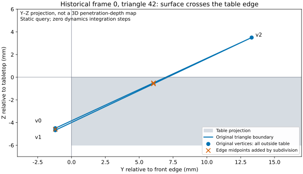

# Table-edge intersection: static contact diagnostic

> **Historical diagnostic snapshot:** test counts, next steps and uncommitted/pending-validation statements below describe that diagnostic stage, not current delivery status. See the [current experiment report](SETTLING.md) for the full dynamics repair, later controls and limitations.

[简体中文](TABLE-CONTACT.zh-CN.md) | [English](TABLE-CONTACT.md)

**Conclusion: the historical cloth/table intersection is reproducible in static collision queries without a robot or dynamics integration.** For one recorded triangle, independent table-interior intrusion is **2.556627 mm**, while MuJoCo 3.11.0 reports only **0.001032 mm** maximum native contact penetration for that triangle. These different definitions cannot substitute for each other. A small native contact metric can therefore coexist with visible surface intersection.

This advances [#32](https://github.com/huangkiki/Dexlab/issues/32); **it is not a physical repair or successful cloth grasp**. The current source has not passed its complete remote release gate and is not merged or released.



The figure projects the original triangle onto Y–Z. Orange crosses mark added edge midpoints on the same planar surface. Coordinates come from the packaged historical reference, not a generated successful pose. A projection does not directly measure 3D intrusion. [Full numbers](evidence/table-contact/static-v2.json) · [Figure provenance](evidence/table-contact/figure-provenance.json)

## Controls and limits

Use historical frame 0 and select the greatest independently measured table-interior intrusion among its 288 triangles (index 42). This selection constructs a counterexample, not a statistical sample. Preserve the existing 96 table boxes, coordinates, 1.2 mm collision radius and contact settings.

| Static query | All / witness contacts | Witness surface interior intrusion (mm) | Witness maximum native penetration (mm) |
|---|---:|---:|---:|
| Isolated original triangle | 1 / 1 | 2.556627 | 0.001032 |
| Full panel, inspecting the same triangle | 367 / 1 | 2.556627 | 0.001032 |
| Isolated triangle, midphase disabled | 1 / 1 | 2.556627 | 0.001032 |
| Same triangle subdivided into four | 10 / 10 | 2.556627 | 1.785617 |
| Negative control: triangle raised by 20 mm | 0 / 0 | 0 | 0 (no contacts) |

The independent measure maximizes interior distance to the nearest table boundary over points in the triangle. The native measure is `max(0,-dist)` over generated contacts, with collision-radius semantics. They are not one common error measure; numerical equality is not an acceptance criterion.

All three original vertices are outside the table, but the connecting surface cuts through the edge. Isolating the triangle and disabling midphase do not remove the discrepancy, so full-panel contact competition or midphase culling alone cannot explain this example. Subdivision preserves the static surface but changes contact sampling and exposes deeper contacts. **It does not establish correct dynamics:** nodes, degrees of freedom and material discretization would also change.

## Official implementation and bounded inference

The upstream `3.11.0` tag resolves to `b85fdca54f0e0038b804af146a0b4e94199e00d0`:

- [Collision dispatch](https://github.com/google-deepmind/mujoco/blob/b85fdca54f0e0038b804af146a0b4e94199e00d0/src/engine/engine_collision_driver.c) routes 2D flex/box pairs to a specialized box–triangle path.
- [Primitive collision](https://github.com/google-deepmind/mujoco/blob/b85fdca54f0e0038b804af146a0b4e94199e00d0/src/engine/engine_collision_primitive.c): `mjraw_BoxTriangle` checks triangle vertices against the box and box corners against the triangle, without separately covering all edge–edge intersections.

Together with the static counterexample, this identifies contact sampling coverage as a concrete investigation target. It does not attribute every MuJoCo cloth problem to one cause. Official engine source and binaries were not changed. The runtime `libmujoco` hash matches the installed wheel RECORD and is included in the report. [Upstream file hashes](evidence/table-contact/upstream.json) document source inspection, not an engine rebuild.

## Initialization, parameter provenance and approximations

Recorded `t=0` **is not the initial flat panel**. `run_cloth.py` first settles cloth passively for 2 s using CG, a 0.5 ms step and 100 iterations, then plans the pregrasp and resets velocity/time. Frame 0 already intersects the table. Dynamics investigation must include settling, not just lifting.

| Item | Current value and source | Interpretation / unverified assumptions |
|---|---|---|
| Table | 96 adjacent fixed boxes; union `x=[−0.54,0.54]`, `y=[0.40,0.84]`, `z=[0.494,0.5] m`; `cloth_model.add_table` | Historical numerical construction, not a measured table; tiling is an existing contact-distribution measure |
| Panel | 169 vertices, 288 triangles, initial grid spacing about 16.67 mm, total mass 15 g | Uncalibrated single-layer numerical panel |
| Thickness / radius | Bending thickness 0.5 mm; collision radius 1.2 mm | Different purposes; 2.4 mm collision diameter is not measured fabric thickness |
| In-plane / bending | Internal edge equalities; bending `young=1e5, poisson=0, elastic2d=bend`, damping `.0001` | Different approximations for in-plane and bending response; no measured constitutive calibration |
| Contact | `condim=3`, cloth friction `1 .005 .0001`, table friction `.6 .005 .0001`; `solref=.002 1, solimp=.99 .999 .001` | Existing heuristic settings; constraint parameters are not measured stiffness |
| Manipulation | Newton, 0.25 ms, 100 iterations, pyramidal cone, `impratio=100` | Different from settling; no integration of either phase in this diagnostic |
| Drives | Fingers `kp=15, kv=.15, ±1`; arms `kp=1000, kv=40, ±60`; existing joint targets and robot bias compensation | Uncalibrated simulation drives; cloth has no actuation or external attachments |
| Robot collision | Convex collision representation of existing surface meshes | Not the apple SDF–SDF path; the static counterexample contains no robot |

The diagnostic rebuilds prescribed geometry and calls `mj_fwdPosition` to generate contacts, without integration. Internal edge constraints create a valid flex in the reduced query; its mass distribution, bending and self-contact are not claimed dynamically equivalent to the original cloth. Controllers, physical thresholds and historical records remain unchanged.

## Reproduction and validation

Run from the repository root using the existing environment. No apple or cloth episode is needed:

```bash
.venv/bin/python demos/cloth-folding/src/diagnose_table_contact.py \
  demos/cloth-folding/evidence/grasp/table-reference.npz \
  --output /tmp/table-contact-new.json
.venv/bin/python demos/cloth-folding/src/plot_table_contact.py \
  /tmp/table-contact-new.json --output /tmp/table-contact-figures
```

The numerical output must be a new file; inputs are not rewritten. The diagnostic verifies independent historical depth, compiled coordinates, native library identity and unchanged input hashes. Eight new tests cover the counterexample, full/reduced equivalence, midphase control, subdivision area/coplanarity, raised negative control, corrupt-reference rejection, no integration and refusal to overwrite output. Passing these tests validates the diagnostic, not cloth grasping.

This round passed eight new tests and **all 292 unit tests**; both language figures were visually inspected. Review is by the implementation agent only; no independent review or full remote dynamics gate for the current tree is claimed.

## Next experiments, not yet executed

1. On the authorized remote environment, record complete settling states, native contact elements/positions/normals and the first intersection time, establishing how the static mechanism enters an actual trajectory.
2. Keep the controller and physical objective fixed. Change one contact-geometry implementation or discretization factor at a time. Declare whether surface geometry, total mass, in-plane and bending responses are preserved. Do not hide proxy or material changes. Add timestep/solver sensitivity controls where needed and retain failures.
3. Pass a minimal table-edge dynamics case before complete pinch/lift/release; add independent cloth–robot coverage. Retain D02 scoring. This exploratory geometric diagnostic does not silently become a new physical threshold.
4. Complete affected-task checks and both full apple backend gates; retain continuous close-ups and bilingual results before submission, merge and release.

Remote storage headroom still blocks new complete dynamics and release. No original records were deleted and no local full simulation bypass was used. #32 remains open.
