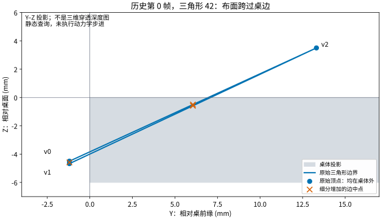

# 桌边穿插：静态接触诊断

> **历史诊断快照：** 本页的测试数量、待办和“未提交／待验证”描述对应诊断当时，不代表当前交付状态。完整动力学修复、后续对照与限制见[最新实验报告](SETTLING.zh-CN.md)。

[简体中文](TABLE-CONTACT.zh-CN.md) | [English](TABLE-CONTACT.md)

**结论：旧轨迹的布面穿桌可以在无机器人、零动力学步进的静态碰撞查询中复现。** 在一个真实记录的三角形上，独立桌体内部侵入量为 **2.556627 mm**，MuJoCo 3.11.0 对它报告的最大原生接触穿透仅 **0.001032 mm**。两者定义不同，不能互相代替。这解释了为何原生接触指标很小，视频仍可明显穿模。

这是 [#32](https://github.com/huangkiki/Dexlab/issues/32) 的诊断进展，**不是夹布物理修复或成功抓取结果**。当前源码尚未通过远端完整发布门禁，未合并发版。



图为原始三角形的 Y–Z 投影，橙色叉号是保持同一平面表面时加入的边中点。坐标来源于打包的历史参考，不是新生成的成功姿态；不能从投影图直接读取三维侵入量。[完整数值](evidence/table-contact/static-v2.json) · [图来源](evidence/table-contact/figure-provenance.json)

## 对照与结论边界

固定使用历史第 0 帧；遍历 288 个三角形，取独立桌体内部侵入量最大的三角形（索引 42）。选择规则是构造反例，不是抽样统计。保留原有 96 块桌体、坐标、1.2 mm 碰撞半径及接触配置。

| 静态查询 | 全部／目标三角形接触数 | 目标布面内部侵入 (mm) | 目标原生接触最大穿透 (mm) |
|---|---:|---:|---:|
| 原始三角形单独查询 | 1 / 1 | 2.556627 | 0.001032 |
| 整片布，读取同一三角形 | 367 / 1 | 2.556627 | 0.001032 |
| 单三角形，关闭 midphase 筛选 | 1 / 1 | 2.556627 | 0.001032 |
| 同一三角形细分为四片 | 10 / 10 | 2.556627 | 1.785617 |
| 单三角形整体上移 20 mm 的负对照 | 0 / 0 | 0 | 0（无接触） |

独立指标是三角形内部点到桌体最近边界的最大内侧距离；原生指标是已有接触点的 `max(0,-dist)`，包含碰撞半径语义。没有定义为同一“误差”，也不以两者数值相等作为验收。

原始三个顶点都在桌体外，但连接它们的布面跨过桌边。单独取出三角形及关闭 midphase 后现象不变，说明本反例不能仅归因于整片布的接触数量竞争或 midphase 漏选。细分保持静态表面不变，却改变接触采样，检测到更深的接触；**这不证明细分后的动态解就正确**，因为节点、自由度和材料离散也会变化。

## 官方实现与已排除的猜测

核对上游 `3.11.0` 标签对应提交 `b85fdca54f0e0038b804af146a0b4e94199e00d0`：

- [碰撞分派](https://github.com/google-deepmind/mujoco/blob/b85fdca54f0e0038b804af146a0b4e94199e00d0/src/engine/engine_collision_driver.c)：二维 flex 与 box 进入专用 box–triangle 路径。
- [基本碰撞函数](https://github.com/google-deepmind/mujoco/blob/b85fdca54f0e0038b804af146a0b4e94199e00d0/src/engine/engine_collision_primitive.c)：`mjraw_BoxTriangle` 检查三角形顶点与盒体、盒角与三角形，没有单独覆盖所有边与边的相交组合。

结合静态反例，接触采样覆盖是本案例的明确调查方向。这里没有把所有 MuJoCo 布料问题归结为同一个原因，也没有修改其源代码或二进制。运行时 `libmujoco` 的 SHA-256 与安装 wheel 的 RECORD 一致，哈希写入数值报告。上游源码哈希见[来源清单](evidence/table-contact/upstream.json)；源码阅读不是“重新编译过引擎”的声明。

## 初始化、参数来源和近似

记录中的 `t=0` **不是最初平铺状态**。`run_cloth.py` 先执行 2 s 被动沉降（CG、0.5 ms、100 次迭代），再进行预抓取规划、清零速度和时间。第 0 帧已经有穿插，因此后续动力学排查必须覆盖沉降过程，不能只检查正式抬升阶段。

| 项目 | 当前源码值与来源 | 解释／未验证项 |
|---|---|---|
| 桌体 | 96 块相邻固定盒；整体 `x=[−0.54,0.54]`、`y=[0.40,0.84]`、`z=[0.494,0.5] m`；`cloth_model.add_table` | 历史数值构造，不是真实桌体测量；分块是已有接触分布处理 |
| 布网格 | 169 顶点、288 三角形，初始边格约 16.67 mm，总质量 15 g | 单层数值面片，未标定材料 |
| 厚度／半径 | 弯曲模型厚度 0.5 mm；碰撞半径 1.2 mm | 两种用途，不能把 2.4 mm 碰撞直径称作实测布厚 |
| 面内／弯曲 | 内部边等式；弯曲 `young=1e5, poisson=0, elastic2d=bend`，阻尼 `.0001` | 面内约束与弯曲近似不同；无真机本构标定 |
| 接触 | `condim=3`、布摩擦 `1 .005 .0001`、桌摩擦 `.6 .005 .0001`；`solref=.002 1, solimp=.99 .999 .001` | 保留现有启发式参数，不把约束参数当测量刚度 |
| 正式操作 | Newton、0.25 ms、100 次迭代、pyramidal、`impratio=100` | 与沉降配置不同；本次没有运行这些动力学步骤 |
| 关节驱动 | 手指 `kp=15, kv=.15, ±1`；手臂 `kp=1000, kv=40, ±60`；已有关节目标与机器人偏置补偿 | 未校准的仿真驱动，布本身没有驱动或外部固定连接 |
| 机器人碰撞 | 现有表面网格的凸碰撞表示 | 不是苹果抓梗的 SDF–SDF 路径；本次静态反例不含机器人 |

当前诊断重建规定的几何，调用 `mj_fwdPosition` 生成接触；没有积分。单三角形使用独立内部边约束以构造合法 flex，不声称复现原布的质量分配、弯曲或自接触响应。原始控制器、物理验收阈值和历史证据全部保持不变。

## 复现与验证

在仓库根目录，使用现有环境；无需重新运行苹果或夹布：

```bash
.venv/bin/python demos/cloth-folding/src/diagnose_table_contact.py \
  demos/cloth-folding/evidence/grasp/table-reference.npz \
  --output /tmp/table-contact-new.json
.venv/bin/python demos/cloth-folding/src/plot_table_contact.py \
  /tmp/table-contact-new.json --output /tmp/table-contact-figures
```

数值输出必须是新文件；原输入不改写。诊断检查本次历史参考的独立深度一致性、编译后顶点坐标、原生库哈希和输入前后哈希。八项新测试覆盖几何反例、整片／单片一致性、midphase 对照、细分面积与共面性、离桌负对照、损坏参考拒绝、禁止积分及拒绝覆盖输出。它们通过只说明诊断有效，不能当成夹布成功。

本轮八项新测试与 **292 项完整单测通过**；中英图已目视检查。仅自审，没有独立审查或当前源码的远端完整动力学门禁。

## 下一步实验，尚未执行

1. 在授权远端记录完整沉降阶段的面片状态、原生接触元素／位置／法向与首个相交时刻，确认上述静态机制如何进入真实轨迹。
2. 保持控制器及物理目标不变，每次只改变一项：接触几何实现或离散密度。必须披露是否保持表面、总质量、面内与弯曲响应；不能用未说明的替代几何或材料变化掩盖问题。必要时补做步长／求解器敏感性对照，保留失败。
3. 首先通过桌边最小动力学案例，再跑完整夹持—抬升—释放，补独立布—机器人检查。原有 D02 评分继续使用；本探索性几何指标不自动变成新的物理阈值。
4. 完成受影响任务及双后端完整苹果门禁，生成连续近景和双语结果后，才提交合并发版。

当前远端存储余量不足，新完整动力学与发布仍受阻。没有删除旧记录，也没有用本机完整仿真绕过限制。#32 保持开放。
