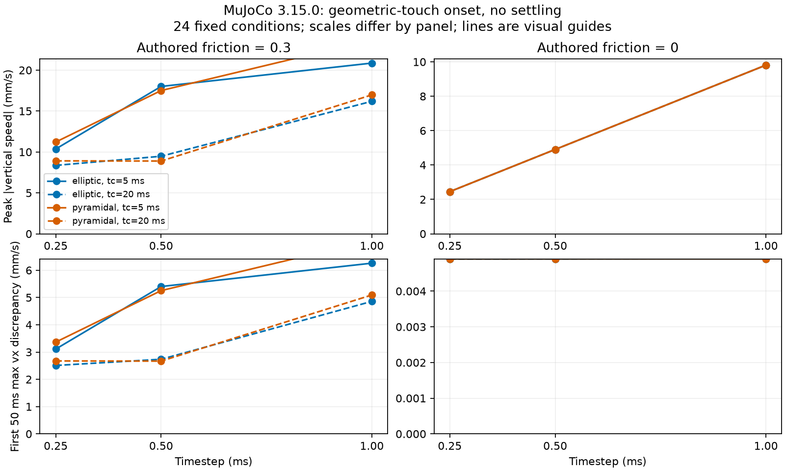

# 接触起始：摩擦锥与时间常数对照

[English](CONE_PROTOCOL.md) | [简体中文](CONE_PROTOCOL.zh-CN.md)

**已执行：24 个固定配置＋2 次精确重复；26/26 数据有效，26/26 通过原有平面接触工程检查。** 本实验属于 MuJoCo 开发对照，不是 Manda 复现，也不是跨引擎物性比较。[前瞻登记](https://github.com/huangkiki/Dexlab/issues/10#issuecomment-6018191256)与[冻结矩阵](../../benchmarks/contact-cone-timeconst-v1.json)保留。

## 问题与固定条件

同一引擎中，摩擦锥和接触时间常数的变化是否影响接触起始瞬态？固定新建 0.2 kg、40 mm 立方体，重力 9.81 m/s²、初始水平速度 0.25 m/s。从几何刚好接触开始，竖直及角速度为零，不做静置预热；没有驱动器或运行中位姿覆盖。这是非平衡接触起始，不是稳态滑动。

elliptic/pyramidal × 时间常数 5/20 ms × 步长 1/0.5/0.25 ms × 设定摩擦 0.3/0，共 24 个配置，各运行 0.5 s；再分别精确重复摩擦 0.3、步长 1 ms、时间常数 5 ms 的两个锥配置。固定阻尼比 1、solimp=[0.95,0.99,0.001,0.5,2]、Euler/Newton、100 次迭代、容差 1e-10。单工作进程，预算 600 s、硬截止 660 s；结果出来后未增加样本或调参。

[官方参数说明](https://mujoco.readthedocs.io/en/stable/modeling.html#solver-parameters)说明了接触响应与积分设置的区别。这里两个时间常数均大于 2dt；修改时间常数会改变接触刚度/阻尼响应，不能仅作为数值误差细化。设定摩擦为零时仍保留原生摩擦下限。

## 结果与结论



纵轴从零开始，不同面板量程不同；连线只是三个已测步长的视觉引导，不代表收敛阶。图中不重复绘制两次重复运行，但[完整 CSV](evidence/cone-timeconst/cone-results.csv)与[独立评分](evidence/cone-timeconst/cone-results.json)保留全部 26 次记录。

| 观察项 | 实测结果 | 能说明什么 |
|---|---|---|
| 数据有效／工程检查通过 | 26/26／26/26 | 本夹具通过原有限值，不等于材料准确 |
| 重复状态数组完全一致 | 2/2 | 两个固定设置的可重复性，不是总体统计 |
| 摩擦 0.3：最大竖直速度绝对值 | 8.360–23.682 mm/s | 通过验收的配置仍有明显瞬态差异 |
| 摩擦 0.3：前 50 ms 最大水平速度偏差 | 2.508–7.104 mm/s | 相对有条件的刚性库仑参照的差异 |
| 设定零摩擦：同一水平速度偏差 | 0.004903–0.004917 mm/s | 负对照很小但非零，保留原生摩擦下限 |
| 换锥：pyramidal 减 elliptic 的最大竖直速度差 | −0.583 至 +2.819 mm/s | 符号随匹配配置变化，没有统一胜出的锥 |
| 时间常数 20 减 5 ms：最大竖直速度差 | −8.614 至 0 mm/s | 本有限矩阵中下降或不变，不是通用调参法则 |

12 对摩擦锥对照和 12 对时间常数对照保持其余已声明因素一致。零摩擦组的最大竖直速度在这些设置中等于 g·dt（2.4525、4.905、9.81 mm/s），其中包含几何接触起始的首步重力作用，不能当成静置后滑动不稳定。CSV 同时给出前 10 ms 的法向冲量减去重力冲量，其符号也依赖配置。诊断指标没有替换或放宽原工程验收标准。

**研究决策：** 先分离求解器／接触配置，再归因于引擎。粗粒度任务验收通过，仍可能存在配置敏感性。不选“最优锥”、不宣称渐近收敛、不与 Genesis 合并排名，也不把时间常数调整称为共同物性标定。[验收审计](CONCLUSIONS.zh-CN.md)中的共同材料响应与卸载修复仍未完成。

## 验证与复现

新增可选摩擦锥参数已读回实际编译设置，默认仍为 elliptic。7 项针对性测试覆盖编译选项和合成负例：缺行／缺案例、修改设置／XML、同步注入力、哈希和重复不一致。合成测试不是新增物理实验。独立进程从原始记录重新评分，与原结果完全一致。执行前通过官方 wheel／最新稳定版 MuJoCo 3.15.0 准入。整个受限流程耗时 152.713 s，包含准入与测试，不是纯物理测速。单进程强制上限 16 GiB、2 核等效 CPU、128 进程／线程、禁用 swap、660 s 截止；未发生 memory-high 或 OOM 事件。

在已安装源码环境、官方 MuJoCo 3.15.0、`DEXLAB_MUJOCO_PROFILE=qualification-3.15.0` 下，放入[资源限制流程](../../docs/autoresearch.zh-CN.md)执行：

```bash
python -m dexlab.contact_cone_run /path/to/new-study
python -m dexlab.contact_cone_run /path/to/study --verify
python scripts/report_contact_cone.py /path/to/study /path/to/report
```

后两个命令只读取归档，不重跑动力学。保留 XML、原生参数读回、每步状态／力／接触／警告、源码快照与哈希。冻结协议 SHA-256 为 `11833036123c60de572cfd8e6325d0b181328f33a19250430f42d3985f906a52`。没有修改官方引擎、放宽阈值或看结果后重新调参。本结果是接触起始微基准，不是抓取成功或真机验证。
