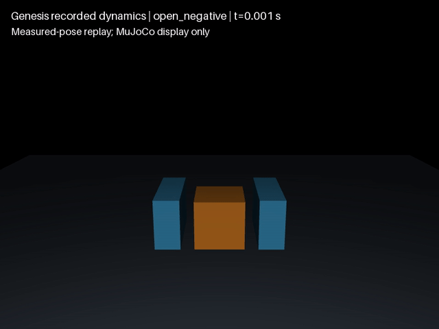

# Genesis 基础几何夹持与释放

[English](GENESIS_PINCH.md)

**开发工况通过当前判据，但不是完整后端资格。** 官方 Genesis 1.4.3、CPU FP64、椭圆摩擦锥、0.5 ms 步长下，动态三关节夹具夹起自由方块并释放。两次重置轨迹完全一致；两次张指负对照始终留桌。这不是成功率统计、苹果梗 SDF、GPU 或真机结果。


完整轨迹对照：步长与接触参数均有差别，不能将两条曲线直接解释成单因素因果比较。

## 问题、参数和标准

原配置保持正常，但释放落桌的峰值穿透为 3.902 mm。不能只看夹起高度或剪掉落桌片段。

方块边长 40 mm、质量 0.064 kg，摩擦 0.5，重力 9.81 m/s²；夹具质量 1/0.1/0.1 kg，附加惯量显式清零。三个移动关节 PD 增益为 1000/500/500 与 50/20/20，力限 ±50/10/10 N。控制是显式脚本先验；每步记录实际位置、速度、姿态及接触力。物体无附着或直接驱动。

0–0.5 s 闭合，1–2 s 抬升，2–3 s 验收保持，3.2 s 张指，3.8–4 s 验收落桌。主配置检查全部 8000 步，不抽帧。

- 全程原生穿透及独立方块—桌面穿透 ≤1 mm，沿用 `contact_pinch.py` 工程标准，不代表硬件容差。
- 保持中心高度 ≥60 mm，两指均有力，无其他支撑超过 0.01 N。
- 释放窗口中心高度 ≤30 mm，手指接触力 ≤0.01 N；张指负例全程高度 ≤30 mm。
- 接触力汇总与原生合力误差 ≤1e-8 N；逐步动量残差除以重量冲量 ≤5%。
- 参数和实际初态单独核验；重复运行要求实际轨迹完全一致。这只说明本次同环境重置复现。

独立几何检查仅覆盖方块与桌平面；指垫穿透仍采用原生接触深度，不宣称独立全表面验证。

## 诊断与全部步长结果

独立落体固定中心高度 85 mm，3 个步长 × 3 个时间常数 × 2 次重置，共18条轨迹，排除了夹爪才能触发的问题。几何 `get_sol_params()` 返回存储值；原生 `collider/contact.py` 对两侧参数取均值，然后将时间常数下限限制为两倍子步长。因此读回 2 ms 不保证接触实际使用 2 ms。该解释来自源码，不冒充接触内部参数实测。

修复仅将桌面与方块几何时间常数设为 2 ms，三个关节读回仍为 10 ms；指垫保持默认，因此指垫—方块的混合值与桌面—方块不同。

| 步长 | 修复后全程原生峰值穿透 | 独立桌面峰值 | 1 mm 判据 |
|---|---:|---:|---|
| 1 ms | 0.044 mm | 0.032 mm | 通过 |
| 0.5 ms | 0.665 mm | 0.665 mm | 通过 |
| 0.25 ms | 0.758 mm | 0.758 mm | 通过 |

**不宣称数值收敛。** 1 ms 的峰值明显受采样影响。此前全局时间常数 10 ms、步长 2/1/0.5 ms 的峰值为 3.902/3.364/3.981 mm；全局 4 ms 为 1.849/0.940/1.555 mm，只有一项通过，不能挑选它宣布修复。所有这些都是开发工况，不是未见测试集。

主配置两次夹持的保持最低高度均为 83.701 mm，释放高度 ≤19.999 mm，力汇总误差 0，最大动量残差重量比 2.61e-9；张指负例没有被夹具带起。[完整评分](../../docs/evidence/genesis-pinch-score.json)。

## 复现与边界

使用已有 [Genesis 环境](GENESIS_CONE.zh-CN.md)，通过资源准入后：

```bash
python -m dexlab.genesis_pinch_probe /path/to/new-run --dt 0.0005
python -m dexlab.genesis_pinch_score /path/to/new-run
```

拒绝覆盖输出；源码哈希、模型、参数读回及每步原始轨迹保留。评分器不加载引擎。原始证据已随 v0.31.0 发布。

#42 仍需剩余能力与误差/成本验收；当前不覆盖苹果形状、接触全表面参考、真实摩擦标定或学习控制。


## 连续实测状态回放

| 夹持、保持与释放 | 张指负对照 |
|---|---|
|  |  |

[夹持 MP4](media/genesis-pinch.mp4) · [负对照 MP4](media/genesis-open_negative.mp4) · [夹持来源](media/genesis-pinch.json) · [负对照来源](media/genesis-open_negative.json)

原始记录已随 [v0.31.0](https://github.com/huangkiki/Dexlab/releases/tag/v0.31.0) 发布。这里回放其中第 0 次实测轨迹，**不是重新运行 MuJoCo 物理得到的结果**。显示使用实际关节位置、物体位置与标量在前的四元数，不使用控制目标替代状态。夹爪直接采用记录中的 XML；方块与平面保持相同基础几何。相机固定，不跟随物体。闭合、抬升、保持、张开、落桌全过程无剪切、无插值或平滑。第 1 次重置重复仍保留在原始数据与评分中。

121 帧从第一个物理步后 0.0005 s 覆盖到 4.0 s；30 fps 编码时长为 4.033 s。清单逐帧记录准确采样索引和仿真时刻。时间降采样不能显示所有瞬态冲击，也不能证明无穿透；应查看完整逐步曲线与独立评分。MuJoCo 仅进行前向运动学显示，不推进动力学。清单单独记录渲染编码墙钟耗时，不能当作 Genesis 仿真耗时。源码、模型、输入与媒体均记录哈希，不代表真机或视觉策略能力。

```bash
python scripts/render_genesis_pinch.py /path/to/raw/pinch-0.json /path/to/raw/gripper.xml /path/to/new-replay
```

使用标准渲染依赖及 EGL，并遵守资源和 IO 互斥规则。输出目录不得已存在；缺失物理步或非法姿态会被拒绝。GPU 隔离、容量与同步阶段耗时见 [GPU 报告](GENESIS_GPU.zh-CN.md)。#42 剩余能力及误差/成本验收仍未完成。
