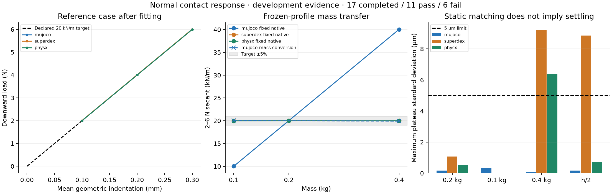

# Normal contact response

[English](NORMAL_RESPONSE.md) | [简体中文](NORMAL_RESPONSE.zh-CN.md)

**Matching a static response does not establish matching material dynamics.** This development protocol makes that distinction measurable with official MuJoCo 3.11.0, SuperDex 1.0.0 FP64 and PhysX/Isaac Sim 5.1. No engine source or binary is modified. PhysX uses a disclosed local UniSim adapter extension for native compliant contact.



## Protocol and parameter provenance

A 40 mm, frictionless cube begins at rest, touching a horizontal plane. Each native physics step receives a prescribed vertical COM force: gravity compensation minus a downward load of **2, 4, 6 and −1 N**, each lasting 0.2 s. Negative load releases the cube upwards. No position servo, attachment or runtime pose write is used. Reference mass is 0.2 kg and timestep 0.5 ms.

The declared engineering target is **20 kN/m**, giving 0.1/0.2/0.3 mm geometric indentation. This is a synthetic response specification, not a measurement of Wuji skin, apple material or a real pad. The final 50 ms of each load stage supplies means and standard deviations. Only the 2/6 N endpoints supply the fit; 4 N, masses 0.1/0.4 kg and timestep 0.25 ms validate prescribed profiles. These are development transfer checks, not random held-out trials.

Frozen checks include 5% load/response error, 5 μm plateau standard deviation, 1 mm maximum penetration, momentum residual below 5% of weight, no tension, limited orientation/lateral motion, and complete separation/zero contact force after release. Transient penetration and momentum include **every step**. Limits were written before the candidate runs and were not relaxed.

| Native profile | Parameters and interpretation |
|---|---|
| MuJoCo | Constant impedance `solimp=[0.9,0.9,0.001,0.5,2]`; initial direct `solref=[-10000,-100]`. A 2–6 N secant of 80,003.75 N/m yields fitted stiffness magnitude `10000 × 20000 / 80003.75 ≈ 2499.883`; damping remains 100. Exact values are in the suite. |
| SuperDex | Penalty coefficient 12,500,000; threshold 1 μm; smoothing half-distance 0.5 μm; normal viscous damping 0. The coefficient was selected from the cube face area and target slope; native integration determines the measured response. This is not a transferable Young's modulus. |
| PhysX | Native force-based compliant contact: **5,000 N/m and 2 N·s/m per contact constraint**, average combination, acceleration spring disabled. Four face contacts motivate the initial whole-cube target; measured force and indentation validate it. TGS 8/2, contact offset 0.1 mm, rest offset zero. |

MuJoCo's direct contact reference specifies constraint acceleration and depends on impedance/inertia; it is not a force spring in N/m. PhysX's force spring acts per native contact constraint, so changing contact count/locations can change the macroscopic response. See the [MuJoCo model documentation](https://mujoco.readthedocs.io/en/latest/modeling.html#solver-parameters) and [PhysX compliant-contact documentation](https://nvidia-omniverse.github.io/PhysX/physx/5.4.0/docs/RigidBodyDynamics.html#compliant-contacts). Installed SDK schema support and native execution, rather than documentation alone, qualified this adapter path.

Before transfer runs, a separate MuJoCo conversion was declared: multiply **both** direct `solref` components by `0.2 / mass`. This is an explicit conversion for this fixed, constant-impedance cube/plane fixture, not a general contact-material mapping. Fixed-native and converted outcomes are both retained; validation outputs were not used to retune them.

## Results and failures

All **17 experiments completed: 11 passed all checks, 6 failed**. These are heterogeneous development checks, not independent Bernoulli trials or an engine ranking; no success-rate confidence interval is attached. The [complete report](evidence/normal-response-v1.json) records every outcome.

- The initial MuJoCo profile failed the response target. Its fitted reference and half-timestep cases passed. With fixed native parameters, 0.1/0.4 kg produced about **10.01/40.04 kN/m** and failed. The predeclared mass conversion produced **20.04/19.93 kN/m**, both passing.
- SuperDex matched the static slope but failed settling for 0.4 kg and the half-timestep case: maximum plateau standard deviations **9.23 and 8.85 μm**, above 5 μm. Less integration damping at a smaller step is a hypothesis, not an established root cause. No damping retune was applied to these validation results.
- PhysX matched the static slope but its 0.4 kg run had **6.39 μm** plateau fluctuation. It also failed the unchanged native-inertia check: imported diagonal inertia `0.00010666700109140947` versus declared `0.00010666666666666668 kg·m²` exceeds the existing 3 ppm tolerance. The source MJCF retains full precision; the rounded native import is preserved for investigation, not relabeled as exact.

The normal-contact values are archived alongside native observations. PhysX compliant parameters are read back from composed USD bindings before reset; this is **not direct native material-tensor readback**. Native forces, motion, mass/inertia, worker exit, contact ledger and source/artifact hashes are checked separately. Static matching does not qualify damping, friction, SDF contact geometry, grasp robustness or hardware accuracy. Those remain in [Issue #10](https://github.com/huangkiki/Dexlab/issues/10).

## Reproduce

Use the repository environment; PhysX also needs `scripts/setup_physx.sh` and its documented SDK requirements. The setup uses a separate `UniSim-physx-compliance` checkout, preserving prior adapter checkouts. The public matrix fixes every candidate and includes the initial and transferred failures; it performs no online tuning.

```bash
.venv/bin/python demos/contact-benchmark/normal_response.py run runs/normal-response \
  --suite benchmarks/contact-normal-v1.json
.venv/bin/python demos/contact-benchmark/normal_response.py verify runs/normal-response
.venv/bin/python demos/contact-benchmark/plot_normal_response.py \
  runs/normal-response/report.json --output runs/normal-response/response.png
```

An individual force protocol uses `python -m dexlab.contact_indent_run --protocol normal-load --engine mujoco --normal-parameters profile.json --output runs/normal-one`. The profile uses the native field names in the table. Existing indentation/sliding defaults are retained.

The release evidence archive contains the exact suite, all raw arrays and contact ledgers, native and source snapshots, receipt hashes, offline scorer and plot script. `verify` exits zero only when all published outcomes are reproduced, **including physical failures**. Runtime failures remain distinct. Runs shared a machine with the apple batch, so timings are not isolated performance measurements.

Current setup uses `UniSim-physx-precision`: the follow-up [transient study](TRANSIENT_RESPONSE.md) corrects inertial export rounding without changing physics tolerances. The v0.13 historical archive remains immutable; use tag v0.13.0 to rerun its original adapter. New runs may pass the inertia check while retaining the settling failure.
