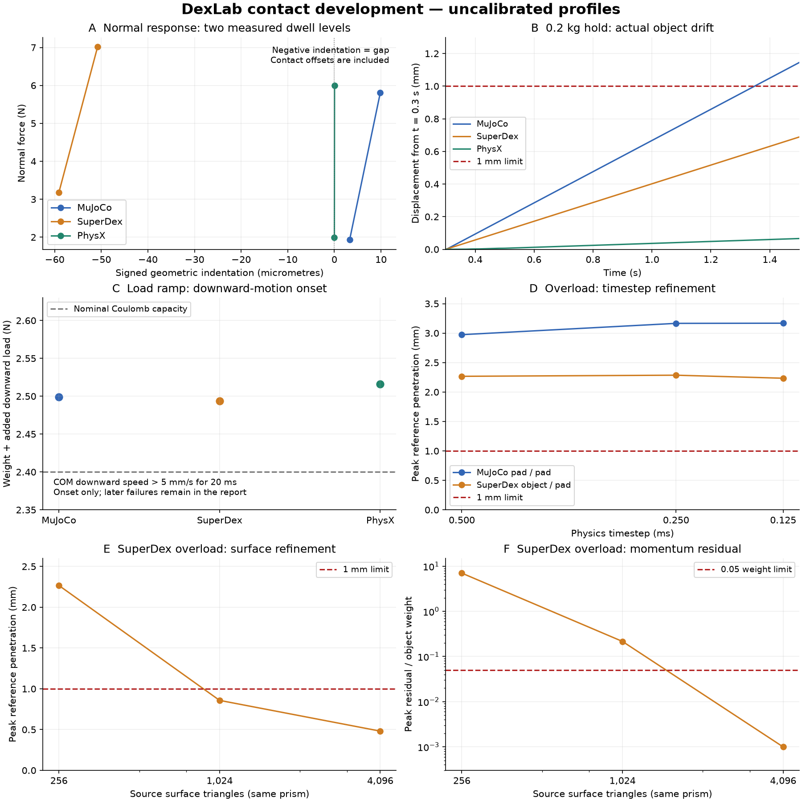

# 接触力学开发实验

[简体中文](README.zh-CN.md) | [English](README.md)

三个 UniLab 任务分别测量平面滑动、法向压入/卸载、双指夹圆柱的载荷变化与释放。MuJoCo 3.11.0、SuperDex 1.0.0 FP64 使用官方原生 API；PhysX 使用已验证的 UniSim/Isaac Sim 5.1 适配器。没有修改引擎源码或二进制。

**当前是未校准的开发实验，不是正式留出结果或引擎精度排名。** 原始失败保留；材料响应校准、正式测试集和隔离运行的速度—误差研究仍属于 [Issue #10](https://github.com/huangkiki/Dexlab/issues/10)。



## 实验与结果

| 开发实验 | MuJoCo | SuperDex | PhysX |
|---|---:|---:|---:|
| 静置、正/反向滑动、零摩擦 | 4/4 | 4/4 | 4/4 |
| 压入与完全卸载 | 1/1 | 1/1 | 1/1 |
| 原始圆柱表面：保持、过载、零摩擦、加载斜坡、最后释放 | 0/4 | 1/4 | 4/4 |
| 细分圆柱表面（4,096 个三角形）：同样四种条件 | — | 4/4 | — |

这是不同物理检查的计数，不合成为任务成功率。另保留 4 次步长细化、1 次迭代上限、1 次中间网格与 1 次材料读数复核；前六次失败，材料读数复核通过。全部 **38 次已完成实验中 25 次通过、13 次失败**；[逐次结果](evidence/development-v2.json)包含旧评分、新增离线复核、源码/运行哈希及耗时。38 次不是独立随机试验，不计算二项成功率区间。

- **MuJoCo 保持**：0.2 kg 圆柱漂移 1.145 mm，超过原定 1 mm 上限。过载等负对照确实滑落并最终自由落体，但两指在物体离开后继续受力闭合，发生 2.70–3.26 mm 的指腹间穿透，完整实验失败。夹具没有行程限位；该行为属于当前公开的夹具边界，不能从评分中删除。
- **SuperDex 边缘接触**：负对照滑出指腹下缘时，物体穿透为 1.38–2.27 mm，瞬时线动量残差为重力的 0.84–7.04 倍。过载中峰值与 `STOPPED` 状态相伴；将步长从 0.5 ms 减至 0.25/0.125 ms，或把非线性迭代上限从 100 提至 400，均未消除失败。这是观测到的数值问题，不是已确认的引擎根因。
- **PhysX**：四种圆柱条件通过。最大参考表面穿透 0.5275 mm 出现在最初 6 ms 接近阶段，未从统计剔除。该结果不能证明真实指腹材料更准确。

**表面离散实验**：保持正棱柱表面、质量/惯量、力命令、0.5 ms 步长、100 次迭代上限及评分阈值不变，只把每个平面三角形细分。过载的三角形数 256 → 1,024 → 4,096，对应峰值穿透 2.267 → 0.858 → 0.481 mm，动量残差/重力 7.036 → 0.216 → 0.000993。中间分辨率仍失败；最高分辨率的保持、过载、零摩擦和加载斜坡全部通过。默认仍保留原始配置，细化案例单独命名；这表明本例对表面离散敏感，不能推广为任意场景已解决。

三者的加载斜坡在约 2.499、2.493、2.516 N 总向下载荷时触发运动检测。检测定义为质心向下速度超过 5 mm/s 并持续 20 ms；它包含瞬态与检测延迟，不是精确的静摩擦极限。

## 物理与控制约定

- 平面任务：边长 40 mm、质量 0.2 kg 的方块，静置 0.2 s 后测量 0.5 s。无外部运行时驱动；仅在测量开始赋予声明的初速度。解析参照假设水平、无翻滚、库仑摩擦且没有其他耗散。
- 压入任务：同一方块，零摩擦，以实际高度/速度反馈施加竖直质心力，控制周期 1 ms、限幅 40 N，依次接近、两档加载和卸载。报告实际几何压入量及接触力；接触偏移也会改变曲线，不能把割线斜率当作指腹材料模量。
- 圆柱任务：半径 10 mm、半高 30 mm 的 **64 边正棱柱近似**，最大径向离散误差约 12.05 μm；不是 SDF 或胶囊替代。每侧指腹 0.1 kg，平移关节只允许 x 方向运动，原生位姿逐步读取。物体为自由刚体，只有前 0.3 s 显式补偿重力用于准备。
- 每指外加法向力 4 N，实际接触法向载荷独立检查。名义摩擦 0.3，正常质量 0.2 kg，过载质量 0.4 kg；零摩擦与 0–4 N 附加载荷斜坡另列。1.5 s 开始向外驱动/制动并撤力；没有物体附着或运行时位姿重写。
- 基线步长 0.5 ms。细化时控制周期仍为 1 ms，命令零阶保持。MuJoCo 的软约束、SuperDex 的平滑罚力、PhysX TGS 分别使用原生配置；相同摩擦数值不表示完整响应已等价。

## 测量和证据边界

共同参考几何用正棱柱与有向盒的分离轴计算重叠，同时检查物体—指腹和指腹—指腹。原生接触距离、原生烘焙表面与该参考几何不是同一测量，尚未证明所有烘焙细节等价。

保存实际位姿/速度、命令力、法向/总接触力、完整原生接触记录、收敛状态、源码快照和哈希。离线验收核对接触力账目、线动量、实际质量/惯量、所记录的摩擦参数、PhysX 退出记录及运行前源码哈希。旧 SuperDex 记录主要读取物体摩擦；新运行同时读取物体和全部指腹/平面摩擦，并复核法向分量与原生法向/总力相容。接触组合规则和全部烘焙参数仍需进一步覆盖。接触记录使用无损 gzip，兼容旧 JSON。

新增切向速度诊断用 `v + ω × r` 在原生接触位置计算两刚体的相对运动，再投影到切平面。使用实际积分后状态；MuJoCo 接触位置/法向来自刚完成的求解，可能相差一个物理步。记录缺失为未知，无载接触不记为零滑移；不跨帧跟踪接触 ID，不报告材料点累计滑移。PhysX 法向接触与摩擦锚点分别保留，不强行一一配对。

这些实验与另一个苹果批次在同机运行。当前耗时包含步进、观测与 IPC，仅作记录；没有隔离性能结论。PhysX 没有原生收敛残差或时钟读回，时间来自同步完成的步数。缺失量不填成零。历史适配器构造/查询错误及首次圆柱传感器初始化失败仍保存在开发原始目录，未计入上表已完成物理实验。

## 运行与复核

先完成仓库[安装](../../docs/installation.zh-CN.md)。PhysX 还需要[适配器及 Isaac Sim 环境](../physx-contact/README.zh-CN.md)。命令在仓库根目录执行；每次使用新输出目录。

```bash
.venv/bin/python -m dexlab.contact_plane_native --engine mujoco \
  --case demos/contact-benchmark/cases/dev-slide.json --output runs/contact-plane
.venv/bin/python -m dexlab.contact_indent_run --engine superdex \
  --case demos/contact-benchmark/cases/dev-indent.json --output runs/contact-indent
.venv/bin/python -m dexlab.contact_pinch_run --engine physx \
  --case demos/contact-benchmark/cases/dev-cylinder-overload.json --output runs/contact-cylinder
.venv/bin/python -m dexlab.contact_pinch_run --verify runs/contact-cylinder
```

`--engine` 可替换为三个后端；其他控制条件见 [cases](cases)。对应任务为 `DexLab-ContactPlane-v0`、`DexLab-ContactIndent-v0`、`DexLab-ContactCylinder-v0`。目前只接受 `dev-` 案例，防止把尚未冻结的配置当作正式测试。

退出码 1 可表示物理检查失败，先读 `summary.json` 和 `run.json` 区分运行错误。汇总报告不能代替完整原始数组/接触记录进行重评分。新增实现通过 207 项项目单元测试；发布流程另要求当前源码的两条完整 14 s 抓梗回归。

## 离线复核发布证据

[v0.12.0 原始记录包](https://github.com/huangkiki/Dexlab/releases/download/v0.12.0/v0.12.0-contact-development-evidence.tar.gz) 包含全部 38 次完整运行及 3 次初始化失败、原生与源码快照、逐文件哈希和绘图脚本（136,594,576 字节）。使用对应 DexLab 版本及已安装的 Python 环境；重评分不启动引擎，不需要 Isaac Sim。

```bash
gh release download v0.12.0 --repo huangkiki/Dexlab \
  --pattern v0.12.0-contact-development-evidence.tar.gz --dir runs/contact-evidence-v012
tar -xzf runs/contact-evidence-v012/v0.12.0-contact-development-evidence.tar.gz \
  -C runs/contact-evidence-v012
.venv/bin/python demos/contact-benchmark/rescore_results.py runs/contact-evidence-v012
.venv/bin/python demos/contact-benchmark/plot_results.py runs/contact-evidence-v012 \
  --output runs/contact-evidence-v012/development.png
```

压缩包 SHA-256：`5a836c146ed5b726d29f60813322e68e4cb03a1ba7f9c8f301c379ec4e003279`。批量复核命令仅在所有记录的评分完全复现时返回零，包含原有的 13 次物理失败；它不会把这些失败重新判成物理通过。
