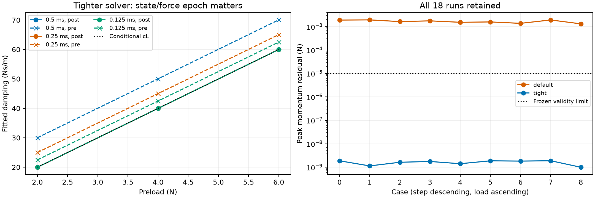

# 原生切线辨识——预注册开发协议

[English](TANGENT_IDENTIFICATION.md) | [简体中文](TANGENT_IDENTIFICATION.zh-CN.md)

本合成 BOX/PLANE 工况检验 [条件关系 D=cL](DAMPING_REFERENCE.zh-CN.md)，不是真机标定或引擎排名。
18组原生记录均已完成；协议和工程容差在各批执行前冻结。

- 官方 SuperDex 1.0.0 FP64，沿用后向欧拉适配，不修改引擎。
- 边长40 mm、质量0.2 kg、重力9.81 m/s²、零摩擦；罚系数12,500,000，
  阈值1 µm、平滑半距0.5 µm，两参与体法向阻尼均为10 s/m。
- 9个全新场景：预载荷2/4/6 N，步长0.5/0.25/0.125 ms；按步长递减、载荷递增执行。
  不挑选随机种子，不重跑失败以替换结果。
- 每场景0.4 s稳定、0.4 s拟合、0.4 s小幅验证。世界质心施力并补偿重力。
  叠加20和35 Hz正弦，每个分量幅值在拟合窗为预载荷2%，验证窗为1%；均含整数周期。
  验证窗延续状态，不是独立重复，不给总体置信区间。
- 拟合 Fz=截距+K×深度+D×向内速度。预测变量中心化、标准化，条件数须≤20且秩为3。
  步前、步后状态分别报告；步后是后向欧拉假设，不事后挑选拟合更好的时序。
  接触力在已求解步后读取，内部线性化时序不可直接观测。
- 稳定末0.1 s速度≤10 µm/s、高度标准差≤1 µm、平均支撑误差≤1%。
  激励段接触持续且数量固定，仅法向平移；总力与接触力求和误差≤1e-7 N，
  每步动量残差≤1e-5 N。原生收敛标志不能替代数据验收。
- 拟合与预测RMS上限为各自单个激励分量幅值的5%；条件阻尼相对10L参考误差≤10%，
  振幅敏感性同样限于参考的10%。它们是预设数值诊断容差，不是实测材料不确定度。
  无效数据与假设不成立都保留并报告。
- 小步长结果只说明敏感性，不证明收敛。拟合系数含离散化与几何效应，
  内部接触参数组合、截断和平滑尚不可观测。

在配置好的硬资源限制内运行：

```bash
python -m dexlab.contact_tangent_run OUTPUT
```

保留全部位姿、速度、接触力账本、原生参数/求解器读回、源码哈希及失败。
耗时含观测与写文件，不作独立求解器测速比较。

## 求解器受控后续实验

默认求解器9组均未达到固定1e-5 N动量残差上限（实测0.00131–0.00194 N）。
原生绝对/相对容差读回为0.001/1e-6，全部失败保留。第二批预注册实验仅将两项
求解器容差收紧到1e-9/1e-9，迭代上限仍为100；使用 `--tight-solver`。
物理参数、激励序列与验收阈值保持不变。

## 结果与解释

**默认求解器0/9数据有效，高精度求解器9/9有效**。两批物理输入、初态、原生几何及
参与体/求解器读回已逐对核对，仅声明的两项求解容差不同。全部工况从原始接触记录和
状态数组重新评分。峰值动量残差从0.001312–0.001939 N降到9.91e-10–1.88e-9 N，
固定1e-5 N门禁没有放宽。这支持求解终止精度是第一批不一致的受控影响因素，
不能泛化成默认设置在其他任务上均不可靠。

9组有效数据的步后局部拟合、小幅预测和条件cL比较均达到原定阈值；2/4/6 N下
阻尼接近20/40/60 Ns/m。若配给步前状态，步长0.125/0.25/0.5 ms下拟合阻尼
分别约增大2.5/5/10 Ns/m。**状态与力的时序不匹配可能表现成材料阻尼差异。**
两种时序及全部拒收结果一并公开。



| Preload / 预载荷 (N) | Step / 步长 (ms) | K (N/m) | D (Ns/m) | Prediction RMS / 预测RMS (N) |
|---|---|---|---|---|
| 2 | 0.5 | 19999.853 | 19.98825 | 0.00007547 |
| 4 | 0.5 | 19998.972 | 39.98297 | 0.00022888 |
| 6 | 0.5 | 19997.629 | 59.98624 | 0.00039416 |
| 2 | 0.25 | 19999.902 | 19.98509 | 0.00007850 |
| 4 | 0.25 | 19999.107 | 39.97798 | 0.00023685 |
| 6 | 0.25 | 19997.805 | 59.97936 | 0.00040630 |
| 2 | 0.125 | 19999.914 | 19.98318 | 0.00008042 |
| 4 | 0.125 | 19999.167 | 39.97539 | 0.00024156 |
| 6 | 0.125 | 19997.889 | 59.97581 | 0.00041325 |

这些数据支持本工况下的条件载荷相关局部阻尼律，不能证明全轨迹等价、材料物理准确，
也不代表之前的卸载负力已经修复。完整共同材料标定和真机参照仍未完成。三个步长
仅作敏感性证据，不作渐近收敛结论；不为人工指定的确定性工况伪造总体置信区间。

## 离线复现

[v0.35.0原始归档](https://github.com/huangkiki/Dexlab/releases/download/v0.35.0/contact-tangent-evidence-v1.tar.gz)含两批全部记录和9组拒收结果。
仓库内有[逐工况汇总](../../docs/evidence/tangent-identification-v1.json)和图表脚本。解压后：

```bash
python -m dexlab.contact_tangent_verify tight/study/load-2-dt-500us
python demos/contact-benchmark/tangent_report.py default/study tight/study --output OUTPUT
```

独立复核重新读取接触记录、核对归档哈希、重建逐步力/数量/状态并检查动量。
默认容差批次应返回退出码1，表示未达门禁，不表示原始文件损坏或缺失。
