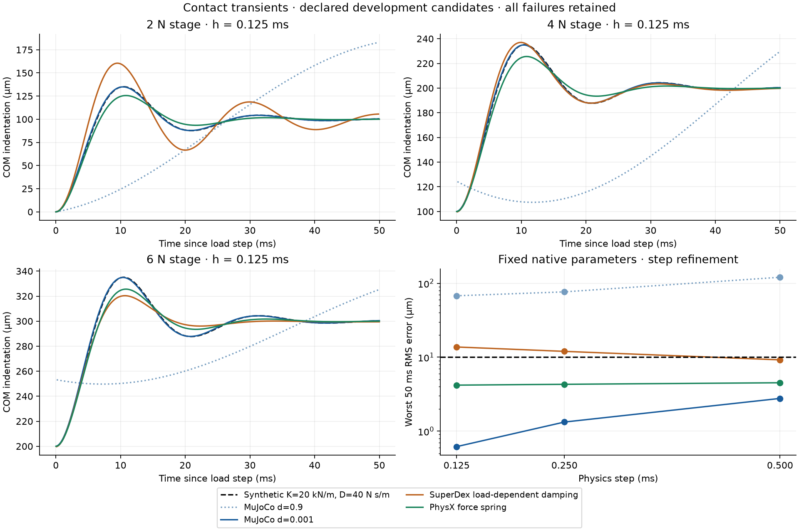

# Contact transients

[English](TRANSIENT_RESPONSE.md) | [简体中文](TRANSIENT_RESPONSE.zh-CN.md)

The [historical solver/version audit](../../docs/physx-solver-audit.md) separates native scene readbacks, source/report TGS profiles and missing fields; [P0 #126](https://github.com/huangkiki/Dexlab/issues/126) retains contemporaneous core/loaded-library identity gaps.

**Calibrate a response, then test its transfer. Matching a static indentation is insufficient.** This development comparison adds a declared damping target and timestep refinement to the normal-load fixture. Official MuJoCo 3.11.0, SuperDex 1.0.0 FP64 and PhysX/Isaac Sim 5.1 remain unmodified.



## Fixed experiment

The frictionless 40 mm cube has mass 0.2 kg. Prescribed COM forces produce downward loads of 2, 4, 6 and −1 N, each for 0.2 s. The last stage releases the cube. There is no position servo, attachment or runtime pose overwrite.

The positive-load reference is the exact solution of `m*x'' + D*x' + K*x = L`, starting from rest, with **K = 20,000 N/m and D = 40 N·s/m**. This is a synthetic Kelvin–Voigt engineering target, not measured Wuji skin or apple material. It is not used during detachment: a bilateral spring would introduce artificial adhesion.

Each load step adds 2 N, or 100 μm equilibrium indentation. The first 50 ms of each positive stage must have **RMS error <10 μm and peak error <25 μm**. No time, position or phase alignment is fitted. Whole-run native parameter, force-ledger, momentum, penetration, settling, no-tension and release checks remain unchanged. Passing the transient diagnostic alone is insufficient.

The [12-job matrix](../../benchmarks/contact-transient-v1.json), target and profiles were declared before execution. Four candidates each run at **0.5, 0.25 and 0.125 ms**, with unchanged native parameters. These are deterministic development checks, not held-out success trials; a binomial confidence interval or general engine ranking would be inappropriate.

## Parameter provenance

| Candidate | Declared mapping and limitation |
|---|---|
| MuJoCo, constant impedance d=0.9 | Direct `solref=[-2500,-5]`. For four symmetric face contacts, test the mapping `solref=−(1−d)/(4m) × [K,D]`. This is a fixture-specific hypothesis; reference-acceleration constraints do not become force springs simply by matching static stiffness. This is **not** the previous normal-v1 damping profile. |
| MuJoCo, d=0.001 | Same mapping gives `solref=[-24975,-49.95]`. All other fixture settings stay fixed. |
| SuperDex | Retain the normal-v1 penalty coefficient 12,500,000, threshold 1 μm and smoothing half-distance 0.5 μm. Set normal viscous coefficient **10 s/m**, motivated by `D / 4 N`. The installed official property documents damping proportional to elastic contact force times normal velocity; this is **not a constant 40 N·s/m damper**. |
| PhysX | Four face constraints motivate **5,000 N/m and 10 N·s/m per native constraint**, average material combination, acceleration spring disabled. TGS 8/2 and offsets remain unchanged. Composed USD parameter readback and actual motion/force checks are separate. |

The [MuJoCo solver documentation](https://mujoco.readthedocs.io/en/latest/modeling.html#solver-parameters) describes impedance and reference acceleration; [PhysX compliant contacts](https://nvidia-omniverse.github.io/PhysX/physx/5.4.0/docs/RigidBodyDynamics.html#compliant-contacts) describe force-spring semantics. The SuperDex wheel property's docstring is included in the evidence archive. No single numerical stiffness/damping field is assumed portable between these laws.

## Results, including failures

All **12 native runs completed**. Six passed both physical and transient checks; six failed. Seven passed the transient diagnostic, but one of those failed the physical no-tension requirement. The [complete report](evidence/transient-response-v1.json) retains all outcomes.

| Candidate | Worst transient RMS, h=0.5 / 0.25 / 0.125 ms | Combined checks |
|---|---|---|
| MuJoCo d=0.9 | 120.65 / 76.54 / 67.77 μm | 0/3; transient, settling and finite-window load response fail |
| MuJoCo d=0.001 | 2.77 / 1.33 / 0.62 μm | 3/3 |
| SuperDex load-dependent damping | 9.21 / 12.00 / 13.75 μm | 0/3; all fail no tension; two also fail transient RMS |
| PhysX force spring | 4.51 / 4.30 / 4.19 μm | 3/3; residual response error remains |

SuperDex's minimum measured upward-normal force during release was **−0.451 / −0.282 / −0.161 N**, near 0.6055 s. Those values are native contact-ledger sums, not inferred forces or evidence of a permanent attachment. Finer timesteps reduce that peak but do not remove the failed no-tension check. Its 4 N response is closer to the constant-damping target than its 2 N response; the load-dependent law must be considered before transfer. No post-validation damping retune or threshold relaxation was performed.

MuJoCo's lower impedance profile follows this target more closely; this says nothing about overall engine superiority. PhysX's small error reduction under refinement does not establish convergence to the exact target. Smaller timesteps alone cannot repair a mismatched contact law.

## Inertial export correction

The earlier 0.4 kg PhysX failure traced to `MjSpec.to_xml()` rounding compiled inertials before native import. A **local UniSim adapter fix** writes compiled mass, COM, principal inertia and its frame at 17 significant digits after serialization. It does not modify MuJoCo, PhysX or their numerical precision; geometry/joint serialization is outside its scope.

A separate repeat with the original normal-v1 parameters reads inertia **0.00010666666639735922 kg·m²**, versus declared 0.00010666666666666668. The unchanged 3 ppm check now passes. Plateau fluctuation remains **6.387 μm**, failing the unchanged 5 μm limit. Historical failed evidence is preserved. Adapter validation covers inferred, explicit rotated and full-tensor inertials; 1,350 tests pass with 92 optional skips, plus lint/type/package checks and exact 19-file patch replay.

## Reproduce and inspect cost

The repository environment and optional PhysX setup are required. Current `scripts/setup_physx.sh` uses the separate `UniSim-physx-precision` checkout. For the historical v0.13 adapter, use that immutable tag. Run into a fresh directory:

```bash
.venv/bin/python demos/contact-benchmark/normal_response.py run runs/contact-transients \
  --suite benchmarks/contact-transient-v1.json
.venv/bin/python demos/contact-benchmark/normal_response.py verify runs/contact-transients
.venv/bin/python demos/contact-benchmark/plot_transient_response.py runs/contact-transients \
  --output runs/contact-transients/response.png
```

`verify` checks the suite, native receipts, source/artifact hashes and every static/transient result. Zero means reproduced outcomes, including physical failures. The release archive includes all 12 runs, the separate inertia repeat, scorer, freeze receipt, parameter documentation and both languages.

For 0.8 s simulated time at h=0.125 ms, recorded step-plus-observation time was approximately 0.31 s (MuJoCo d=0.001), 0.78 s (SuperDex) and 16.43 s (PhysX subprocess path). Preparation time is separately recorded. These costs include different instrumentation/IPC paths and concurrent apple testing; they are **not isolated engine-throughput measurements**. Material/friction calibration, contact representation transfer, formal evaluation and controlled speed–error studies remain in [Issue #10](https://github.com/huangkiki/Dexlab/issues/10).
