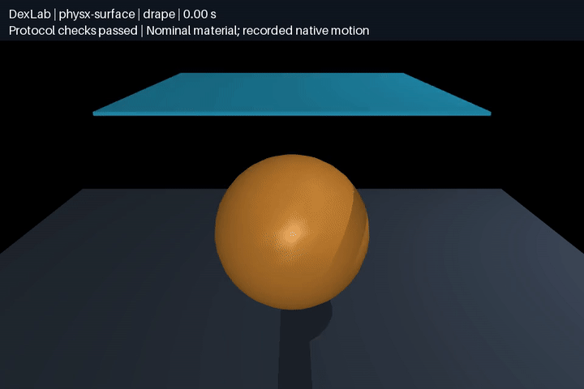
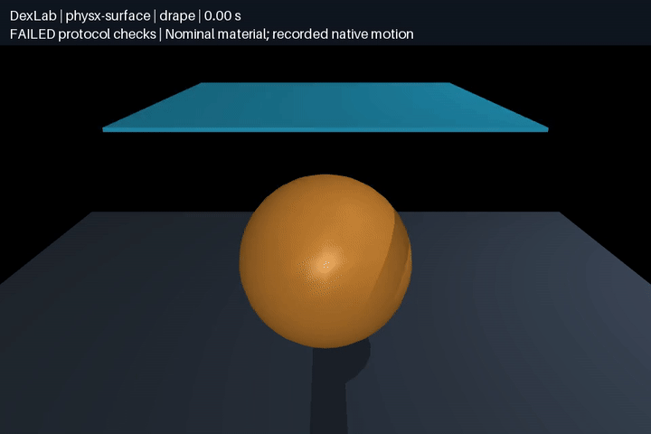

# Native PhysX surface cloth

[English](cloth.md) | [简体中文](cloth.zh-CN.md)

PhysX surface deformables run through the registered **UniLab `DexLab-Cloth-v0` task**, using the existing shared triangle mesh, case manifests and independent geometry scorer. The task owns a separate Isaac Sim scene; UniSim supplies worker-runtime discovery, not a built-in cloth adapter. Official PhysX and IsaacLab files remain unchanged.



[Video / 视频](media/cloth-drape.mp4) · [Provenance / 来源](media/cloth-drape.json)

## Reproduce

Install the [optional pinned Isaac Sim worker](README.md#setup-and-run) first. Run from the repository root:

```bash
.venv/bin/python -m dexlab.cloth_benchmark run \
  --solver physx-surface --case dev-sag --device cuda:0 --iterations 16 \
  --output demos/physx-contact/runs/my-cloth-sag
.venv/bin/python -m dexlab.cloth_benchmark verify \
  demos/physx-contact/runs/my-cloth-sag
.venv/bin/python demos/cloth-benchmark/src/render.py \
  demos/physx-contact/runs/my-cloth-sag
```

Set `UNISIM_ISAACSIM_HOME` when using a nondefault worker location. `dev-drape` uses a sphere and ground; `dev-folded-drop` requires `--suite benchmarks/cloth-self-contact-v1.json`. Each run records every 0.5 ms step for three seconds plus the actual initial state. Existing output directories are never overwritten. CPU execution is rejected.

The force-controlled `dev-extension` protocol is **unsupported**: the pinned surface tensor API has no per-node force upload. The runner rejects it before launching a worker and retains an `unsupported` record. It does not approximate the prescribed force by changing positions or velocities. The default seven-solver batch remains unchanged; request `--solver physx-surface --device cuda:0` explicitly to include this optional runtime.

## Representation and parameters

| Item | Definition |
|---|---|
| Geometry | Original triangle surface, native beta `OmniPhysicsSurfaceDeformableSimAPI`; no tetrahedral volume or particle-cloth substitution |
| Material | Young's modulus 20 kPa, Poisson ratio 0, thickness 0.5 mm, dynamic friction 0.5; nominal engineering inputs |
| Mass | Case areal density divided by thickness supplies material density; total mass also authored explicitly. Native nodal masses are not exposed by this tensor API |
| Boundary | Explicit vertex-to-fixed-world-anchor constraints for the pinned edge; free drop/drape have no attachments |
| Solver | 0.5 ms, 16 position iterations, self-collision and speculative CCD enabled; zero authored linear/elastic/bend damping and sleep/settling thresholds |
| Collision offsets | Surface rest offset equals case radius (default 1 mm); contact offset twice that radius |
| State | Native surface-node position and velocity tensors; node/element ordering and rest geometry are checked against the input |

Areal density/total mass are declared inputs, not independent native mass readback. Numerical material values do not imply equivalence to MuJoCo flex, Newton cloth or SuperDex shells. The 100 m/s native speed ceiling is reported and hitting it fails acceptance. Static friction is not claimed for deformables; the versioned [physics limitations](https://docs.omniverse.nvidia.com/kit/docs/omni_physics/107.3/dev_guide/guides/current_limitations.html) distinguish it from rigid-body friction.

SDK initialization may advance physics. The runner archives that warm-up state and restores the declared position and zero velocity **once before recording**. No node-state writes occur during the measured trajectory. The fixed edge uses a separate world anchor: attaching to an ancestor of the cloth did not constrain it in development. This failed freefall record is retained.

The isolated worker uses the official headless app configuration with unrelated IsaacLab RL/task extensions omitted in a separate generated file. Its source hash and BSD license accompany the archive. Shutdown clears the official simulation-context callback through its public lifecycle method before stopping; no SDK patch is used.

## Validation boundaries

The existing independent scorer checks every saved step for finite state, initial state, pins below 1 µm and obstacle penetration below 1.5 mm. Triangle-interior sphere distances and a separate sampled surface-crossing audit are reused unchanged. The latter samples at approximately 100 Hz, excludes vertex-sharing faces and does not prove continuous collision or finite-thickness non-overlap.

Native topology, raw-state/source hashes, full worker logs and successful stop acknowledgement/process exit are additional checks. The exact pinned SDK plugin-dependency warning is listed separately. Model setup without a complete scored trajectory is not acceptance. No hardware material accuracy or engine ranking is claimed.

Development runs and prior API, initialization and boundary failures are retained in the evidence index. This is passive cloth qualification, not robot cloth grasping or a folding policy. [Broader cloth benchmark](../cloth-benchmark/README.md) · [Issues #5](https://github.com/huangkiki/Dexlab/issues/5) / [#12](https://github.com/huangkiki/Dexlab/issues/12).

## Frozen experiment results

Pinned Isaac Sim 5.1.0.0 / IsaacLab 0.47.2 / PhysX 107.3 on RTX 4090. Existing scene manifests were used without held-out retuning. Results on the final source:

| Experiment set | Passed | Physics check failed | Unsupported |
|---|---:|---:|---:|
| Development, 4 cases | 3 | 0 | 1 |
| Held-out, 15 cases | 10 | 1 | 4 |
| Development timestep/mesh refinement, 9 runs | 8 | 1 | 0 |

All supported runs completed with clean shutdown, without runtime errors or timeouts. The four unsupported held-out cases prescribe external nodal forces. They are neither executed physics failures nor omitted from capability coverage.

Held-out `test-drape-03` has **two crossing pairs of nonadjacent triangles at 0.22 s**. The first batch with the same numerical configuration had 11 passes and four unsupported cases; the final repeat has 10 passes, one failure and four unsupported cases. Native engine metadata matches; intervening changes only formatted/reordered Python imports and renamed a retained tensor-owner variable. The discrepancy has no confirmed cause. Both batches are retained; the first does not establish repeatable success.

Refinement uses 0.25 ms, 0.125 ms and a 17×9 mesh (default 9×5) for sag, drape and folded drop. Refined-mesh drape has surface crossings; the other eight runs pass. This does not establish monotonic time or spatial convergence. Default development drape has **0.03676 mm** maximum sphere penetration and sag has **0.138 µm** maximum pin error. These are nominal numerical observations, not measured material accuracy.

[All per-case results and development failures](evidence/cloth-v1.json) · [Full raw evidence archive](https://github.com/huangkiki/Dexlab/releases/download/v0.11.0/v0.11.0-physx-cloth-evidence.tar.gz). The archive includes trajectories, source snapshots, native scenes, logs, early failures and a SHA-256 manifest. Offline rescoring does not launch Isaac Sim:

```bash
# Extract the archive into a separate directory, then score an included run
.venv/bin/python -m dexlab.cloth_benchmark verify \
  /path/to/extracted/demos/physx-contact/runs/cloth-test-final-v2/test-drape-03-physx-surface
```

This failing example must return a nonzero exit code. The GIF replays the complete 0–3 s trajectory from the first development batch at 25 fps; MuJoCo only draws recorded meshes without stepping physics. Host step timings include IPC and state readback, and other simulations ran concurrently. These are not isolated engine speed rankings.

## Failure replay



[Continuous failure video](media/cloth-drape-failure.mp4) · [Provenance](media/cloth-drape-failure.json). This is the complete `test-drape-03` recording, labeled as failed. Crossing times/counts come from independent scoring of raw states; 25 fps video cannot establish absence of intersections at every physics step.
