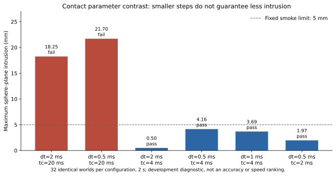

# Stable engine qualification

[English](engine-qualification.md) | [简体中文](engine-qualification.zh-CN.md)

Release metadata, successful import, device smoke, and full task qualification are different evidence stages. A compatible package combination does not qualify an apple or cloth scene.

## Frozen inventory

Official releases and PyPI metadata were checked on 2026-10-04 UTC (2026-10-05 local). MuJoCo 3.14.0, MuJoCo Warp 3.14.0 and Warp 1.17.0 are the isolated GPU probe candidates. The historical demo installer remains unchanged; its old results stay historical.

| Profile | Status | Boundary |
|---|---|---|
| MuJoCo 3.14.0 native | Pending | Full apple regressions and cloth diagnostic still required |
| MuJoCo Warp 3.14.0 + Warp 1.17.0 | Pending | Per-device runtime/contact probe is not SDF grasp qualification |
| Newton 1.6.0 `sim` | Blocked combination | Its MuJoCo and MJWarp ~3.12 requirements conflict with latest 3.14 |
| Genesis 1.4.3 | Pending | Separate rigid and cloth qualification, issue #42 |
| SuperDex FP64 1.0.0 | Historical task evidence | Stable metadata alone does not qualify a new combination |
| Isaac Sim 6.1.0 | Pending | Embedded PhysX and complete task runtime still need verification |
| ovphysx 0.6.3 | Excluded from stable primary comparison | Distribution classifier is Alpha |

## Reproducible GPU smoke

`scripts/probe_mjwarp.py` runs 32 independent copies of a synthetic 0.1 kg, 0.05 m sphere dropping onto a plane, 1,000 steps at 2 ms. It checks native/binding identity, finite state, complete elapsed simulation time, gross crossing, final support and settling. Every step is sampled. The 5 mm gross-crossing, 2 mm final-height and 0.02 m/s settling bounds are smoke diagnostics, not grasp acceptance or calibrated material tolerances. Outputs include exact model/source hashes, versions, precision, solver and failures.

Run one process per available device with explicit GPU isolation. Warmup uses disposable state. Kernel compilation, every-step host copies and concurrent work make the wall time unsuitable for engine speed ranking. Use the existing research guard and resource envelope, not a second scheduler. Refuse occupied devices or insufficient memory/storage. Official wheels and installed files must be checked before execution; no engine patches or dependency overrides.

## Measured development results

Six devices first ran 32 identical initial-state replicas each. All six default-parameter records agreed and failed intrusion acceptance. A subsequent six-device parameter contrast had **four passing and two failing configurations**. These are not 192 independent random trials, a held-out evaluation, or an engine ranking.

| Step (ms) | Contact time constant (ms) | Maximum geometric intrusion (mm) | Complete smoke |
|---:|---:|---:|---|
| 2 | 20 | 18.254 | fail |
| 0.5 | 20 | 21.703 | fail |
| 2 | 4 | 0.498 | pass |
| 0.5 | 4 | 4.157 | pass |
| 1 | 4 | 3.686 | pass |
| 0.5 | 2 | 1.972 | pass |

Native MuJoCo with the identical default XML measured 18.254210 mm intrusion versus MJWarp's 18.254361 mm. This supports a soft-contact-parameter explanation for this failure, not a GPU-specific penetration claim. Four shorter-time-constant configurations passed, but timestep effects are nonmonotonic; lower penetration alone establishes neither accuracy nor convergence. Engine code and thresholds were unchanged. CUDA state precision is float32; versions, model/source and official native hashes accompany the records.

[All results and native counterpart trace](evidence/engine-qualification/contact-probes.json) · [Original probe v1](evidence/engine-qualification/probe-v1.py) · [Parameter contrast v2](evidence/engine-qualification/probe-v2.py) · [Official wheel hashes](evidence/engine-qualification/official-wheel-manifest.json) · [Plot provenance](evidence/engine-qualification/plot-provenance.json)

## Remaining admission work

`engine_versions.validate_versions` tests stale inventories, previews, yanked/missing evidence, wrapper/native mismatch and incompatible extras. Its positive result explicitly says `runtime_qualified: false`. It is a metadata-checking foundation, not yet a dispatch gate. Full runtime evidence, artifact/source freeze checks, formal-batch integration and publication-time rechecks remain #41. All worker receipts were inspected and failures retained; these development probes do not qualify a task.

[Official MJWarp usage](https://mujoco.readthedocs.io/en/stable/mjwarp/index.html) · [MuJoCo release](https://github.com/google-deepmind/mujoco/releases/tag/3.14.0) · [MJWarp release](https://github.com/google-deepmind/mujoco_warp/releases/tag/v3.14.0) · [Warp release](https://github.com/NVIDIA/warp/releases/tag/v1.17.0)
