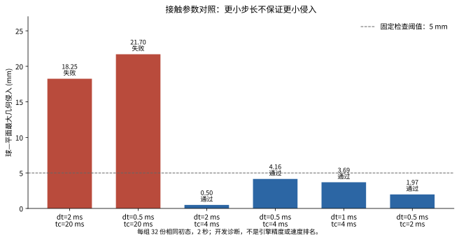

# 稳定版引擎准入

[English](engine-qualification.md) | [简体中文](engine-qualification.zh-CN.md)

当前 Newton 核心证据与下方历史 `sim` extra 依赖表分开：官方 1.6.1 / Warp 1.18.0 的 CPU XPBD 球–平面配置通过正常、重建与禁碰撞对照。这不等于固定版本 UniSim SolverMuJoCo 适配器升级，也不代表 SDF/抓取通过。[协议与全部原始证据](newton-contact.zh-CN.md)。

发布元数据、导入成功、设备基础检查、完整任务验收是不同层次。依赖兼容不等于苹果或布料场景通过。

## 当前交付证据

迁移源码树 `8ac3d71b27145ec664af37728b676dd6c8dd1f38` 已通过 335 项测试及两个后端各完整 14 秒苹果抓取与独立验收。后续来源校验补充通过 346 项测试；最终提交源码的门禁尚待完成。未派发测试集场景。

| 迁移测量 | MuJoCo 3.14.0 | SuperDex FP64 1.0.0 |
|---|---:|---:|
| 最大穿透（mm） | 0.1150 | 0.4523 |
| 保持期最低离桌高度（mm） | 125.6343 | 115.2156 |
| 最大腕部相对位移（mm） | 0.1319 | 0.0399 |
| 完整 14 秒独立验收 | 通过 | 通过 |

上述为单场景开发结果，两引擎配置不同；腕部相对位移不等于材料点滑移。布料仍失败，详见下文。五个参与发行包还分别完成官方归档哈希与实际安装代码比对：[来源凭据](evidence/native-official-wheels.json)。

候选环境的 `autoresearch.py check/submit` 要求 `DEXLAB_QUALIFICATION_WHEELS` 指向私有 wheel 目录。双后端运行及评分之后，自动重新哈希与评分原始记录、关联官方归档与已安装代码、冻结实测源码/运行时/配置，并在提交前刷新版本发布状态。验证失败或版本已过时都会阻止 commit/push。旧的运行时记录不能替代此门禁。最终结果将绑定实际提交树与发版证据。

## 冻结清单

2026-10-04 UTC（本地 2026-10-05）重新核对官方发布与 PyPI 信息。本轮隔离 GPU 检查候选为 MuJoCo 3.14.0、MuJoCo Warp 3.14.0、Warp 1.17.0。历史演示安装器保持原固定版本，旧记录仍为历史证据。

| 配置 | 状态 | 边界 |
|---|---|---|
| MuJoCo 3.14.0 原生 | 部分通过 | 迁移版双后端苹果通过；布料失败；最终来源门禁待完成 |
| MuJoCo Warp 3.14.0 + Warp 1.17.0 | 待验 | 每卡运行/接触检查不等于 SDF 抓取通过 |
| Newton 1.6.0 `sim` | 组合受阻 | MuJoCo 与 MJWarp 的 ~3.12 依赖和最新 3.14 冲突 |
| Genesis 1.4.3 | 待验 | 刚体与布料分别准入，见 #42 |
| SuperDex FP64 1.0.0 | 已有历史任务证据 | 版本稳定不等于新组合通过 |
| Isaac Sim 6.1.0 | 待验 | 须核验内嵌 PhysX 与完整任务 |
| ovphysx 0.6.3 | 排除于稳定版主比较 | 发行包分类为 Alpha |

## 可复现 GPU 基础检查

`scripts/probe_mjwarp.py` 模拟 32 份独立的 0.1 kg、半径 0.05 m 球体落到平面，步长 2 ms，共 1,000 步。逐步采样，检查原生库与绑定一致性、有限状态、完整时间、明显穿越、最终支撑和静置。5 mm 明显穿越、2 mm 最终高度误差、0.02 m/s 静置速度是基础检查阈值，不是抓取验收或实测材料公差。输出记录模型/源码哈希、版本、精度、求解器和失败。

按可用设备每卡一个进程、显式隔离 GPU。预热使用独立状态。编译、逐步回传与并行负载使整体耗时不能作为引擎速度排名。沿用研究锁和资源限制，不新增调度器；设备被占或内存/磁盘预算不足时拒绝运行。运行前核对官方 wheel 与安装文件，不改引擎、不忽略依赖冲突。

## 本轮测得结果

六个设备先各运行 32 份相同初态副本，默认参数的六份记录一致且均未通过侵入检查。随后六卡分别运行六组参数：**4 组通过、2 组失败**。这不是 192 次独立随机试验，也不是留出测试或引擎排名。

| 步长 (ms) | 接触时间常数 (ms) | 最大几何侵入 (mm) | 完整基础检查 |
|---:|---:|---:|---|
| 2 | 20 | 18.254 | 失败 |
| 0.5 | 20 | 21.703 | 失败 |
| 2 | 4 | 0.498 | 通过 |
| 0.5 | 4 | 4.157 | 通过 |
| 1 | 4 | 3.686 | 通过 |
| 0.5 | 2 | 1.972 | 通过 |

原生 MuJoCo 同一默认 XML 的侵入为 18.254210 mm，MJWarp 为 18.254361 mm。这个对照支持“默认软接触参数导致本场景失败”，不支持“GPU 更容易穿模”。缩短接触时间常数后四组通过，但离散步长的作用不单调；低侵入不等于已证明准确或收敛。未修改引擎或放宽阈值。CUDA 状态为 float32；版本、模型、脚本和官方二进制哈希均在记录中。

[全部结果与原生对照轨迹](evidence/engine-qualification/contact-probes.json) · [原始脚本 v1](evidence/engine-qualification/probe-v1.py) · [参数对照脚本 v2](evidence/engine-qualification/probe-v2.py) · [官方 wheel 哈希](evidence/engine-qualification/official-wheel-manifest.json) · [绘图溯源](evidence/engine-qualification/plot-provenance.json)

## 尚未完成的准入

`engine_versions.validate_versions` 仅证明元数据兼容，不证明任务通过。苹果派发现已接入原始记录重评分及运行时/源码冻结，见下文；最新完整任务验证、发布前复核及未支持配置审计仍属于 #41。布料因失败证据保持未准入。

[官方 MJWarp 用法](https://mujoco.readthedocs.io/en/stable/mjwarp/index.html) · [MuJoCo 发布](https://github.com/google-deepmind/mujoco/releases/tag/3.14.0) · [MJWarp 发布](https://github.com/google-deepmind/mujoco_warp/releases/tag/v3.14.0) · [Warp 发布](https://github.com/NVIDIA/warp/releases/tag/v1.17.0)

## 原生候选配置

首次在 3.14.0 下运行全套测试，因布料与接触适配器硬编码 3.11.0，出现 4 个失败和 18 个错误，苹果回归尚未启动。失败日志保留。

`DEXLAB_MUJOCO_PROFILE=qualification-3.14.0` 显式选择候选配置，要求包版本与实际原生版本均为 3.14.0；元数据记录候选身份及 `formal_batch_qualified: false`。默认 `historical-3.11.0` 继续拒绝静默升级。此开关仅开放资格验证，不替代官方发布核查、哈希验证、任务评分或正式派发门禁。碰撞、控制、求解器参数和物理阈值未改。

## 原生苹果结果与剩余失败

显式候选配置运行了 311 项测试，仍有 **1 个失败、2 个错误**。两处布料错误来自 `implicitfast` 不再支持当前 flex 弹性配置，需要明确记录积分方案迁移。圆柱测试测得 3.9903707646 N，未满足原有的 4 N ± 0.001 N 检查。失败记录保留，未放宽阈值或修改官方二进制。

随后独立运行苹果任务，两后端均完成 14 秒轨迹与独立评分，11–14 秒保持窗口逐物理步检查。[机器可读评分](evidence/native314-apple-qualification.json) 将证据绑定到源码树 `2fd01ed93ac9a67e9286dcaed413c4566d9481c1`。

| 指标 | MuJoCo 3.14.0 | SuperDex 1.0.0 FP64 |
| --- | ---: | ---: |
| 最大穿透（mm） | 0.1165 | 0.4523 |
| 保持期最小离桌高度（mm） | 125.6668 | 115.2155 |
| 相对腕部最大位移（mm） | 0.3355 | 0.0399 |
| 独立苹果验收 | 通过 | 通过 |

每列仅为一个开发场景，使用各引擎自身配置；腕部相对位移不是材料点滑移。这不是保留场景 benchmark，也不是精度排名，全套测试与正式派发准入仍未通过。控制使用已知位姿和显式协同，苹果梗为刚体，未验证真机。

首个苹果独立运行在 12 GiB 内存高水位下超时。相同源码仅将高水位提高到 15 GiB，保留 16 GiB 硬上限及零 swap 后通过；失败输出继续保留。此次受资源限制的运行不作为仿真速度测量。

## 本机迁移诊断（2026-10-05）

早期本机迁移检查通过 315 项单测；布料显式迁移至 discrete 积分器，历史 implicitfast 配置保留。开发集披覆实验仍测得最大球面侵入 2.656 mm，超过既有 1.5 mm 上限，因此布料尚未合格。圆柱测试已区分法向力投影与总夹持力；未修改引擎或放宽物理验收。此前双后端 14 秒苹果结果属于旧源码树，本次修改后的完整回归和正式派发准入仍待完成。

保留原 311 项及本机 314/315 项测试的失败记录。仅候选配置显式选用 discrete，以解决两项积分器错误；没有启用实验性 IPC。缺少可选接触适配器时，现在先归档失败，而不是在写入记录前异常退出。

同一 64 面圆柱夹持配置下，MuJoCo 3.14 每侧法向力 x 投影为 3.990371 N，摩擦力 x 投影为 0.009629 N，总和为 4.000000 N。法向投影符合棱面近似 `4*cos(pi/64)^2 = 3.990369 N`。历史 3.11 对照的法向投影为 4 N，切向 x 分量为零；该观测尚不能解释原生接触法向变化的原因。单测改为检查总水平力，仍使用原 0.001 N 容差；独立法向载荷验收未改变。

3 秒 dev-drape 实验完整运行，状态有限、源码及哈希检查通过，但最大球面侵入为 2.655568 mm，超过原有 1.5 mm 上限。301 个抽检帧没有发现自交，不代表连续时间保证。该开发集诊断既不代表机器人夹布问题已修复，也不代表留出集批次已准入。

机器人夹布的 9 秒完整候选实验也未合格：最大边长应变 5.48% 超过 5% 原阈值。独立桌体几何检查在 225 帧中的 219 帧发现布面进入桌体，首帧即存在；三角形内部最大深度为 3.0 mm（6 mm 厚桌体内部到最近边界的距离，不能当作穿越总距离）。在线接触深度不足以否认这个几何问题。保持期抬升 12.12 cm、双指接触比例 100%、最大材料锚点误差 2.34 mm，仍不能声明整体通过。检查基于 25 Hz 零厚度三角形，未覆盖帧间或独立手部表面碰撞。

[Local migration evidence / 本机迁移证据](evidence/native314-local-migration.json)

## 实际派发准入

苹果 `benchmark run --split test` 现在要求 `--qualification-records` 指向私有 JSON，映射配置键（`apple_admission.profile_key`）到原始资格运行目录。任务记录本次源码与实际运行时的前后身份；读取器重新计算原始数据/模型哈希并调用独立评分器，旧记录缺少这些观测时不会自动升级。每个新批次从官方 PyPI 刷新五个参与包的稳定发布及分发哈希；真实模块所有权、FP64 状态和二进制 RECORD 逐项核查。MuJoCo 库取自进程实际映射；SuperDex 没有在此暴露原生语义版本接口，明确记录原生载荷哈希和精度，不冒充版本接口。

冻结内容写入 `run.json`，不包含资格原始目录的私有路径。恢复沿用该冻结，工作进程前后核对源码/原生文件及配置；直接调用留出 worker 也不能省略准入。`publication_status` 刷新发布状态，上游有更新时将原批次标为历史并要求重新资格验证，不改写原结果。该发布检查仍须纳入最终交付核验；当前源码的新双后端完整记录尚待生成与验收，不能声称已完成正式批次。

布料批次及单个留出案例均拒绝派发，开发诊断和历史离线评分仍可运行。没有跳过资格的开关。`scripts/autoresearch.py check` 与现有 demo 启动器统一使用显式 `SUPERDEX_PYTHON`（未设置时使用工作树 `.venv`），避免新版本运行与旧解释器评分混用。

本机有界验证可用 `DEXLAB_RUN_ROOT` 指定私有数据盘上的绝对目录；门禁继续使用唯一运行编号保存输出，无需替换工作树目录或覆盖旧结果。

后续本机门禁在准备阶段因资源不足中断：16GiB硬上限/15GiB软上限下，实测60秒完全内存压力为56.61%。未生成物理验收结果，终止记录及原源码树均保留。下一轮拟使用24GiB硬上限/23GiB软上限，仍须实测可用内存并保留原8GiB桌面余量，CPU保持2核、swap保持0；受资源限制的资格运行耗时不作引擎吞吐比较。

新的苹果准入还要求 `--qualification-wheels` 指向私有官方 wheel 目录：逐包比对归档与官方最新元数据哈希，再比对其中 Python/原生代码与实际安装代码。仅本地 RECORD 自洽不足以证明官方来源。冻结记录只保存文件名与哈希，续跑拒绝缺失或变化的来源证据。五个真实发行包现已完成归档到安装代码的比对；最终提交源码的验收仍待完成。

历史演示与历史源码构建不生成准入观测，也不因此获得正式派发资格。仅显式候选兼容配置启用运行前后观测；正式批次仍必须提供完整的独立验证证据。
