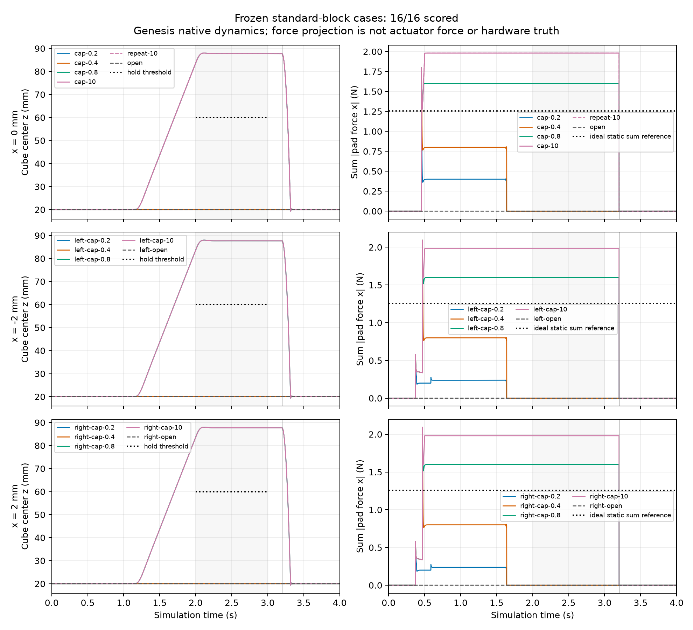

# 标准方块夹持：力限额改变了什么？

在这组固定仿真工况中，0.2/0.4 N逐指限额未能保持方块，0.8/10 N完成保持与释放；该结果在预登记的±2 mm初始偏移下保留。16例全部完成，数值检查16/16通过，三例空夹负对照均正确留在桌面。

## 问题、协议与证据

本项研究一个已有任务的可测失效机制：改变夹指驱动力限额，其他模型、控制轨迹和判据保持不变。[预登记协议](force-limit-protocol.zh-CN.md)先于原生运行保存于提交`9b65579`，6个开发回合后检查源码仍冻结，再运行10个评估回合。没有调参或重跑物理回合；16个独立进程共记录128,000个物理采样。

40 mm、64 g方块由三棱柱关节夹具夹持，官方Genesis1.4.3 / Quadrants1.3.3 / CPU FP64，dt=0.5 ms、每例4 s。摩擦0.5、质量惯量、力限额与初态均读回检查。这些是明确声明的工程模型参数，不是实测材料参数；夹具也不代表UR7e或CTAG2F90D的标定模型。


左为0.4 N失败，右为0.8 N成功；连续完整4 s的实际状态回放，无状态插值。Genesis提供动力学，MuJoCo仅用于显示；原始MP4与逐帧映射见[回放目录](evidence/force-limit/replays/)。空夹负例亦保留。图片与动画不能替代全速率验收。

## 为什么会失败

开发中心位置的1.025–1.075 s描述性窗口中，实测如下（力均为双指之和）：

| 逐指驱动限额 N | 夹指力x投影模长和 N | 夹指向上支撑 N | 桌面支撑 N |
|---|---:|---:|---:|
| 0.2 | 0.4000 | 0.2000 | 0.42784 |
| 0.4 | 0.8000 | 0.4000 | 0.22784 |
| 0.8 | 1.6000 | 0.62834 | 0 |
| 10 | 1.9809 | 0.62834 | 0 |

方块重力为0.62784 N。低限额时夹指未提供足够向上支撑，桌面仍承担余重；高限额时物体离桌并保持。10 N限额并不意味着10 N实测法向力。偏移±2 mm的0.2 N工况中，x投影模长和约0.23774 N，又与中心工况不同，进一步说明不能把限额直接当接触力。

该单变量对照支持本模型内的承载不足解释。理想平面静态估算为每指0.62784 N，但它不定义真实执行器临界值；只测试了四档限额，未证明连续单调性或精确失效边界。上述诊断窗口在结果分析时选择，仅作描述，不改预登记验收。x投影是平面夹指假设下的诊断量，不能替代一般接触法向观测或硬件测量。



## 全部工况

PASS对空夹行表示负对照通过，不表示抓取成功。保持失败首次违反评分窗口的时刻为2.0 s，这是窗口内首个违规采样，不是滑移开始时刻。

| Case | Initial x mm | Cap N/finger | Numerical validity | Task/control | Hold minimum z mm | Maximum penetration mm |
|---|---:|---:|---|---|---:|---:|
| dev-cap-0.2 | 0 | 0.2 | PASS | FAIL | 19.9989 | 0.052226 |
| dev-cap-0.4 | 0 | 0.4 | PASS | FAIL | 19.9989 | 0.052615 |
| dev-cap-0.8 | 0 | 0.8 | PASS | PASS | 83.7011 | 0.664850 |
| dev-cap-10 | 0 | 10 | PASS | PASS | 83.7011 | 0.664849 |
| dev-repeat-10 | 0 | 10 | PASS | PASS | 83.7011 | 0.664849 |
| dev-open | 0 | 10 | PASS | PASS | 19.9989 | 0.003978 |
| eval-left-cap-0.2 | -2 | 0.2 | PASS | FAIL | 19.9989 | 0.048589 |
| eval-left-cap-0.4 | -2 | 0.4 | PASS | FAIL | 19.9989 | 0.098646 |
| eval-left-cap-0.8 | -2 | 0.8 | PASS | PASS | 83.7008 | 0.665087 |
| eval-left-cap-10 | -2 | 10 | PASS | PASS | 83.7008 | 0.665157 |
| eval-left-open | -2 | 10 | PASS | PASS | 19.9989 | 0.003978 |
| eval-right-cap-0.2 | 2 | 0.2 | PASS | FAIL | 19.9989 | 0.048589 |
| eval-right-cap-0.4 | 2 | 0.4 | PASS | FAIL | 19.9989 | 0.098646 |
| eval-right-cap-0.8 | 2 | 0.8 | PASS | PASS | 83.7008 | 0.665087 |
| eval-right-cap-10 | 2 | 10 | PASS | PASS | 83.7008 | 0.665157 |
| eval-right-open | 2 | 10 | PASS | PASS | 19.9989 | 0.003978 |

## 有效性、成本与复现

最大原生穿透0.665158 mm，低于原1 mm阈值；逐接触力向量和与原生净力误差0 N；逐步动量残差最大值低于2.61e-9倍重力冲量。这些只证明记录/数值一致性，不证明物理真实。10 N独立进程重复的全部采样状态和接触完全相同，不保证所有工况普遍确定性。

16个原生子进程总耗时210.695 s，包含导入、初始化、仿真和写盘。首例使用新建的本轮JIT缓存，耗时51.134 s；其余10.278–11.127 s。独立评分共3.971 s。每例`timings.json`保留初始化、建场景、控制、步进、读回、写盘与销毁分项。这是带观测的单世界耗时，不是引擎速度排名。准备阶段失败和有界服务资源/成本另行记录；渲染与压缩均在物理测速窗口之外。

8个偏移夹持案例有4通过、4失败。固定集合没有声明抽样总体，不提供置信区间或总体成功率，也不宣称真机精度、学习/视觉控制或引擎优越性。真机标定仍属#6，跨模型标定比较仍属#3。预登记清单保留运行前原始状态，实际执行状态以[summary.json](evidence/force-limit/summary.json)为准。

[cases/](evidence/force-limit/cases/)保存全部无损压缩记录，并验证解压字节哈希。使用匹配的仓库版本，将一个工况目录复制到临时目录，在临时目录解压`*-0.json.gz`，再执行下式即可离线评分，无需启动Genesis：

```bash
PYTHONPATH=src python -m dexlab.genesis_pinch_score TEMPORARY_CASE_DIRECTORY
```

评分先验证工况、清单和经审查的执行源码，再计算独立判据。这是溯源支持，不是防伪证明。六个抓取失败与三个负例完整保留。参见[文件哈希](evidence/force-limit/artifact-hashes.json)、[官方wheel证明](evidence/force-limit/official-proof.json)、[冻结源码](evidence/force-limit/frozen.json)、[全部包版本](evidence/force-limit/installed-packages.json)和[逐例指标](evidence/force-limit/summary.json)。

准备至回放打包阶段的有界服务累计1216.444 s，包含失败重试；首尾实际经过1896.039 s，包含编辑与检查间隙。[完整资源与成本账本](evidence/force-limit/resource-cost.json)记录每次返回码、内存峰值、cgroup限额与失败原因，交付门禁另计。测试主机CPU为Intel Core i9-14900K，原生过程限定两个逻辑核等效配额；不与远端硬件混算。准备曾发生下载超时、缓存设置未传入、辅助Python版本和MuJoCo配置错误；均保留。回放首次遇到FFmpeg线程资源不足，保留失败输出后将编码/过滤线程限制为1，没有提高资源上限或改动任何物理轨迹。这个运行后显示修复与原生源码冻结分别记录。
