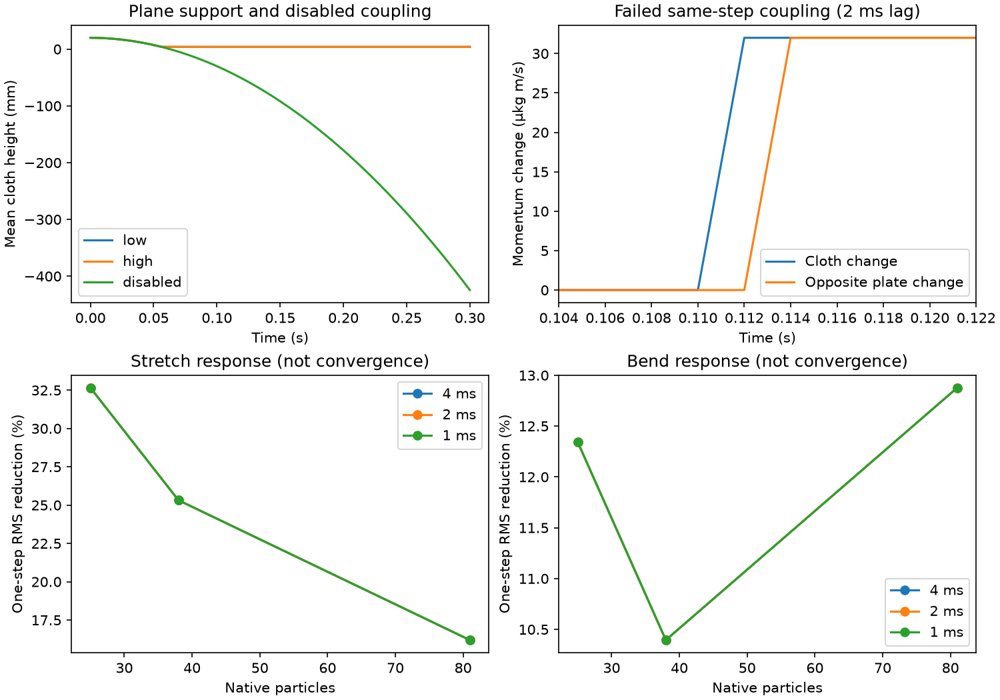
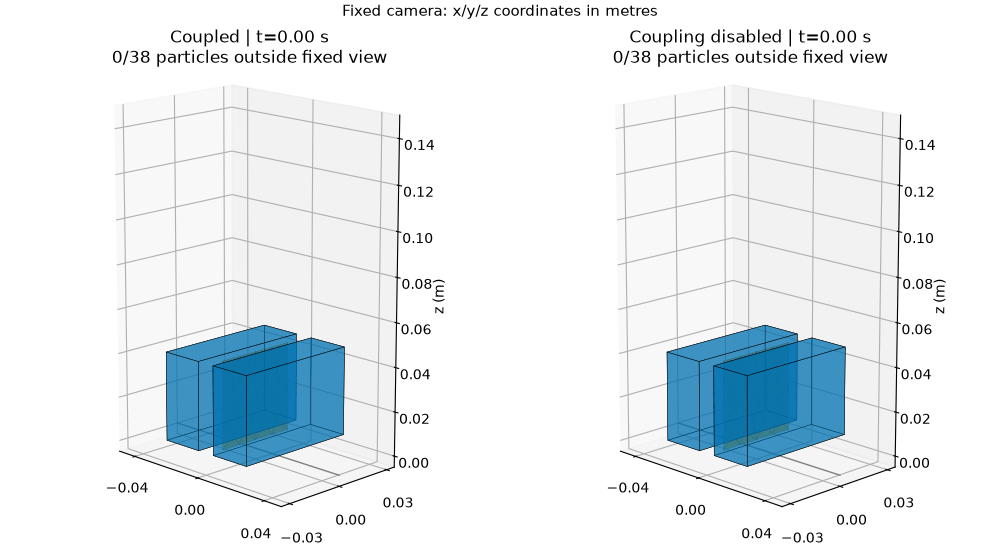
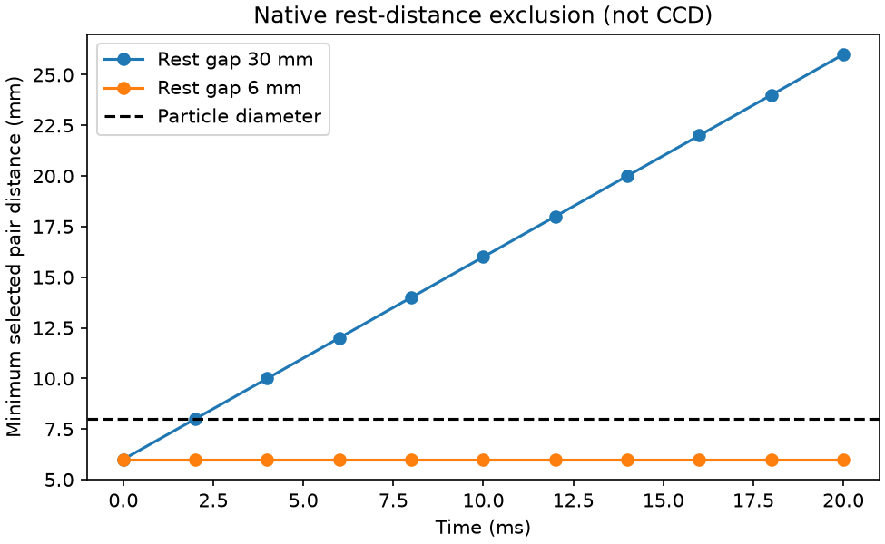

# Genesis PBD thin-cloth qualification

Status: six diagnostic batches completed (plane, free plate, response sensitivity, baseline and gravity-compensated gripper, and self-contact pairs); full cloth qualification remains open. This is a separate synthetic thin-surface experiment, not Genesis rigid qualification, calibrated fabric or MPM/FEM substitution.

## Source audit

Official [Genesis 1.4.3](https://github.com/Genesis-Embodied-AI/genesis-world/releases/tag/v1.4.3), revision `216a708e06124595521a9d36a51fae5393fd4ff8`, remains the latest stable release at admission. Installed official source distinguishes:
- `engine/materials/PBD/cloth.py`: density is kg/m²; total mass comes from mesh area. Stretch compliance is documented m/N and bending compliance rad/N; these are solver parameters, not an identified continuum fabric model.
- `engine/entities/pbd_entity.py`: native remeshing uses particle size; final particles/topology and equal per-particle mass must be read back. Authored vertex count cannot stand in for native resolution.
- `engine/couplers/legacy_coupler.py::_func_pbd_collide_with_rigid_geom`: contact tests particle-center signed distance against half particle size. Position correction implies velocity change and applies opposite momentum change to the rigid body. This source formula is not runtime coupling proof. The rigid/PBD path explicitly omits tangential friction; changing cloth friction is not proof of cloth/table Coulomb friction.
- `engine/solvers/pbd_solver.py`: self-contact is particle-pair separation, with rest-distance exclusion. It is not a continuous triangle/edge crossing guarantee. Boundary collisions can act as a hidden floor; place the lower domain below all expected negative-control positions.

## First frozen development batch

One CPU FP64 worker, official unchanged runtime, no rendering during timing. At most six trajectories and 1,800 s total. Three scenes each reset/repeated twice: coupled plane with friction 0.01, coupled plane with friction 0.5, and plane coupling disabled with friction 0.01. Set plane regular/coupling friction and cloth static/kinetic friction together for each named condition; all other settings fixed. This is an API-effect diagnostic, not equal-material calibration.

Generate our own 40 mm square triangulated 5×5 input grid, no downloaded asset. Native remeshing may change topology: save actual vertices, faces, edge rests, masses and parameter arrays. Area density 0.2 kg/m²; native particle diameter 8 mm; initial cloth height 20 mm; initial uniform x velocity 0.2 m/s; gravity (0,0,-9.81) m/s². dt 2 ms, one substep, 150 steps (0.3 s), four stretch and one bend iteration; stretch compliance1e-7, bend1e-5, relaxation0.3/0.1, air resistance0. No pins, attachment, controller or state injection after initialization. Domain lower z=-1 m; reference freefall final z approximately-0.424 m, far above it.

Record initial and every-step particle positions/velocities, actual native settings and any available rigid reaction readback. Do not label a rigid-only contact accessor as PBD coupling force without checking its implementation. Missing native force remains unavailable; momentum-derived force is a separate diagnostic, not native truth. Timing separates init/build, stepping, observations and scoring. Preserve failures and interrupted artifacts.

Frozen checks: finite complete records; supported surface min z≥-0.5 mm and final 0.1 s center-height within0.5 mm of4 mm radius; disabled coupling must fail support and follow discrete semi-implicit freefall within0.1 mm position/0.001 m/s velocity. Compare reset initial state and all trajectories at1e-9 m /1e-8 m/s; report deviation rather than silently resampling. Report full signed horizontal travel/velocity and low-versus-high-friction differences, without requiring a friction effect to call the diagnostic valid. Source predicts no tangential friction in this coupling path; native runs must establish the actual behavior.

## Remaining original Issue scope

This first batch cannot close #77. Next stages require preregistered stretch/unload and bend references, at least three mesh/timestep levels, triangle-surface/crossing audit, self-contact controls, free-body momentum/reaction, and real actuator clamp/hold/release controls. Continuous close-ups and quality/cost plots accompany actual records. Unsupported features get bounded negative evidence, never a surrogate or relaxed criterion. Hardware material accuracy remains unqualified.

## Development result (not full qualification)

The six preregistered trajectories completed using the verified official 1.4.3 wheel. Native remeshing produced 38 particles from the 25 authored vertices. Both coupled conditions settled at 4 mm, with no below-plane vertex penetration. Disabled coupling followed discrete freefall (maximum z error 1.15e-14 m), confirming the domain boundary did not create support. Both repeats were identical in recorded positions and velocities.

Changing the declared friction from 0.01 to 0.5 produced zero difference across recorded trajectories: each travelled 60 mm horizontally and retained approximately 0.2 m/s final horizontal velocity. This supports the source-level finding of absent tangential friction in this PBD/rigid path. Passing this **diagnostic** does not mean frictional cloth grasping passed. Do not tune this friction parameter expecting a verified gripping response.

The bounded process completed in 68.981 s, including provenance checks and initialization. Scene build times were 22.477/3.083/2.914 s; individual 150-step loops took 4.528–5.317 s. These are single-worker diagnostic timings, not a cross-engine throughput ranking. Raw records and frozen source are included in the evidence package below. An earlier orchestration attempt failed before physics because the system Python lacked `hashlib.file_digest`; it was corrected to use the established Python 3.12 environment, preserving the failure record.

## Free-body momentum protocol

The next four trajectories use a free 80×80×10 mm plate (density15.625 kg/m³, measured mass1 g, six free DOFs), zero gravity and no table/pins/actuator. Cloth starts at20 mm with vz=-0.1 m/s; all other mesh/compliance/dt settings are retained. Coupling on/off each has two resets;150steps each. Read actual cloth particle masses/velocities and rigid COM mass/velocity; check total linear momentum residual ≤1% of initial magnitude +1e-8 kg m/s. Positive exchange requires plate downward momentum gain and opposite cloth change each at least10% of initial cloth momentum. Disabled coupling requires plate displacement≤1e-9m, speed≤1e-8m/s, and unchanged cloth velocity within1e-8m/s. Repeat tolerances remain1e-9m/1e-8m/s. This conservation reference does not qualify angular momentum or native force readback. Runtime cap1800s; no writes after initialization, hidden attachments or threshold tuning.

### Free-body result: same-step conservation failed

All four trajectories completed in the bounded process (33.257 s), with exact reset repeats. Disabled coupling passed: plate remained at rest and cloth retained its velocity. With coupling enabled, cloth changed z momentum by +3.2e-5 kg m/s and the plate eventually received -3.2e-5 kg m/s. However, the cloth change occurred at step56 and the plate change at step57. Maximum simultaneous total-momentum residual was3.2e-5 kg m/s, exceeding the frozen3.3e-7 tolerance. The qualification therefore **fails**; final residual≈1.76e-19 does not erase the transient failure.

A post-hoc one-step-offset diagnostic reduces residual to≈1.76e-19, supporting a one-step coupling delay; it is not the acceptance metric. Official simulator order runs rigid pre-coupling integration before legacy coupling; `rigid/abd/misc.py::func_apply_coupling_force` accumulates pending `cfrc_coupling_*` fields. This matches the measured 2 ms lag. No native source was edited. Direct rigid contact-force fields are still not qualified as PBD reaction output. This records two-way exchange with delayed response, not same-step momentum fidelity.

## Frozen one-step response sensitivity

A separate 36-cell factorial uses particle diameters12/8/6 mm and dt4/2/1 ms; stretch/bend enabled/disabled are tested separately. Zero gravity and velocity, no rigid bodies/pins. Initialize x*=1.1 for stretch, or z+=0.2|x| for bend, once at z0.2m. Official options reject zero iterations before scene build; the failed attempt is retained. The preregistered correction keeps4stretch/1bend iterations for all cells, disables a constraint using its supported zero relaxation, and activates only stretch0.3 or bend0.1 as appropriate. No response result existed before this correction; thresholds are unchanged. Previous density/compliance/relaxation remain fixed. Save actual rest topology, mass, initial/final states and native options.

Independent references are rest edge lengths and flat adjacent-face normals. Enabled checks require RMS strain/angle to decrease by>1e-10 and COM shift≤1e-9m; disabled checks require unchanged position≤1e-9m and velocity≤1e-8m/s, finite nondegenerate geometry. All cells remain visible. These minimal direction checks do not validate constitutive magnitude, unloading, long-time stability or continuum convergence. Changing native particle size also changes contact scale. Analytic flat/stretch/V-fold fixtures verify the scorer. Single worker,36 steps total,1800s cap.

### Response results

All36 cells passed the frozen direction/negative-control checks. Disabled constraints produced unchanged positions/velocities. Bounded wall time78.028s; first option-validation failure remains recorded.

| Particle diameter (mm) | dt (ms) | Native particles | Strain RMS reduction (%) | Bend RMS reduction (%) |
|---|---|---|---|---|
| 12 | 4 | 25 | 32.65760 | 12.34211 |
| 12 | 2 | 25 | 32.65760 | 12.34211 |
| 12 | 1 | 25 | 32.65759 | 12.34211 |
| 8 | 4 | 38 | 25.31551 | 10.39499 |
| 8 | 2 | 38 | 25.31551 | 10.39499 |
| 8 | 1 | 38 | 25.31550 | 10.39499 |
| 6 | 4 | 81 | 16.19278 | 12.87683 |
| 6 | 2 | 81 | 16.19278 | 12.87683 |
| 6 | 1 | 81 | 16.19278 | 12.87683 |

These are relative changes after one solver step, not after equal physical time. Strong mesh dependence remains; near-identical timestep entries do not establish time convergence or calibrated elastic moduli.

## Packaged evidence and geometric audit



The [manifest](evidence/genesis-cloth/manifest.json) hashes compressed raw states, independent scores, every-frame geometry audits, official wheel/code proofs and frozen runner/scorer sources. [Plane raw](evidence/genesis-cloth/plane-record.json.gz), [coupling raw](evidence/genesis-cloth/coupling-record.json.gz), [response raw](evidence/genesis-cloth/response-record.json.gz) retain both passing and failing outcomes. Unpack a record using Python gzip, then run its frozen scorer against the resulting JSON; the coupling scorer intentionally returns nonzero. No engine is needed for offline scoring; NumPy is required.

Every saved frame was audited:906plane +604coupling +72response states; no nonadjacent triangle crossing or degeneracy was found. Shared-vertex pairs are excluded. This is not a self-contact positive/negative experiment. For the fixed plane, straight interpolation of vertices has its minimum at an endpoint vertex; the disabled trajectory crosses the plane. That mathematical interpolation audit does not certify the engine's unobserved path or general swept self-contact. The moving plate has no plane audit substituted for its finite rotating geometry.

## Self-contact control limitation

The [official API audit](evidence/genesis-cloth/self-contact-api.json) records all PBD option/material fields and four rejected attempts to set `enable_collision=False` or `enable_self_collision=False`. A rigid-solver self-collision option exists, but does not disable the PBD particle-pair kernel. The official PBD pre-coupling step calls that kernel without a public enable flag in this audited path. We therefore cannot claim a matched native self-contact-off control through these interfaces. Changing particle size/rest geometry or monkey-patching a kernel would change the experiment or violate the official-engine constraint. This does not mean self-contact is absent: its particle-pair path still requires a dedicated folded-surface stress test; the current non-crossing frames do not qualify it.

## Frozen actuator clamp/hold/release diagnostic

Use an explicitly synthetic three-prismatic-DOF rigid gripper derived from the existing Genesis pinch fixture, not a UR7e/Wuji hardware model. Official Genesis1.4.3 CPU FP64;dt2ms,one substep,4s/2000steps, two reset repeats for each of coupled-gripper and gripper-coupling-disabled conditions (4trajectories,max1800s,one worker). Fixed floor remains coupled in both. Cloth is the same authored40mm square/rho0.2/8mm particle diameter/compliances/iterations; rotate90deg abouty so it hangs vertically, bottominitialz4mm, centerz24mm. No cloth pins/attachments/position writes after initialization.

Pads from the existing fixture: centersx±40mm,z25mm, halfsizes10/30/20mm, slide inward. Initialize actual jaw positions25.5mm (9mmgap), lift0. Command ramp to26.25mm (7.5mmgap) in0.2s, hold to1s, lift80mm from1–2s, holdto3.2s, open jaws to0 then retainlift through4s. Explicit PD prior:kp[1000,500,500],kv[50,20,20],forcelimits[±50,±10,±10]N, zeroarmature. Control is a prescribed test, not learned dexterity. Coupling-off disables gripper/PBD coupling only; regular rigid contacts remain.

Read every initial/step actual q/qvel/actuator force plus command, particle positions/velocities/masses/topology and pad poses/quaternions. Record native force accessor scope; derive geometric pad distances independently. Freeze criteria: actual lift≥70mm during2.2–3.1s; clothminimumheight≥50mm, cloth-to-carriage center drift≤5mm in thatwindow, pad midsurface intrusion≤0.5mm (report8mm nominal particle thickness separately); afterrelease and by4s clothminimumheight≤5mm and actualjawgap≥40mm. Negative must not satisfy heldlift. Resetpos≤1e-9m/vel≤1e-8m/s; preserve all failures. If cloth fails to hold, score failure without pins, largerfriction or threshold changes. This probes the known missing tangential friction path and does not promise successful grasp. Raw trajectory enables continuous close-up replay; replay is not solver evidence.

Status: baseline completed and failed; follow-up below.

### Actuator baseline failed; gravity-compensation follow-up pending

Four baseline trajectories completed in281.248s and reset exactly. The coupled condition never met held-lift criteria: minimum cloth height4mm, hold-window center drift252.906mm, actual minimum lift68.216mm. The disabled condition also did not hold. Independent every-frame triangle-interior audit found0mm maximum pad intrusion with coupling and10mm with coupling disabled. These are failed grasp diagnostics, not a successful release demonstration: `released=true` in the frozen score means only the final open-jaw/floor endpoint was met, not that a previously held cloth was released.

[Raw record](evidence/genesis-cloth/gripper-record.json.gz), [frozen score](evidence/genesis-cloth/gripper-score.json), [triangle audit](evidence/genesis-cloth/gripper-geometry.json), [replay provenance](evidence/genesis-cloth/gripper-replay.json). The fixed camera replay shows repeat0 of both conditions and explicitly counts particles outside view; all physical-step states remain available.



The1.2kg moving fixture and1000N/m lift kp predict11.772mm gravity droop, consistent with80mm commanded versus68.216mm actual. A separately preregistered follow-up adds only g×imported movable mass/readback kp to the lift command, retaining every physical threshold/contact setting and original failed evidence. No cloth state writes or hidden attachment. The corrected result follows.

### Gravity compensation result

The four follow-up trajectories completed in277.725s with exact reset repeats. Actual minimum lift improved to79.988mm, clearing the unchanged70mm actuator criterion. Cloth minimum height remained4mm and coupled hold-window relative drift252.443mm; the grasp still failed. Thus lift droop was a real controller confound but not the sole cause of grasp failure. This does not identify missing friction as the sole cause either; baseline and follow-up remain separate failed records.

## Self-contact eligibility result

One cloth entity contains two disconnected patches; this isolates the native particle rule, not a connected fold. With identical imported XY positions, topology and masses,38 eligible overlapping cross-layer pairs moved from6 to8mm after one step. The38 pairs excluded by the6mm rest-distance condition stayed at6mm. Both reset repeats were exact, with no COM shift. Four trajectories completed in10.584s. The later separation increase reflects velocity derived from the initial overlap correction; it is not evidence of a measured restitution law.

[Raw states](evidence/genesis-cloth/self-record.json.gz) · [score](evidence/genesis-cloth/self-score.json) · [geometry audit](evidence/genesis-cloth/self-geometry.json)



## Acceptance status and remaining work

| Requirement | Evidence and status |
|---|---|
| Thickness/geometry |8mm particle readback; every-frame plane/self-surface and pad-triangle audits. General swept triangles remain unqualified. |
| Stretch/bend |36-cell one-step reference/sensitivity checks pass. Constitutive magnitude, unloading and longer-time response remain unqualified. |
| Self-contact |Matched rest-distance eligibility controls pass; no public PBD off toggle; connected folded cloth/CCD unqualified. |
| Two-way coupling |Exchange measured with2ms lag; frozen same-step momentum criterion fails. Native force accessor still unqualified. |
| Actuator clamp/hold/release |Baseline and gravity-compensated fixtures both fail hold. Open/floor endpoint is not successful grasp-release evidence. |
| Reproducibility/media |Raw states, hashes, frozen code, offline scores and fixed-camera sampled replays provided; hardware calibration not claimed. |

This is a staged delivery for Issue77; the full issue remains open. [Compensated raw](evidence/genesis-cloth/gripper-compensated-record.json.gz), [score](evidence/genesis-cloth/gripper-compensated-score.json), [triangle audit](evidence/genesis-cloth/gripper-compensated-geometry.json), [continuous replay](evidence/genesis-cloth/gripper-compensated-replay.gif).

## Reproduction

Use the repository setup environment, then install the optional official runtime with `uv pip install --python .venv/bin/python genesis-world==1.4.3`. Experiments must pass `scripts/bounded_run.py` resource admission; select your own existing data volume/device. Do not launch them unbounded on a desktop. Each probe takes a new output directory and refuses overwrite:

```bash
.venv/bin/python -m dexlab.genesis_cloth_probe OUTPUT
.venv/bin/python -m dexlab.genesis_cloth_coupling_probe OUTPUT
.venv/bin/python -m dexlab.genesis_cloth_response_probe OUTPUT
.venv/bin/python -m dexlab.genesis_cloth_gripper_probe OUTPUT --gravity-compensation
.venv/bin/python -m dexlab.genesis_cloth_self_probe OUTPUT
```

The commands above are workload commands to place after the bounded runner's `--`. All references are synthetic development fixtures; no held-out material score is claimed. For an inexpensive offline regression without a native run:

```bash
.venv/bin/python -m unittest discover -s tests -p 'test_genesis_cloth*.py'
```

`python -m dexlab.genesis_cloth_replay RECORD.json.gz OUTPUT --prefix gripper` regenerates the fixed-camera replay from recorded states only.
