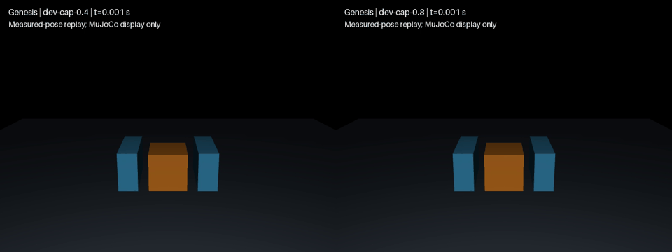

# DexLab 假期阶段报告：已经得到什么结论

证据截止：v0.42.1。本文汇总已有交付，不把尚未执行的实验计入结果。拟随 v0.42.2 发布；正式发布状态以 GitHub Release 为准。

## 可以直接用于汇报的结论

这个阶段，我们把“仿真里能抓起来”推进到了“能解释为什么成功或失败，并让别人复核”的标准物体实验。最清晰的结果是：在固定方块、摩擦和动作下，较低夹指驱动力限额不能提供足够支撑，较高限额完成保持与释放；成功与失败都通过原始接触、穿透和动量记录检查。与此同时，接触参数迁移、薄布摩擦夹持和适配器接入揭示了明确限制。**目前能够报告配置内的机制和有效性边界，不能报告哪套引擎最真实。**

DexLab 的定位保持为：研究机器人如何在可信的仿真中完成接触密集操作。“可信”是逐项积累的证据要求，尚不是已经取得的真机精度认证。

## 六项可交付发现

| 研究问题 | 已有结果 | 初步结论与限制 |
|---|---|---|
| 夹指力限额如何影响标准方块抓取？ | 40 mm、64 g方块，16回合全部完成；0.2/0.4 N保持失败，0.8/10 N保持与释放通过；预登记±2 mm偏移保留该结果 | 本模型内支持承载不足解释。驱动限额不等于接触力；四档离散测试不能给出精确临界值或总体成功率 |
| 名义接触参数能否直接迁移？ | 三配置×十组质量/尺寸，共30次；联合目标0/30满足 | 固定参数映射不能直接满足这组指定合成目标；不是实测材料误差，也不证明引擎算法错误 |
| 当前 Genesis 薄布能否靠摩擦夹持？ | 所查PBD/刚体耦合缺切向摩擦；夹爪抬升79.988 mm、布料最低高度4 mm；动量检查失败 | 当前声明配置不准入。几何/重置检查通过不能抵消夹持或动量失败；不推广为所有布料模型都不可行 |
| 合成触觉图能否证明承重？ | 首批有深度图但原生接触力为0；三批开发后限定工况通过；32/64网格不改变配对物理轨迹 | 几何深度是观测量，不能冒充力、压力或真实传感器精度；三批控制变化和失败均保留 |
| 基本接触能否独立验收？ | Newton XPBD指定CPU工况最大穿透0.000849 mm，保持支撑误差0.051353%；禁碰撞负例失去支撑 | 证明所测基础支撑与负例可被区分；不等于完整抓取、SDF或硬件资格 |
| 统一适配器是否已经简化任务？ | UniSim 1.7.10未修改加载器拒绝Genesis1.4.3；隔离初始化/cache读回FP32；已迁移路径0、已证实删减0行 | 当前标准方块保留原生FP64路径。私有兼容候选未完成成对物理验证，不纳入正式支持 |

逐项证据：[力限额](force-limit-results.zh-CN.md)、[质量/尺寸迁移](../demos/contact-benchmark/TRANSFER.zh-CN.md)、[薄布](genesis-cloth.zh-CN.md)、[合成触觉](synthetic-tactile.zh-CN.md)、[Newton接触](newton-contact.zh-CN.md)、[适配器边界](unisim-reuse-boundary.zh-CN.md)。详细报告保留版本、参数、判据、逐例结果、成本和复现入口。

## 最有说服力的主实验

建议口头汇报以标准方块为主线：冻结物体、控制序列和评分标准，只改变夹指力限额，再用偏移位置检查结论是否保留。

中心工况的描述性窗口内，0.4 N逐指限额对应双指向上支撑约0.4000 N，桌面仍承担0.22784 N；0.8 N限额时夹指支撑约0.62834 N、桌面支撑为0。方块重力0.62784 N。这为本模型内失败原因提供力学证据，不能把运行后选择的诊断窗口说成预登记判据。

16/16通过数值有效性检查不表示16次抓取成功：六次抓取失败、三个张开负例均保留；8个偏移夹持案例中4通过、4失败。最大穿透0.665158 mm，低于原1 mm门限。该门限是工程验收，不是已标定的真实误差。

这是实测状态回放；Genesis产生动力学，MuJoCo仅显示，不进行二次动力学。动画不能替代逐物理步记录。

## 本阶段真正形成的交付

- 可复现的标准物体实验、原生参数读回、独立评分和负对照。
- 成功、失败、版本与原始证据相连的中英报告，保留未通过的配置。
- 对接触、驱动、合成观测和适配器的明确准入边界。

历史苹果梗演示及十场景回归保留历史标记；1/10与10/10只能说明各自固定配置的表现。不能由此推出引擎优越性。尚无真实力—位移、滑移或释放测量作为共同参照；没有证明视觉闭环、学习策略或真机迁移能力。

## 今晚的收尾任务与完成标准

当前开发范围收敛为本报告和一个正式阶段版本；暂停领取新的研究实验，保留所有未提交候选。

1. 核对上述六项与已交付证据，完成中英报告和首页入口。
2. 核对文档链接、版本、差异和适用测试；报告新增内容不能改变物理判据。
3. 提交报告PR，按现有规则审查并合并；发布一个新版本，附报告/验证记录，核实远端标签和附件后才宣布发布完成。

计划完成时间为今晚；外部服务故障不能计为已发布。版本是阶段成果汇总，不宣称所有开放Issue完成，不把修辞上的“正式”升级为物理真实性认证。

## 后续研究：按能回答的问题排序

1. **真实参照（#6）**：获取标准物体尺寸、质量、夹具力—位移、滑移和释放记录及不确定性。具备数据后，才能回答仿真与真实行为的误差。
2. **冻结比较（#3）**：把标定数据和独立评估工况分开，保持任务、预算和判据一致，报告误差及成本；数据缺失时不做真实性排名。
3. **适配器取舍（#4）**：恢复已准备的同任务原生/适配器对照，检查参数、状态、完整接触与重置，再量化真正减少的维护代码；无收益则保留原生实现。
4. **新增任务（#47→#48/#52）**：原生版本与观测资格满足后，再接入操作任务和动作回放。薄布与真实触觉另有模型/测量前提，不用追加成功视频替代验收。

后续任务不属于本次版本的未完成发布条件。以能够被反驳和复核的具体问题推进，避免为了增加任务数量而扩展。
