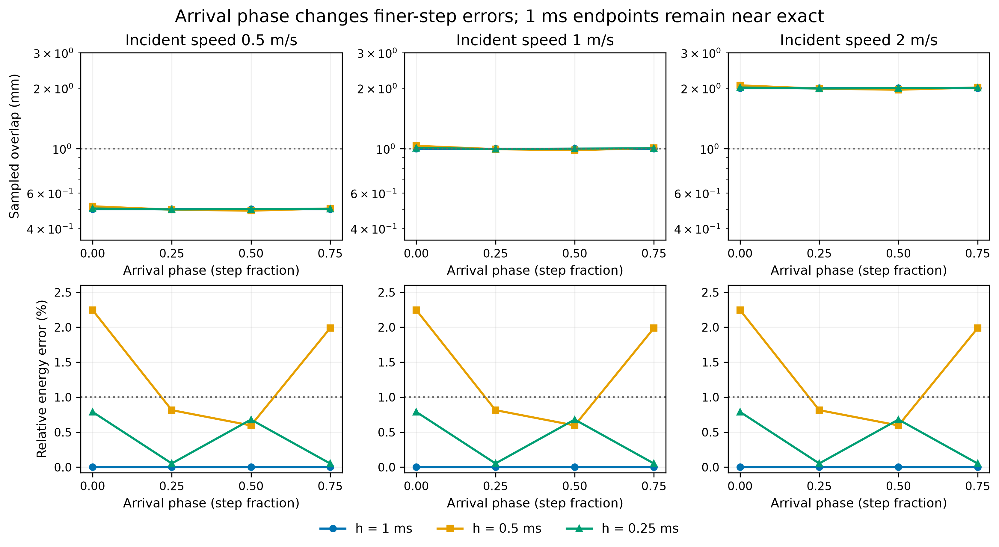

# 到达相位敏感性：粗步长的近零末态误差在测试偏移下仍保持

[English](impact-phase-results.md) | [简体中文](impact-phase-results.zh-CN.md)

**36 个有效工况：30 例末态通过、14 例联合通过；9 组速度/步长组合中只有 2 组在全部四个测试相位下通过。** 复用九个已发布高刚度记录，仅新增27个相位偏移工况，没有重跑基线物理。

原先怀疑“1 ms 近零末态误差仅依赖原始到达对齐”，本次结果**没有支持该猜测**。四种相位、三种速度下，1 ms 的末态速度/能量误差都保持在机器精度量级。相反，0.5 ms 的动能误差随相位变化为0.5964–2.2464%，0.25 ms 为0.05207–0.79007%。这些结果尚未识别剩余的数值机制，也不证明存在普适最佳步长。



全部四相位联合通过的两组为0.5 m/s下的1 ms与0.25 ms。1 m/s、1 ms的四例均为**仅浮点边界拒绝**：存储重叠0.0010000000000000009 m，比1 mm高约8.67e-19 m。保留严格验收，但不解释为有物理意义的超量。边界诊断不改变计数，也不能按表格四舍五入值重新判定。

## 全部有限相位集合

| u (m/s) | h (ms) | Joint passes / 4 | All four | Worst velocity error (m/s) | Energy error range (%) | Overlap range (mm) |
|---:|---:|---:|---|---:|---:|---:|
| 0.5 | 1 | 4 | pass | 6.66134e-16 | 1.77636e-13–2.66454e-13 | 0.5–0.5 |
| 0.5 | 0.5 | 2 | fail | 0.0055542 | 0.596356–2.24636 | 0.490234375–0.515625 |
| 0.5 | 0.25 | 4 | pass | 0.00196743 | 0.0520681–0.79007 | 0.49730525–0.502826571 |
| 1 | 1 | 0 | fail | 1.33227e-15 | 1.77636e-13–2.66454e-13 | 1–1 |
| 1 | 0.5 | 2 | fail | 0.0111084 | 0.596356–2.24636 | 0.98046875–1.03125 |
| 1 | 0.25 | 2 | fail | 0.00393486 | 0.0520681–0.79007 | 0.9946105–1.00565314 |
| 2 | 1 | 0 | fail | 2.66454e-15 | 1.77636e-13–2.66454e-13 | 2–2 |
| 2 | 0.5 | 0 | fail | 0.0222168 | 0.596356–2.24636 | 1.9609375–2.0625 |
| 2 | 0.25 | 0 | fail | 0.00786973 | 0.0520681–0.79007 | 1.989221–2.01130629 |

## 全部工况

stiffness-*为复用基线。Final为原末态判定，joint为同时满足1 mm重叠预算；所有失败保留。

| Case | u (m/s) | h (ms) | Phase | Velocity error (m/s) | Energy error (%) | Overlap (mm) | Final / joint |
|---|---:|---:|---:|---:|---:|---:|---|
| stiffness-10 | 0.5 | 1 | 0 | 4.44089e-16 | 1.77636e-13 | 0.5 | pass / pass |
| stiffness-11 | 0.5 | 0.5 | 0 | 0.0055542 | 2.24636 | 0.515625 | fail / fail |
| stiffness-12 | 0.5 | 0.25 | 0 | 0.00196743 | 0.79007 | 0.502826571 | pass / pass |
| stiffness-13 | 1 | 1 | 0 | 1.11022e-15 | 2.22045e-13 | 1 | pass / fail |
| stiffness-14 | 1 | 0.5 | 0 | 0.0111084 | 2.24636 | 1.03125 | fail / fail |
| stiffness-15 | 1 | 0.25 | 0 | 0.00393486 | 0.79007 | 1.00565314 | pass / fail |
| stiffness-16 | 2 | 1 | 0 | 2.66454e-15 | 2.66454e-13 | 2 | pass / fail |
| stiffness-17 | 2 | 0.5 | 0 | 0.0222168 | 2.24636 | 2.0625 | fail / fail |
| stiffness-18 | 2 | 0.25 | 0 | 0.00786973 | 0.79007 | 2.01130629 | pass / fail |
| phase-01 | 0.5 | 1 | 0.25 | 5.55112e-16 | 2.22045e-13 | 0.5 | pass / pass |
| phase-02 | 0.5 | 1 | 0.5 | 4.44089e-16 | 1.77636e-13 | 0.5 | pass / pass |
| phase-03 | 0.5 | 1 | 0.75 | 6.66134e-16 | 2.66454e-13 | 0.5 | pass / pass |
| phase-04 | 0.5 | 0.5 | 0.25 | 0.00202942 | 0.815062 | 0.49609375 | pass / pass |
| phase-05 | 0.5 | 0.5 | 0.5 | 0.00149536 | 0.596356 | 0.490234375 | pass / pass |
| phase-06 | 0.5 | 0.5 | 0.75 | 0.00502014 | 1.9879 | 0.502929687 | fail / fail |
| phase-07 | 0.5 | 0.25 | 0.25 | 0.000132263 | 0.0528912 | 0.49730525 | pass / pass |
| phase-08 | 0.5 | 0.25 | 0.5 | 0.00170716 | 0.680532 | 0.49914569 | pass / pass |
| phase-09 | 0.5 | 0.25 | 0.75 | 0.000130136 | 0.0520681 | 0.500986131 | pass / pass |
| phase-10 | 1 | 1 | 0.25 | 8.88178e-16 | 1.77636e-13 | 1 | pass / fail |
| phase-11 | 1 | 1 | 0.5 | 1.33227e-15 | 2.66454e-13 | 1 | pass / fail |
| phase-12 | 1 | 1 | 0.75 | 8.88178e-16 | 1.77636e-13 | 1 | pass / fail |
| phase-13 | 1 | 0.5 | 0.25 | 0.00405884 | 0.815062 | 0.9921875 | pass / pass |
| phase-14 | 1 | 0.5 | 0.5 | 0.00299072 | 0.596356 | 0.98046875 | pass / pass |
| phase-15 | 1 | 0.5 | 0.75 | 0.0100403 | 1.9879 | 1.00585937 | fail / fail |
| phase-16 | 1 | 0.25 | 0.25 | 0.000264526 | 0.0528912 | 0.9946105 | pass / pass |
| phase-17 | 1 | 0.25 | 0.5 | 0.00341432 | 0.680532 | 0.998291381 | pass / pass |
| phase-18 | 1 | 0.25 | 0.75 | 0.000260273 | 0.0520681 | 1.00197226 | pass / fail |
| phase-19 | 2 | 1 | 0.25 | 2.22045e-15 | 2.22045e-13 | 2 | pass / fail |
| phase-20 | 2 | 1 | 0.5 | 2.66454e-15 | 2.66454e-13 | 2 | pass / fail |
| phase-21 | 2 | 1 | 0.75 | 1.77636e-15 | 1.77636e-13 | 2 | pass / fail |
| phase-22 | 2 | 0.5 | 0.25 | 0.00811768 | 0.815062 | 1.984375 | pass / fail |
| phase-23 | 2 | 0.5 | 0.5 | 0.00598145 | 0.596356 | 1.9609375 | pass / fail |
| phase-24 | 2 | 0.5 | 0.75 | 0.0200806 | 1.9879 | 2.01171875 | fail / fail |
| phase-25 | 2 | 0.25 | 0.25 | 0.000529052 | 0.0528912 | 1.989221 | pass / fail |
| phase-26 | 2 | 0.25 | 0.5 | 0.00682864 | 0.680532 | 1.99658276 | pass / fail |
| phase-27 | 2 | 0.25 | 0.75 | 0.000520545 | 0.0520681 | 2.00394452 | pass / fail |

## 证据与复现

[冻结协议](impact-phase-protocol.zh-CN.md)与[清单](evidence/impact-phase/manifest.json)提交为d4ae95dd35580728dca85e5b47408f0410b174d6，并在新增批次前[预登记](https://github.com/huangkiki/Dexlab/issues/103#issuecomment-6048317646)。仅改变初始自由飞行间隙：x1=-0.06 m，x2=0.06+u*h*alpha m。两球各1 kg、半径0.05 m、刚度1000000 s⁻²、零阻尼、Euler/Newton100/容差1e-12、常数阻抗0.9；无重力/摩擦/自旋/驱动，总时长0.2 s、末态窗口0.02 s。官方MuJoCo3.15.0 CPU FP64，核验实际运行时身份与编译参数。

[结果JSON](evidence/impact-phase/results.json)保留全部峰值力、有符号冲量/误差范数、接触时长、到达诊断、成本、哈希及组内极值。力样本使用积分前时刻，对应积分后状态晚一个步长。本集合首次采样接触比自由飞行解析到达晚约0–0.75 ms。这些是采样诊断，不是已验证的连续力波形。选取九个基线前，上一版全部27条联合结果已离线重评一致。

从[v0.44.1](https://github.com/huangkiki/Dexlab/releases/tag/v0.44.1)获取impact-stiffness-raw-v1.zip，从[v0.44.2](https://github.com/huangkiki/Dexlab/releases/tag/v0.44.2)获取impact-phase-raw-v1.zip。核验[归档哈希](evidence/impact-phase/archive.json)，分别解压到包含manifest.json及工况子目录的目录，再运行：

```bash
python -m dexlab.impact_phase --baseline stiffness --input phase --output rescored.json
python scripts/plot_impact_phase.py --input rescored.json --output sensitivity.png
```

科学字段应一致；评分墙钟观测值会变化。重评无需运行引擎，合并前检查基线运行时、清单与轨迹/XML哈希绑定。

## 成本、边界与下一问题

新增27例批次0.07986 s；累计建模0.01715 s、原生推进0.01529 s、观测0.02102 s、工况总计0.07461 s，联合评分0.05886 s。受限服务墙钟为仿真0.882 s、评分0.376 s，不含安装/发布验收。Intel Core i9-14900K；强制16 GiB、两核、128进程、零swap、1800 s及独占窗口。基线测时来自前一批次；极短、未重复的观测不能证明性能排名。

有限相位判据加强了单相位证据，但不代表成功概率或普适稳健性。末态通过仍不能验证瞬态接触力或校准后的抓取表现。对抓取，应分别保留几何与运动预算，并在选配置前公布敏感性。下一科学问题是离散无阻尼接触模型能否解释持续存在的1 ms末态表现；进一步测试前应先独立推导预测。本轮不推出引擎优越性或真实材料精度结论。
