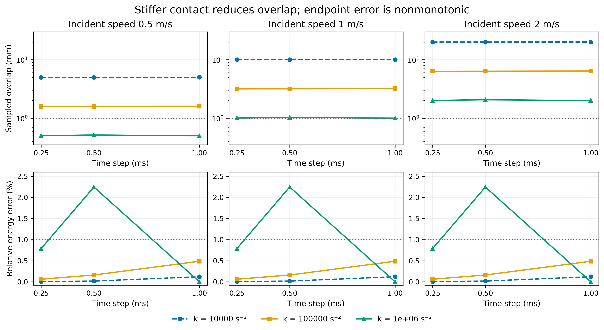

# Stiffness reduces overlap, but endpoint accuracy is not monotonic

[English](impact-stiffness-results.md) | [简体中文](impact-stiffness-results.zh-CN.md)

**27 valid cases: 24 pass the original final-state criteria, and only 2 also meet the separate 1 mm overlap budget.** This official MuJoCo 3.15.0 experiment reuses nine published equal-mass cases and adds eighteen higher-stiffness cases. No previous simulation was repeated. The budget is an engineering geometric limit (1% sphere diameter), not measured material stiffness or complete grasp acceptance.



At k=100000 s⁻², all nine final-state checks pass, but sampled overlap remains 1.58–6.40 mm. At k=1000000 s⁻², overlap decreases further, while the 0.5 ms step produces 2.246% relative energy error for all three incident speeds. The 1 ms endpoint is nearly exact; 0.25 ms gives 0.7901% energy error. These three samples do not establish monotonic convergence. A fortuitously accurate endpoint does not qualify a coarse timestep; contact phase sensitivity has not been tested.

The two joint passes are stiffness-10 and stiffness-12 (0.5 m/s, 1 and 0.25 ms). **stiffness-13 is a floating-point boundary-only rejection:** its stored overlap is 0.0010000000000000009 m, approximately 8.67e-19 m above the limit. This is not meaningful physical excess. The frozen strict comparison is retained, so the formal count remains two; rounded table entries must not be used to recount passes.

## Complete results

The impact-* rows are reused baselines. Every failure is included; final and joint verdicts are distinct.

| Case | k (s⁻²) | u (m/s) | h (ms) | Velocity error (m/s) | Energy error (%) | Overlap (mm) | Final / joint |
|---|---:|---:|---:|---:|---:|---:|---|
| impact-01 | 10000 | 0.5 | 1 | 0.000301259 | 0.120576 | 5.00402841 | pass / fail |
| impact-02 | 10000 | 0.5 | 0.5 | 4.50749e-05 | 0.0180316 | 5.00049845 | pass / fail |
| impact-03 | 10000 | 0.5 | 0.25 | 1.75224e-05 | 0.00700922 | 5.00034562 | pass / fail |
| impact-04 | 10000 | 1 | 1 | 0.000602519 | 0.120576 | 10.0080568 | pass / fail |
| impact-05 | 10000 | 1 | 0.5 | 9.01499e-05 | 0.0180316 | 10.0009969 | pass / fail |
| impact-06 | 10000 | 1 | 0.25 | 3.50449e-05 | 0.00700922 | 10.0006912 | pass / fail |
| impact-07 | 10000 | 2 | 1 | 0.00120504 | 0.120576 | 20.0161136 | pass / fail |
| impact-08 | 10000 | 2 | 0.5 | 0.0001803 | 0.0180316 | 20.0019938 | pass / fail |
| impact-09 | 10000 | 2 | 0.25 | 7.00897e-05 | 0.00700922 | 20.0013825 | pass / fail |
| stiffness-01 | 100000 | 0.5 | 1 | 0.00121671 | 0.487867 | 1.60105 | pass / fail |
| stiffness-02 | 100000 | 0.5 | 0.5 | 0.000403628 | 0.161581 | 1.58598908 | pass / fail |
| stiffness-03 | 100000 | 0.5 | 0.25 | 0.000154877 | 0.0619701 | 1.58228404 | pass / fail |
| stiffness-04 | 100000 | 1 | 1 | 0.00243342 | 0.487867 | 3.2021 | pass / fail |
| stiffness-05 | 100000 | 1 | 0.5 | 0.000807255 | 0.161581 | 3.17197817 | pass / fail |
| stiffness-06 | 100000 | 1 | 0.25 | 0.000309755 | 0.0619701 | 3.16456807 | pass / fail |
| stiffness-07 | 100000 | 2 | 1 | 0.00486683 | 0.487867 | 6.4042 | pass / fail |
| stiffness-08 | 100000 | 2 | 0.5 | 0.00161451 | 0.161581 | 6.34395634 | pass / fail |
| stiffness-09 | 100000 | 2 | 0.25 | 0.000619509 | 0.0619701 | 6.32913614 | pass / fail |
| stiffness-10 | 1e+06 | 0.5 | 1 | 4.44089e-16 | 1.77636e-13 | 0.5 | pass / pass |
| stiffness-11 | 1e+06 | 0.5 | 0.5 | 0.0055542 | 2.24636 | 0.515625 | fail / fail |
| stiffness-12 | 1e+06 | 0.5 | 0.25 | 0.00196743 | 0.79007 | 0.502826571 | pass / pass |
| stiffness-13 | 1e+06 | 1 | 1 | 1.11022e-15 | 2.22045e-13 | 1 | pass / fail |
| stiffness-14 | 1e+06 | 1 | 0.5 | 0.0111084 | 2.24636 | 1.03125 | fail / fail |
| stiffness-15 | 1e+06 | 1 | 0.25 | 0.00393486 | 0.79007 | 1.00565314 | pass / fail |
| stiffness-16 | 1e+06 | 2 | 1 | 2.66454e-15 | 2.66454e-13 | 2 | pass / fail |
| stiffness-17 | 1e+06 | 2 | 0.5 | 0.0222168 | 2.24636 | 2.0625 | fail / fail |
| stiffness-18 | 1e+06 | 2 | 0.25 | 0.00786973 | 0.79007 | 2.01130629 | pass / fail |

## Method, evidence and reproduction

The [preregistered protocol](impact-stiffness-protocol.md) and [manifest](evidence/impact-stiffness/manifest.json) freeze source commit `73f3113f21539ff641c1aed34f17680fdc604cea`, two 1 kg spheres of radius 0.05 m, incident speed 0.5/1/2 m/s, timestep 1/0.5/0.25 ms and duration 0.2 s. Euler, Newton (100 iterations, tolerance 1e-12), direct solref=(-k,0), constant impedance 0.9; no gravity, friction, spin or actuation. The prior elastic reference swaps equal-mass velocities and conserves momentum and kinetic energy. Restitution is not fitted.

[Machine-readable results](evidence/impact-stiffness/results.json) include native peak force, signed impulse vector and impulse-error norm, sampled contact duration, per-case timings, XML/trace hashes, runtime identity and all verdicts. The protocol's “signed impulse error” wording is represented by the signed vector plus its explicit analytical reference; the scalar error field is a nonnegative norm. Peak force and contact duration are timestep-dependent sampled diagnostics, not continuous-time extrema or independently validated transient-force truth.

Retrieve `elastic-impact-raw-v1.zip` from [v0.44.0](https://github.com/huangkiki/Dexlab/releases/tag/v0.44.0) and the new raw archive from [v0.44.1](https://github.com/huangkiki/Dexlab/releases/tag/v0.44.1). Verify [archive hashes](evidence/impact-stiffness/archive.json), extract to separate baseline/new directories, then run the engine-free scorer:

```bash
python -m dexlab.impact_stiffness --baseline baseline --input new --output rescored.json
python scripts/plot_impact_stiffness.py --help
```

Use the directories containing manifest.json and case subdirectories. Recomputed scientific fields should match; scoring wall time is observational and will differ. Baseline runtime and artifact bindings are checked before combining evidence.

## Cost and scope

The new 18-case native campaign took 0.05229 s; accumulated setup, stepping, observation and case-total times were 0.01013, 0.01041, 0.01436 and 0.04903 s. Independent combined scoring took 0.04343 s. Bounded service wall times were 0.886 s for simulation and 0.384 s for scoring, excluding installation and release checks. Intel Core i9-14900K CPU FP64; enforced 16 GiB, two CPUs, 128 tasks, zero swap, 1800 s limit, exclusive research window. Baseline timing belongs to a previous campaign on the same hardware. These tiny unrepeated timings support cost accounting, not speed rankings.

For grasp research, this demonstrates why endpoint velocity agreement alone is insufficient: contact geometry needs a separate budget, and increased numerical stiffness needs timestep sensitivity checks. It does not demonstrate accurate real-material contact, calibrated grasp forces, another engine's inferiority, or a universally optimal timestep. The scalar u/sqrt(k) scale is a diagnostic, not a validated full transient model. Next: preregister contact-phase offsets and transient diagnostics to distinguish endpoint coincidence from robust behavior, then connect qualified contact tests to load-bearing and slip.
