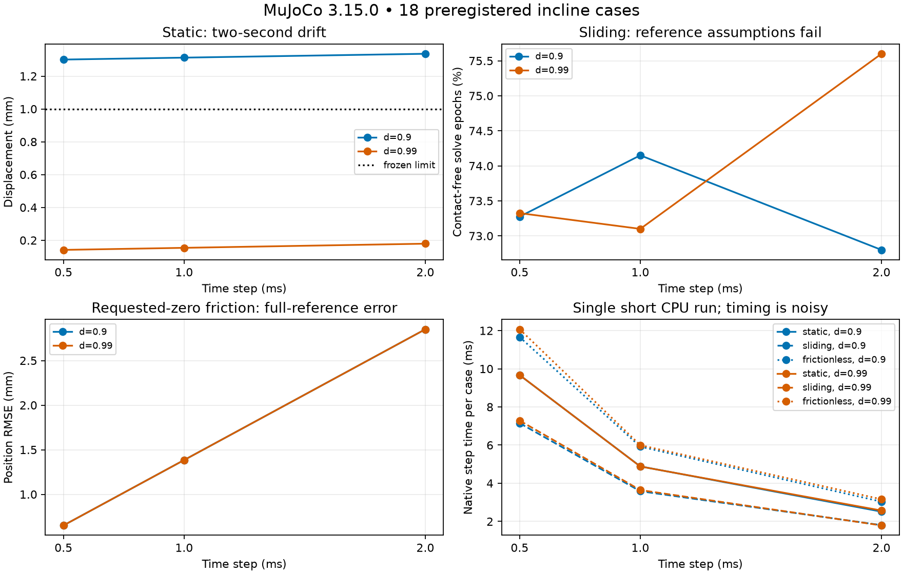

# 斜面摩擦解析评测结果

[English](incline-friction-results.md) · [预登记协议](incline-friction-protocol.zh-CN.md) · [全部指标与哈希](evidence/incline-friction/results.json)

官方MuJoCo3.15.0完成全部18个固定工况，9个满足联合工程容差、9个失败。这是确定性矩阵的计数，不是统计成功率或引擎排名。数值记录自洽与理想物理响应准确性分别验收。

## 已经能得出的结论

15°、μ0.5在声明的理想库仑模型中允许静止。恒定接触阻抗0.9时，步长2/1/0.5ms对应两秒漂移1.336/1.313/1.301mm，均超过预定1mm界限；阻抗0.99时为0.179/0.154/0.141mm，均通过。在本矩阵内，固定接触参数细化步长没有消除静止漂移，成对改变阻抗的影响更大。这支持数值接触参数敏感性结论，不是对真实表面的标定。

请求零摩擦的6例均满足容差，但原生接触实际读回μ=1e−5，编译后geom系数才是零。实测加速度缺额9.476e−5m/s²，与该下限对应的μg cos15°一致。不能把它宣传成严格无摩擦，或将偏差全部算作时间积分误差。

35°的6个滑动工况全部不满足无转动、持续支撑的解析参考条件：全程72.8–75.6%的求解采样无接触，姿态变化0.113–3.141rad；首次无接触发生在9–24ms，早于0.5s评分窗。即使拟合加速度接近理论，也不能据此通过，因为接触力和运动假设已经失败。这表明本次指定自由方块设置没有实现理想稳定滑动，尚未隔离原因，也不能推断MuJoCo所有滑动场景都失败。没有通过新增约束、控制器、调参或放宽阈值掩盖结果。



## 完整工况

运动工况的位移不是静止漂移；违反参考假设的加速度误差仅供诊断。接触缺失比例覆盖全程。JSON同时包含评分窗力误差、初始静止参考误差、计时及各项判定。

| Case | drift / travel (mm) | acceleration error (m/s²) | rotation (rad) | contact loss | joint pass |
|---|---:|---:|---:|---:|---|
| static-d0.9-h0.002 | 1.3360 | 2.62941e-12 | 0.00127253 | 0.00% | False |
| static-d0.9-h0.001 | 1.3125 | 1.11739e-12 | 0.00127253 | 0.00% | False |
| static-d0.9-h0.0005 | 1.3008 | 6.5559e-13 | 0.00127253 | 0.00% | False |
| static-d0.99-h0.002 | 0.1793 | 1.11795e-13 | 0.000126981 | 0.00% | True |
| static-d0.99-h0.001 | 0.1541 | 3.42595e-14 | 0.000126981 | 0.00% | True |
| static-d0.99-h0.0005 | 0.1415 | 1.48528e-14 | 0.000126981 | 0.00% | True |
| sliding-d0.9-h0.002 | 3219.5391 | 0.0123525 | 3.13036 | 72.80% | False |
| sliding-d0.9-h0.001 | 3218.0635 | 0.000904311 | 0.168716 | 74.15% | False |
| sliding-d0.9-h0.0005 | 3206.5829 | 0.0227201 | 1.20449 | 73.28% | False |
| sliding-d0.99-h0.002 | 3218.4667 | 0.0179469 | 3.13789 | 75.60% | False |
| sliding-d0.99-h0.001 | 3209.0721 | 0.0106093 | 3.14074 | 73.10% | False |
| sliding-d0.99-h0.0005 | 3217.0765 | 0.00497492 | 0.112732 | 73.32% | False |
| frictionless-d0.9-h0.002 | 5082.9180 | 9.47573e-05 | 1.03238e-07 | 0.00% | True |
| frictionless-d0.9-h0.001 | 5080.3791 | 9.47573e-05 | 1.07454e-07 | 0.00% | True |
| frictionless-d0.9-h0.0005 | 5079.1096 | 9.47573e-05 | 1.03238e-07 | 0.00% | True |
| frictionless-d0.99-h0.002 | 5082.9180 | 9.47573e-05 | 4.21468e-08 | 0.00% | True |
| frictionless-d0.99-h0.001 | 5080.3791 | 9.47573e-05 | 8.9407e-08 | 0.00% | True |
| frictionless-d0.99-h0.0005 | 5079.1096 | 9.47573e-05 | 5.16191e-08 | 0.00% | True |

## 复现和成本

安装准入官方运行时后，在仓库既有cgroup与研究窗口内执行：

```bash
python -m dexlab.incline_run --manifest docs/evidence/incline-friction/manifest.json --output /data/new-incline-run
python -m dexlab.incline_score --input /data/new-incline-run --output /data/new-incline-report.json
```

评分器校验文件哈希、编译配置、轨迹结构、初态、原生摩擦、时序及离散冲量/位置一致性。合成负例覆盖状态注入、力/时间破坏及支撑缺失。来源依靠源码和运行记录，不宣称能从数学上排除伪造观测。

物理批次0.806s，受限服务1.373s；42,000步累计原生步进0.101s。这里只是一次Intel Core i9-14900K CPU测量，含显著开销与噪声的短CPU测量，不用于吞吐排名。逐例准备、观测与总时间保留，无渲染，步进期间无传输。独立环境安装另耗61.474s；已有启动器验证16GiB、2CPU配额、128任务、零swap及1800s上限。源码哈希绑定实际运行版本，评分器后续修复单独记录。

首轮汇总因JSON数值类型序列化失败；第二版误将真实脱离支撑归为证据损坏。两次处理失败保留并修正，没有重跑物理，没有改数值容差。当前脱离支撑作为明确参考条件失败呈现，18条原始轨迹全部保留，可重新评分。

## 与抓取的联系及后续

该评测直接说明只给摩擦系数不足以说明数值接触行为；解释抓取保持还需关注静止漂移和真实接触连续性。它不验收任意材料的真实精度或完整抓取控制器。后续先诊断滑动接触生命周期，保留本批冻结结果；再独立预登记中心一维碰撞、恢复系数及守恒评测。真机比较作为后续独立证据层，不阻塞上述解析评测。

[18工况原始归档](https://github.com/huangkiki/Dexlab/releases/download/v0.43.0/incline-friction-raw-v1.zip) · [SHA256与离线读取校验](evidence/incline-friction/archive.json)。归档包含原始采集代码和独立修订的评分器。
