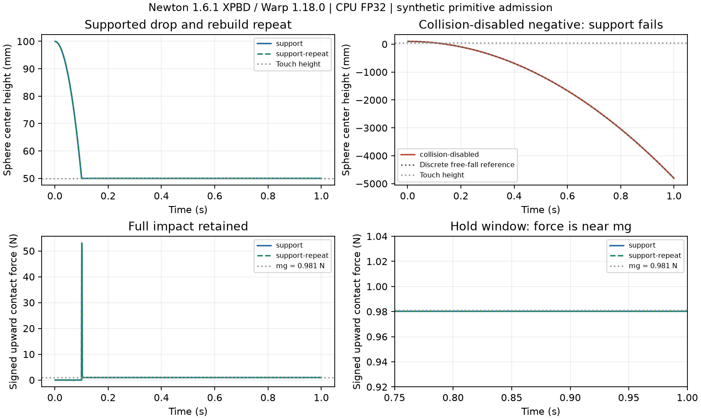

# Newton XPBD contact admission

[English](newton-contact.md) | [简体中文](newton-contact.zh-CN.md)

## Question and frozen development protocol

Does the official Newton 1.6.1 core with Warp 1.18.0 support a finite, reproducible sphere–plane contact episode without MuJoCo? The preregistered primitive admission passed; installation and source inspection alone are not physical evidence.

Use the native `SolverXPBD` on CPU, float32 state, an analytical sphere of radius 0.05 m and mass 0.1 kg, an infinite plane at z=0, gravity (0,0,-9.81) m/s², and initial center z=0.10 m. There is no robot, actuator, learned policy or rendering. Geometry is primitive collision, not SDF–SDF. Density is derived from mass and sphere volume; these are synthetic engineering parameters, not calibrated apple or finger properties.

Before any native episode, freeze dt=0.001 s, 1,000 steps, four XPBD iterations, contact relaxation 0.8, contact weighting enabled, restitution disabled, zero friction and zero adhesion/margin. Record every step, including initial state. Rebuild and repeat the supported episode once; separately run the identical scene with sphere collision disabled as a negative control. No search budget or parameter tuning is included. Native API/setup failures remain recorded; they are not physical failures or successes. One bounded invocation has a 600-second wall limit.

The independent scorer must check finite and complete observations, sphere surface intrusion ≤1 mm at every step, final 0.25 s center-height error ≤1 mm and speed ≤0.01 m/s, and native vertical support-force error ≤5% of mg. These are preregistered engineering admission bounds, not claims of physical accuracy. Report force impulse versus measured momentum change over the complete episode, and deterministic repeat differences. A collision-disabled run must fail support acceptance and match semi-implicit free-fall (within 0.1 mm position and 0.001 m/s velocity); it must not be silently excluded from the results.

## Force semantics and limits

Request `force` contact attributes before constructing contacts; call `SolverXPBD.update_contacts` after each step. Upstream defines the first three components as force on shape0’s body by shape1’s body in world coordinates; map signs using actual shape-to-body indices, not absolute values. Keep raw contact pairs and forces. XPBD reconstructs force from accumulated constraint impulses. Upstream explicitly documents contact-weighting approximations and lack of momentum conservation in general multi-body contacts. This simple static-plane test cannot qualify multi-contact grasp forces, articulated control, cloth, differentiability or GPU speed.

## Adapter inventory

The repository pins UniSim Core 1.7.10. Its Newton extra pins Newton 1.5.1, MuJoCo/MJWarp 3.11.0 and Warp 1.16.0. Those historical constraints cannot be presented as latest-stable qualification. The isolated core experiment does not override them and does not establish UniSim adapter equivalence. Newton’s optional `sim` extra is separate from its core Warp dependency. `SolverMuJoCo` wraps MuJoCo; XPBD is a distinct solver, not another name for MuJoCo’s Newton optimization method. Other Newton solver profiles require separate runtime evidence.

Sources: [official Newton 1.6.1 release](https://github.com/newton-physics/newton/releases/tag/v1.6.1), [XPBD implementation](https://github.com/newton-physics/newton/blob/v1.6.1/newton/_src/solvers/xpbd/solver_xpbd.py), [contact-force convention](https://github.com/newton-physics/newton/blob/v1.6.1/newton/_src/sim/contacts.py). Results and all negative controls are reported below.

### Source inventory, not a capability pass

UniSim 1.7.10 declares `mujoco`, `motrix`, `drake`, `mjwarp`, `newton`, `superdex`, `genesis`, `isaacgym`, and `isaacsim` adapters as available in `unisim/adapters.py`. Its metadata explicitly warns that this declaration does not prove runtime support. Its Newton backend constructs `SolverMuJoCo` in `unisim/backend/newton/backend.py`; this experiment uses the separate upstream core API.

| Newton 1.6.1 public solver export | Evidence in this work |
|---|---|
| SolverXPBD | Selected rigid contact profile; positive/repeat/negative records passed admission |
| SolverMuJoCo | Wrapper identity inspected; no latest adapter qualification |
| SolverFeatherstone, SolverSemiImplicit, SolverVBD, SolverKamino | Exported in upstream source; no native execution or task qualification here |
| SolverImplicitMPM, SolverStyle3D | Exported in upstream source; outside this rigid primitive protocol |

`SolverBase` is an interface, not another engine. A solver's presence in `newton/_src/solvers/__init__.py` does not prove its optional dependencies, joint/contact features, or task validity. No implicit fallback to one of these solvers is allowed.

## Result: primitive admission passed

The three CPU episodes completed in **12.826 s** including first-use JIT, observation copies and scoring; peak cgroup memory was **299,753,472 bytes**, with no high/max/OOM events. This is not steady-state throughput. The repeat is an identical rebuild, not an independent seed. No parameter search or native engine patch was used.

| Check | Supported episode (and identical repeat) | Collision-disabled negative |
|---|---:|---:|
| Maximum surface intrusion | 0.000849 mm | 4,859.901 mm; intentionally fails support |
| Maximum hold height error | 0.0000142 mm | 4,859.901 mm |
| Maximum hold speed | 0 m/s | 9.810061 m/s |
| Maximum hold force error / mg | 0.051353% | 100% |
| Whole-episode vertical momentum residual | 0.000441780 N·s | -0.000006050 N·s |
| Free-fall reference position error | Not a free-fall trajectory after contact | 0.008643 mm |
| Free-fall reference velocity error | Not a free-fall trajectory after contact | 0.0000605 m/s |
| Frozen support criterion | Pass | Fail, as required |

The disabled negative has zero recorded contact force. The normal impact reaches 53.0434 N; the figure preserves that peak and separately magnifies the hold window. A small penetration does not establish calibrated compliance or accurate impact forces. The momentum residual is disclosed, not silently assumed zero. All states, signed forces, material/shape readbacks and the original negative are included in the compressed raw record.



[Raw record (gzip)](evidence/newton-xpbd/record.json.gz) · [Independent scores](evidence/newton-xpbd/score.json) · [Hashes, cost and setup failures](evidence/newton-xpbd/manifest.json) · [Official wheel and installed-code identity](evidence/newton-xpbd/official-wheels.json)

Downloads through proxy and direct PyPI were interrupted after poor transfer progress; their partial files were retained. A Python 3.10 verification helper failed on `hashlib.file_digest` before any native episode; a streaming implementation corrected it. Mirror wheel bytes then matched the authoritative PyPI SHA-256 and every installed Python/native code file. These are setup failures, not hidden physical trials. After the native run, the scorer added shape/material readback and nonfinite-mass validation; the same raw data passed without any threshold change.

## Reproduction

The optional core environment is separate from DexLab's native MuJoCo/SuperDex environment. Match the official wheel proof before dispatch; latest-stable status must be checked again for a new experiment. Set `DEXLAB_DATA_DIR` and `DEXLAB_DATA_DEVICE` to your existing output volume and its actual block device. The guard requires measured desktop reserve and hard cgroup enforcement. Use a fresh output directory.

```bash
uv venv --python 3.12 .venv-newton
uv pip install --python .venv-newton/bin/python newton==1.6.1 warp-lang==1.18.0 numpy==2.5.3
python3 scripts/bounded_run.py --profile experiment --timeout 600 \
  --data-dir "$DEXLAB_DATA_DIR" --io-device "$DEXLAB_DATA_DEVICE" \
  --receipt "$DEXLAB_DATA_DIR/newton-repro-resources.json" -- \
  env PYTHONPATH="$PWD/src" WARP_CACHE_PATH="$DEXLAB_DATA_DIR/newton-cache" \
  "$PWD/.venv-newton/bin/python" -m dexlab.newton_contact_probe "$DEXLAB_DATA_DIR/newton-repro"
PYTHONPATH=src python3 -m dexlab.newton_contact_score "$DEXLAB_DATA_DIR/newton-repro/record.json"
```

Rescore bundled history without Newton or an engine run:

```bash
gzip -dc docs/evidence/newton-xpbd/record.json.gz > /tmp/dexlab-newton-record.json
PYTHONPATH=src python3 -m dexlab.newton_contact_score /tmp/dexlab-newton-record.json
```

This admits one synthetic CPU XPBD contact profile. Robot control, SDF–SDF, cloth, optional solver profiles, GPU execution, convergence and hardware validity remain unqualified; no universal engine ranking follows.
