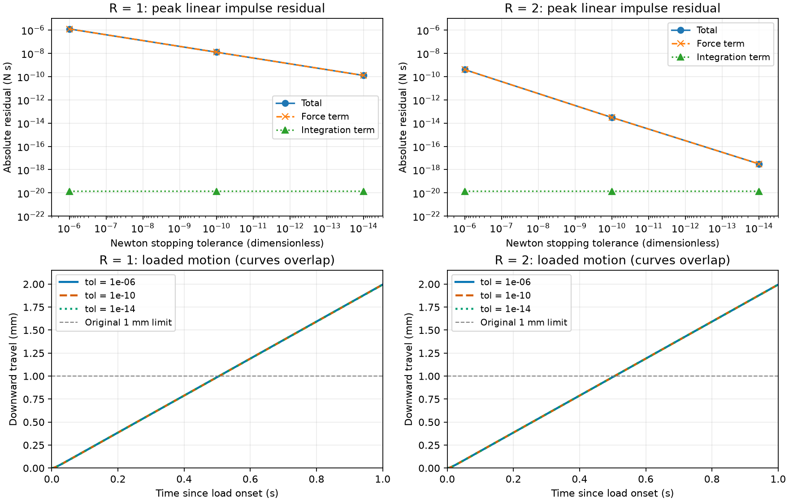

# Pinch residual: numerical closure improves, creep persists

[简体中文](pinch-impulse-results.zh-CN.md) · [Frozen protocol](pinch-impulse-protocol.md) · [All metrics and costs](evidence/pinch-impulse/results.json)

All six new diagnostic cases completed once and satisfy the declared decomposition checks. Both tolerance 1e-10 baselines match their published v0.45.0 trajectories within 1e-12 per state component. This establishes instrumented reproduction of those two cases; it does not reverse the original six rejected marginal records or qualify physical hold.

## Findings

For marginal capacity R=1, the linear impulse residual is localized to `h*(M*qacc-qfrc_smooth-qfrc_constraint)`. Its peak falls from 1.234e-6 to 1.240e-8 to 1.245e-10 N s as stopping tolerance changes from 1e-6 to 1e-10 to 1e-14. The integration contribution stays around 1.4e-20 N s. Thus the recorded velocity update is consistent with native acceleration, while the native acceleration/force balance carries the discrepancy. This controlled tolerance intervention supports a solver-accuracy sensitivity in this fixture, not an engine defect or a universal tolerance recommendation. The precise stopping branch is not established by these observations.

The effect on motion is tiny: R=1 travels 1.99546, 1.99456 and 1.99455 mm during the loaded second. R=2 also travels about 1.99455 mm. All six peak speeds remain around 2.011 mm/s, beyond the original 1 mm/s hold limit. Improving numerical force balance does not remove the soft-contact creep. No threshold changed, and no new record replaces the old results.



Top panels report absolute peak linear residuals; total and force-term curves overlap. Bottom panels show full-rate motion, with a common zero-based axis. The near-overlap of the three motion curves is expected. Solver statistics use scaled units and are separate from the N s residuals.

| R | Tolerance | Total peak (N s) | Integration peak (N s) | Travel (mm) | Peak speed (mm/s) | Maximum iterations | Cap-hit steps |
|---|---:|---:|---:|---:|---:|---:|---:|
| 1 | 1e-6 | 1.233736e-6 | 1.377847e-20 | 1.995464 | 2.012113 | 2 | 0 |
| 1 | 1e-10 | 1.239932e-8 | 1.385609e-20 | 1.994558 | 2.011060 | 2 | 0 |
| 1 | 1e-14 | 1.244804e-10 | 1.383327e-20 | 1.994549 | 2.011050 | 2 | 0 |
| 2 | 1e-6 | 3.918517e-10 | 1.379647e-20 | 1.994549 | 2.011051 | 1 | 0 |
| 2 | 1e-10 | 3.041864e-14 | 1.387489e-20 | 1.994549 | 2.011050 | 1 | 0 |
| 2 | 1e-14 | 3.113910e-18 | 1.382936e-20 | 1.994549 | 2.011050 | 1 | 0 |

Decomposition closure peaks are at most 1.63e-21 N s. Rotational values, RMS values, all timing components and scaled gradient histories remain in the JSON/raw records. No case reaches the 100-iteration cap. A maximum gradient over all recorded iterations is not a terminal convergence criterion; do not interpret it as the stopping tolerance. Monotonic residual reduction is observed only in this six-case grid, not proved generally.

## Reproduction, cost and limits

Official MuJoCo 3.15.0 CPU FP64; source frozen at `c5d70fd80fbe9d1a6386e2cbb16240a649cae361` before the unique campaign. The six-case campaign took 0.227565 s inside a 1.259 s bounded service; scoring service 0.782 s, fresh environment setup 19.075 s and version/wheel/test qualification 32.242 s. The latter included 30 focused tests (1.613 s) and no physics steps. Individual preparation, control, native-step, observation and serialization costs are in the JSON. These short timings are observational, not a speed ranking.

A 16 GiB/two-CPU/128-task/zero-swap/1800 s envelope, measured desktop/disk headroom and exclusive research window were enforced. No transfers or unrelated hashing ran during physics. Software release regression is separate and recorded in the release validation attachment.

After extracting the raw archive below (which includes the two original baseline traces), run from the v0.45.1 checkout in its installed environment:

```bash
python -m dexlab.pinch_impulse_score --input /data/extracted/batch1 \
  --evidence docs/evidence/pinch-impulse --baseline /data/extracted/baseline \
  --output /data/new-scores.json
python scripts/analyze_pinch_impulse.py --input /data/extracted/batch1 \
  --scores /data/new-scores.json --output /data/new-figures
```

The scorer uses no native physics execution. Hashes bind observations to the trusted protocol; they do not prove authenticity against an adversary. Synthetic tests reject missing observations, changed acceleration/state/loads, wrong compiled mass/source/artifacts and baseline mismatch, while retaining remaining cases after a numerical diagnostic rejection.

This guided fixture uses synthetic friction and explicit preload assistance. Findings apply to the declared configuration, not real materials, a robot policy or universal engine fidelity. Future work should test finite fingers and separately preregister solver-stopping diagnostics if exact algorithmic attribution is needed. The v0.45.0 rejection remains historical evidence.

[Raw archive](https://github.com/huangkiki/Dexlab/releases/download/v0.45.1/pinch-impulse-raw-v1.zip) · [Archive verification](evidence/pinch-impulse/archive.json)

SHA-256: `5df37d6862a529400c61f5af951f26f8de5515e3c2dbfc2f7f9c7ca1dc7363ed`; 2975606 bytes, 22 files.
