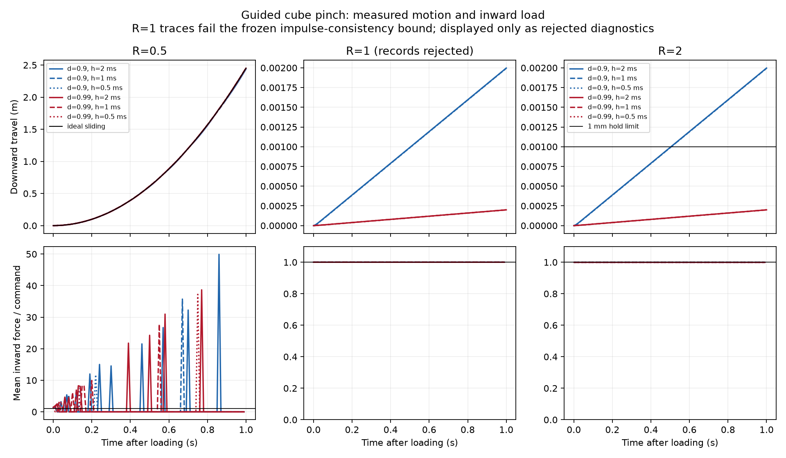

# Standard cube pinch findings

[简体中文](pinch-load-results.zh-CN.md) · [Preregistered protocol](pinch-load-protocol.md) · [All scores](evidence/pinch-load/results.json) · [Impulse diagnostics](evidence/pinch-load/impulse-diagnostics.json)

All18 preregistered native cases completed once: **3 pass,9 fail the physical tolerances,6 fail numerical record consistency**. This is a deterministic matrix, not a population success rate. The full repository regression, archive publication and release remain pending; these findings are not a completed release claim.

## What follows from the records

At twice the ideal static capacity (R=2), impedance0.9 still produces approximately2mm/s steady downward creep and about2mm travel over the loaded second. All three timesteps fail the frozen1mm/1mm/s hold limits. Impedance0.99 reduces creep to approximately0.2mm/s and travel0.2mm; all three pass. Refinement from2ms to0.5ms does not remove the softness-sensitive creep in this fixture. This establishes a configuration-specific hold result, not calibrated material friction or a recommended universal parameter.

At half capacity (R=0.5), all six cases fail normal-command agreement, continuous bilateral support, force response and velocity RMSE. Their travel curves look close to ideal sliding, yet contact repeatedly disappears and returns with force spikes. A smooth-looking displacement curve cannot establish the assumed steady frictional support. All initial preload assistance and constrained jaw freedoms remain explicit in the protocol.

At marginal capacity (R=1), all six records exceed the frozen1e-9N*s linear impulse-consistency bound: peaks range8.7063e-9 to4.8652e-8N*s. Recalculation using the recorded native generalized forces also shows the mismatch; it is not only the independent contact-force summation. Other ratios have much smaller residuals. The records lack native qacc and solver convergence history, so the cause remains unresolved. No claim of actual state injection, universal engine defect, or a qualified marginal hold follows. Displayed R1 motion is rejected diagnostic data. No threshold was relaxed and no physics rerun replaced these cases.



The lower panels show the mean horizontal inward contact force divided by the per-jaw command; R1/R2 use0–1.1 scales to avoid misleading offset notation. Force display samples every10ms; full-rate scores and raw traces retain spikes. Different vertical axes in the upper panels separate metre-scale sliding from millimetre-scale creep. R1 panels are explicitly rejected diagnostics.

## Complete outcomes

Travel and speed in INVALID rows are descriptive raw values, not accepted measurements for physical conclusions. Per-case physical gate failures and costs are in the JSON.

| Case | Travel (mm) | Max loaded speed (mm/s) | Bilateral contact loss | Impulse residual (N s) | Verdict |
|---|---:|---:|---:|---:|---|
| R0.5-d0.9-h0.002 | 2439.2 | 5103.8 | 92.60% | 2.151e-15 | FAIL |
| R0.5-d0.9-h0.001 | 2448.2 | 5143.5 | 92.30% | 1.28e-15 | FAIL |
| R0.5-d0.9-h0.0005 | 2447.9 | 4927.9 | 92.25% | 5.152e-16 | FAIL |
| R0.5-d0.99-h0.002 | 2451.4 | 4916.5 | 92.60% | 2.158e-15 | FAIL |
| R0.5-d0.99-h0.001 | 2452.5 | 5061 | 92.30% | 1.412e-15 | FAIL |
| R0.5-d0.99-h0.0005 | 2453.4 | 4924.2 | 92.25% | 6.219e-16 | FAIL |
| R1.0-d0.9-h0.002 | 1.9966 | 2.0111 | 0.00% | 1.285e-08 | INVALID |
| R1.0-d0.9-h0.001 | 1.9946 | 2.0111 | 0.00% | 1.24e-08 | INVALID |
| R1.0-d0.9-h0.0005 | 1.9936 | 2.0111 | 0.00% | 8.706e-09 | INVALID |
| R1.0-d0.99-h0.002 | 0.19951 | 0.20111 | 0.00% | 4.865e-08 | INVALID |
| R1.0-d0.99-h0.001 | 0.19931 | 0.20111 | 0.00% | 3.563e-08 | INVALID |
| R1.0-d0.99-h0.0005 | 0.19922 | 0.20111 | 0.00% | 3.001e-08 | INVALID |
| R2.0-d0.9-h0.002 | 1.9966 | 2.0111 | 0.00% | 6.237e-14 | FAIL |
| R2.0-d0.9-h0.001 | 1.9945 | 2.0111 | 0.00% | 3.042e-14 | FAIL |
| R2.0-d0.9-h0.0005 | 1.9935 | 2.0111 | 0.00% | 1.53e-14 | FAIL |
| R2.0-d0.99-h0.002 | 0.19951 | 0.20111 | 0.00% | 5.905e-14 | PASS |
| R2.0-d0.99-h0.001 | 0.19931 | 0.20111 | 0.00% | 3.184e-14 | PASS |
| R2.0-d0.99-h0.0005 | 0.19921 | 0.20111 | 0.00% | 1.918e-14 | PASS |

## Cost, reproduction and limits

Official MuJoCo3.15.0 CPU FP64; runner frozen at de096255437d3ef7ea1f9a78344655e75cf68e0f before physics. The campaign took4.369s within a5.029s bounded service. Summed setup0.0151s, command submission0.0641s, native steps0.1317s, observation3.8087s and serialization0.3371s. Environment setup took20.755s. These short observational timings are not an engine ranking.16GiB/two-CPU/128tasks/zero-swap/1800s limits and an exclusive research window were enforced. No transfer or unrelated hashing ran during physics.

The first scoring pass stopped at the first rejected R1 record. The aggregation fix now preserves that rejection and evaluates every remaining case; it changes neither the physics nor the numerical threshold.15 focused tests pass, including rehashed-protocol, changed compiled mass, altered force/state and continued aggregation after invalid evidence. The second scoring service took0.690s. See the protocol for the engine-free scoring command; public raw archive delivery is pending.

For grasping, sufficient commanded squeeze is only a model-level precondition: actual normal forces, sustained contact and acceptable creep must also be verified. These tall guided jaws are a deliberate analytical fixture with synthetic friction and privileged observations, not a robot, learned policy or hardware-validated gripper. Future separately preregistered work should record native acceleration/solver diagnostics for the marginal case and test transfer to finite robot fingers; this study does not silently extend its18-case budget.

```bash
python scripts/analyze_pinch.py --input /data/new-pinch-run --output /data/new-pinch-plots
```
