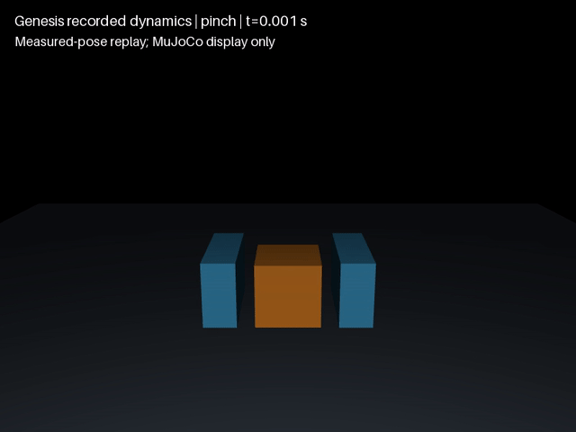

<div class="research-eyebrow">DEXLAB / PHYSICS EVALUATION NOTES</div>

# How does contact shape grasping?

<div class="research-deck">Start with physics. Test the explanation.</div>

Reproducible contact and friction experiments grounded in established physical laws and empirical relations. Findings come first; models, solvers, raw records and their limits follow.

<div class="research-links"><a href="#comparison">Read the comparison ↗</a><a href="#coverage">Six-engine coverage</a><a href="https://github.com/huangkiki/Dexlab/releases">Code & data ↗</a></div>

<div class="research-meta">Evidence release v0.50.0 · Analytical verification / fixed cases · Full-engine matrix incomplete</div>

## What tasks can I run?

Choose a task entry point, then use its documented protocol, environment and results. This table describes **implementations with retained DexLab evidence**. “Executed” includes failures; a pass applies only to the reported version, configuration and cases.

| Task | Implemented engines and validation | Run and evidence entry points |
|---|---|---|
| Inclined-plane friction and one-dimensional impact | MuJoCo / SuperDex have paired incline cases, including failures; MuJoCo has recorded impact experiments | [Incline comparison](https://github.com/huangkiki/Dexlab/blob/main/docs/incline-comparison-results.md) · [Impact](https://github.com/huangkiki/Dexlab/blob/main/docs/elastic-impact-results.md) |
| Plane sliding, normal loading / unloading, and cylinder pinch | MuJoCo / SuperDex / PhysX development cases executed, retaining failures and geometry refinement | [Contact experiments and commands](https://github.com/huangkiki/Dexlab/blob/main/demos/contact-benchmark/README.md) |
| Finite-fixture pinch, lift, hold and release | Genesis completed 16 force-limit cases for studying drive limits and failure mechanisms | [Force-limit results and reproduction](https://github.com/huangkiki/Dexlab/blob/main/docs/force-limit-results.md) |
| Robot SDF apple-stem grasp | MuJoCo / SuperDex passed the specified 14 s scene; PhysX has separate single-scene acceptance with its own configuration and preparation chain | [MuJoCo / SuperDex](https://github.com/huangkiki/Dexlab/blob/main/demos/apple-stem-grasp/README.md) · [PhysX](https://github.com/huangkiki/Dexlab/blob/main/demos/physx-contact/apple.md) |
| Cloth extension, sag, sphere draping and pre-folded drop | MuJoCo flex / SuperDex shell / Newton Physics have historical experiments, including failures; PhysX surface cloth has separate passive cases, without per-node-force extension support | [Cloth benchmark](https://github.com/huangkiki/Dexlab/blob/main/demos/cloth-benchmark/README.md) · [PhysX scope](https://github.com/huangkiki/Dexlab/blob/main/demos/physx-contact/cloth.md) |
| Robot cloth grasp, lift and release | One specified 9 s MuJoCo 3.14 development case passed the limited protocol; self-contact is near the threshold and robustness remains unproven | [Passing configuration, failures and commands](https://github.com/huangkiki/Dexlab/blob/main/demos/cloth-folding/SETTLING.md) |
| Basic rigid sphere–plane contact | Newton Physics 1.6.1 / XPBD normal, repeat and collision-disabled controls passed admission; robot grasping is outside this test | [Protocol, records and verification](https://github.com/huangkiki/Dexlab/blob/main/docs/newton-contact.md) |

Two-hand cloth folding has no demonstrated success. Drake 1.57.0 passes six of nine initial incline cases; all three sliding cases fail and the negative is correctly rejected. [Full records](https://github.com/huangkiki/Dexlab/blob/main/docs/drake-incline-results.md). [#143](https://github.com/huangkiki/Dexlab/issues/143) verifies adapter correspondence; the full research campaign remains [#130](https://github.com/huangkiki/Dexlab/issues/130).

**Our assessment standard: a better engine should reliably cover more types of tasks.** We assess task types alongside physical credibility, stability across conditions and execution cost. Reliably completing more task types under retained criteria expands a configuration's validated scope. Installation, adapter declarations, multiple solvers for one task and repeated runs do not add task types; pass counts from different historical protocols do not form a universal ranking.


## Task coverage by solver

MuJoCo 3.15.0 initial six-profile qualification: elliptic 3/9 each, pyramidal 0/9 each; all six negatives rejected. CG/Newton pyramidal each retain three invalid force/state records. [详细证据 / Evidence](https://github.com/huangkiki/Dexlab/blob/main/docs/mujoco-incline-results.md).

<!-- task-coverage:start -->

States: passed / partial / failed / not run / blocked / unsupported. Cells link to evidence or recovery conditions.

**Historical protocols remain separate; a pass applies only to its protocol.** Reliable coverage under the new protocol requires positive and negative cases, independent physics scoring, frozen holdouts and equal tuning budgets.

### Rigid tasks · historical protocols

| Core / solver / path / version / cohort | Basic contact | Incline | Collision | Fixture pinch | Robot grasp |
| --- | --- | --- | --- | --- | --- |
| **MuJoCo · Newton / Euler**<br>native · 3.15.0<br>rigid-history | [Not run](https://github.com/huangkiki/Dexlab/issues/121) | [Partial](https://github.com/huangkiki/Dexlab/blob/main/docs/incline-comparison-results.md) | [Partial](https://github.com/huangkiki/Dexlab/blob/main/docs/impact-stiffness-results.md) | [Partial](https://github.com/huangkiki/Dexlab/blob/main/docs/pinch-load-results.md) | [Not run](https://github.com/huangkiki/Dexlab/issues/121) |
| **MuJoCo · PGS / elliptic / Euler**<br>native CPU FP64 · 3.15.0<br>mujoco-incline-pgs-elliptic-v1 | [Not run](https://github.com/huangkiki/Dexlab/issues/121) | [Partial 3/9](https://github.com/huangkiki/Dexlab/blob/main/docs/mujoco-incline-results.md) | [Not run](https://github.com/huangkiki/Dexlab/issues/121) | [Not run](https://github.com/huangkiki/Dexlab/issues/121) | [Not run](https://github.com/huangkiki/Dexlab/issues/121) |
| **MuJoCo · PGS / pyramidal / Euler**<br>native CPU FP64 · 3.15.0<br>mujoco-incline-pgs-pyramidal-v1 | [Not run](https://github.com/huangkiki/Dexlab/issues/121) | [Failed 0/9](https://github.com/huangkiki/Dexlab/blob/main/docs/mujoco-incline-results.md) | [Not run](https://github.com/huangkiki/Dexlab/issues/121) | [Not run](https://github.com/huangkiki/Dexlab/issues/121) | [Not run](https://github.com/huangkiki/Dexlab/issues/121) |
| **MuJoCo · CG / elliptic / Euler**<br>native CPU FP64 · 3.15.0<br>mujoco-incline-cg-elliptic-v1 | [Not run](https://github.com/huangkiki/Dexlab/issues/121) | [Partial 3/9](https://github.com/huangkiki/Dexlab/blob/main/docs/mujoco-incline-results.md) | [Not run](https://github.com/huangkiki/Dexlab/issues/121) | [Not run](https://github.com/huangkiki/Dexlab/issues/121) | [Not run](https://github.com/huangkiki/Dexlab/issues/121) |
| **MuJoCo · CG / pyramidal / Euler**<br>native CPU FP64 · 3.15.0<br>mujoco-incline-cg-pyramidal-v1 | [Not run](https://github.com/huangkiki/Dexlab/issues/121) | [Failed 0/9](https://github.com/huangkiki/Dexlab/blob/main/docs/mujoco-incline-results.md) | [Not run](https://github.com/huangkiki/Dexlab/issues/121) | [Not run](https://github.com/huangkiki/Dexlab/issues/121) | [Not run](https://github.com/huangkiki/Dexlab/issues/121) |
| **MuJoCo · Newton / elliptic / Euler**<br>native CPU FP64 · 3.15.0<br>mujoco-incline-newton-elliptic-v1 | [Not run](https://github.com/huangkiki/Dexlab/issues/121) | [Partial 3/9](https://github.com/huangkiki/Dexlab/blob/main/docs/mujoco-incline-results.md) | [Not run](https://github.com/huangkiki/Dexlab/issues/121) | [Not run](https://github.com/huangkiki/Dexlab/issues/121) | [Not run](https://github.com/huangkiki/Dexlab/issues/121) |
| **MuJoCo · Newton / pyramidal / Euler**<br>native CPU FP64 · 3.15.0<br>mujoco-incline-newton-pyramidal-v1 | [Not run](https://github.com/huangkiki/Dexlab/issues/121) | [Failed 0/9](https://github.com/huangkiki/Dexlab/blob/main/docs/mujoco-incline-results.md) | [Not run](https://github.com/huangkiki/Dexlab/issues/121) | [Not run](https://github.com/huangkiki/Dexlab/issues/121) | [Not run](https://github.com/huangkiki/Dexlab/issues/121) |
| **SuperDex · Newton / AUTO / FP64**<br>native · 1.0.0<br>rigid-history | [Not run](https://github.com/huangkiki/Dexlab/issues/121) | [Partial](https://github.com/huangkiki/Dexlab/blob/main/docs/incline-comparison-results.md) | [Not run](https://github.com/huangkiki/Dexlab/issues/121) | [Not run](https://github.com/huangkiki/Dexlab/issues/121) | [Not run](https://github.com/huangkiki/Dexlab/issues/121) |
| **Genesis · Newton / approximate_implicitfast**<br>native CPU FP64 · 1.4.3<br>rigid-history | [Not run](https://github.com/huangkiki/Dexlab/issues/121) | [Not run](https://github.com/huangkiki/Dexlab/issues/121) | [Not run](https://github.com/huangkiki/Dexlab/issues/121) | [Passed](https://github.com/huangkiki/Dexlab/blob/main/docs/force-limit-results.md) | [Not run](https://github.com/huangkiki/Dexlab/issues/121) |
| **Genesis · Newton / approximate_implicitfast**<br>UniSim 1.7.12 + disclosed local patch · 1.4.3<br>genesis-contact-migration-v4 | [Not run](https://github.com/huangkiki/Dexlab/issues/121) | [Not run](https://github.com/huangkiki/Dexlab/issues/121) | [Not run](https://github.com/huangkiki/Dexlab/issues/121) | [Partial](https://github.com/huangkiki/Dexlab/blob/main/docs/unisim-contact-migration.md) | [Not run](https://github.com/huangkiki/Dexlab/issues/121) |
| **Newton Physics · XPBD**<br>native CPU FP32 · 1.6.1 / Warp 1.18.0<br>rigid-history | [Passed](https://github.com/huangkiki/Dexlab/blob/main/docs/newton-contact.md) | [Not run](https://github.com/huangkiki/Dexlab/issues/121) | [Not run](https://github.com/huangkiki/Dexlab/issues/121) | [Not run](https://github.com/huangkiki/Dexlab/issues/121) | [Not run](https://github.com/huangkiki/Dexlab/issues/121) |
| **PhysX · historical readback incomplete (#126)**<br>SDK historical · historical core identity unrecovered (#126)<br>rigid-history | [Partial](https://github.com/huangkiki/Dexlab/blob/main/docs/physx-solver-audit.md) | [Not run](https://github.com/huangkiki/Dexlab/issues/121) | [Not run](https://github.com/huangkiki/Dexlab/issues/121) | [Partial](https://github.com/huangkiki/Dexlab/blob/main/docs/physx-solver-audit.md) | [Not run](https://github.com/huangkiki/Dexlab/issues/121) |
| **Drake · SAP / kLagged / hydroelastic**<br>native CPU FP64 · 1.57.0<br>drake-incline-qualification-v2 | [Not run](https://github.com/huangkiki/Dexlab/issues/151) | [Partial 6/9](https://github.com/huangkiki/Dexlab/blob/main/docs/drake-incline-results.md) | [Not run](https://github.com/huangkiki/Dexlab/issues/151) | [Not run](https://github.com/huangkiki/Dexlab/issues/151) | [Not run](https://github.com/huangkiki/Dexlab/issues/151) |
| **MuJoCo · Newton / implicitfast**<br>native · 3.11.0<br>apple-sdf-14s | [Not run](https://github.com/huangkiki/Dexlab/issues/121) | [Not run](https://github.com/huangkiki/Dexlab/issues/121) | [Not run](https://github.com/huangkiki/Dexlab/issues/121) | [Not run](https://github.com/huangkiki/Dexlab/issues/121) | [Passed](https://github.com/huangkiki/Dexlab/blob/main/demos/apple-stem-grasp/README.md) |
| **SuperDex · Newton / GMRES / FP64**<br>native · 1.0.0<br>apple-sdf-14s | [Not run](https://github.com/huangkiki/Dexlab/issues/121) | [Not run](https://github.com/huangkiki/Dexlab/issues/121) | [Not run](https://github.com/huangkiki/Dexlab/issues/121) | [Not run](https://github.com/huangkiki/Dexlab/issues/121) | [Passed](https://github.com/huangkiki/Dexlab/blob/main/demos/apple-stem-grasp/README.md) |

### Manipulation · historical protocols and gaps

| Core / solver / path / version / cohort | Pushing | In-hand rotation | Cloth grasp/lift | Active folding |
| --- | --- | --- | --- | --- |
| **MuJoCo · Newton / Euler**<br>native · 3.15.0<br>rigid-history | [Not run](https://github.com/huangkiki/Dexlab/issues/47) | [Not run](https://github.com/huangkiki/Dexlab/issues/48) | [Not run](https://github.com/huangkiki/Dexlab/issues/28) | [Not run](https://github.com/huangkiki/Dexlab/issues/28) |
| **SuperDex · Newton / AUTO / FP64**<br>native · 1.0.0<br>rigid-history | [Not run](https://github.com/huangkiki/Dexlab/issues/47) | [Not run](https://github.com/huangkiki/Dexlab/issues/48) | [Not run](https://github.com/huangkiki/Dexlab/issues/28) | [Not run](https://github.com/huangkiki/Dexlab/issues/28) |
| **Genesis · Newton / approximate_implicitfast**<br>native CPU FP64 · 1.4.3<br>rigid-history | [Not run](https://github.com/huangkiki/Dexlab/issues/47) | [Not run](https://github.com/huangkiki/Dexlab/issues/48) | [Not run](https://github.com/huangkiki/Dexlab/issues/28) | [Not run](https://github.com/huangkiki/Dexlab/issues/28) |
| **Newton Physics · XPBD**<br>native CPU FP32 · 1.6.1 / Warp 1.18.0<br>rigid-history | [Not run](https://github.com/huangkiki/Dexlab/issues/47) | [Not run](https://github.com/huangkiki/Dexlab/issues/48) | [Not run](https://github.com/huangkiki/Dexlab/issues/28) | [Not run](https://github.com/huangkiki/Dexlab/issues/28) |
| **PhysX · pending qualification**<br>ManiSkill / SAPIEN · official combination pending #47<br>rigid-history | [Blocked](https://github.com/huangkiki/Dexlab/issues/47) | [Blocked](https://github.com/huangkiki/Dexlab/issues/47) | [Not run](https://github.com/huangkiki/Dexlab/issues/28) | [Not run](https://github.com/huangkiki/Dexlab/issues/28) |
| **Drake · SAP / kLagged / hydroelastic**<br>native CPU FP64 · 1.57.0<br>drake-incline-qualification-v2 | [Not run](https://github.com/huangkiki/Dexlab/issues/47) | [Not run](https://github.com/huangkiki/Dexlab/issues/48) | [Not run](https://github.com/huangkiki/Dexlab/issues/28) | [Not run](https://github.com/huangkiki/Dexlab/issues/28) |
| **MuJoCo · Newton / implicitfast**<br>native · 3.14.0<br>rigid-history | [Not run](https://github.com/huangkiki/Dexlab/issues/47) | [Not run](https://github.com/huangkiki/Dexlab/issues/48) | [Passed](https://github.com/huangkiki/Dexlab/blob/main/demos/cloth-folding/SETTLING.md) | [Not run](https://github.com/huangkiki/Dexlab/issues/28) |
| **Genesis · PBD / rigid coupling**<br>native CPU FP64 · 1.4.3<br>genesis-cloth-diagnostic | [Not run](https://github.com/huangkiki/Dexlab/issues/47) | [Not run](https://github.com/huangkiki/Dexlab/issues/48) | [Failed](https://github.com/huangkiki/Dexlab/blob/main/docs/genesis-cloth.md) | [Not run](https://github.com/huangkiki/Dexlab/issues/28) |

### Cloth tasks · separate historical protocols

| Core / solver / path / version / cohort | Extension | Sag | Sphere drape | Folded drop |
| --- | --- | --- | --- | --- |
| **MuJoCo · Newton**<br>native cpu float64 · 3.11.0<br>cloth-heldout-v1 | [Passed 4/4](https://github.com/huangkiki/Dexlab/blob/main/demos/cloth-benchmark/evidence/heldout-v1.json) | [Failed 0/4](https://github.com/huangkiki/Dexlab/blob/main/demos/cloth-benchmark/evidence/heldout-v1.json) | [Failed 0/4](https://github.com/huangkiki/Dexlab/blob/main/demos/cloth-benchmark/evidence/heldout-v1.json) | [Failed 0/3](https://github.com/huangkiki/Dexlab/blob/main/demos/cloth-benchmark/evidence/heldout-v1.json) |
| **SuperDex · experimental-shell**<br>native cpu float64 · 1.0.0<br>cloth-heldout-v1 | [Passed 4/4](https://github.com/huangkiki/Dexlab/blob/main/demos/cloth-benchmark/evidence/heldout-v1.json) | [Partial 3/4](https://github.com/huangkiki/Dexlab/blob/main/demos/cloth-benchmark/evidence/heldout-v1.json) | [Failed 0/4](https://github.com/huangkiki/Dexlab/blob/main/demos/cloth-benchmark/evidence/heldout-v1.json) | [Failed 0/3](https://github.com/huangkiki/Dexlab/blob/main/demos/cloth-benchmark/evidence/heldout-v1.json) |
| **Newton Physics · xpbd**<br>native cpu float32 · 1.7.0.dev0 @ 2dee3234<br>cloth-heldout-v1 | [Passed 4/4](https://github.com/huangkiki/Dexlab/blob/main/demos/cloth-benchmark/evidence/heldout-v1.json) | [Passed 4/4](https://github.com/huangkiki/Dexlab/blob/main/demos/cloth-benchmark/evidence/heldout-v1.json) | [Failed 0/4](https://github.com/huangkiki/Dexlab/blob/main/demos/cloth-benchmark/evidence/heldout-v1.json) | [Failed 0/3](https://github.com/huangkiki/Dexlab/blob/main/demos/cloth-benchmark/evidence/heldout-v1.json) |
| **Newton Physics · vbd**<br>native cpu float32 · 1.7.0.dev0 @ 2dee3234<br>cloth-heldout-v1 | [Passed 4/4](https://github.com/huangkiki/Dexlab/blob/main/demos/cloth-benchmark/evidence/heldout-v1.json) | [Passed 4/4](https://github.com/huangkiki/Dexlab/blob/main/demos/cloth-benchmark/evidence/heldout-v1.json) | [Failed 0/4](https://github.com/huangkiki/Dexlab/blob/main/demos/cloth-benchmark/evidence/heldout-v1.json) | [Failed 0/3](https://github.com/huangkiki/Dexlab/blob/main/demos/cloth-benchmark/evidence/heldout-v1.json) |
| **Newton Physics · semi_implicit**<br>native cpu float32 · 1.7.0.dev0 @ 2dee3234<br>cloth-heldout-v1 | [Passed 4/4](https://github.com/huangkiki/Dexlab/blob/main/demos/cloth-benchmark/evidence/heldout-v1.json) | [Passed 4/4](https://github.com/huangkiki/Dexlab/blob/main/demos/cloth-benchmark/evidence/heldout-v1.json) | [Failed 0/4](https://github.com/huangkiki/Dexlab/blob/main/demos/cloth-benchmark/evidence/heldout-v1.json) | [Failed 0/3](https://github.com/huangkiki/Dexlab/blob/main/demos/cloth-benchmark/evidence/heldout-v1.json) |
| **Newton Physics · featherstone**<br>native cpu float32 · 1.7.0.dev0 @ 2dee3234<br>cloth-heldout-v1 | [Passed 4/4](https://github.com/huangkiki/Dexlab/blob/main/demos/cloth-benchmark/evidence/heldout-v1.json) | [Passed 4/4](https://github.com/huangkiki/Dexlab/blob/main/demos/cloth-benchmark/evidence/heldout-v1.json) | [Failed 0/4](https://github.com/huangkiki/Dexlab/blob/main/demos/cloth-benchmark/evidence/heldout-v1.json) | [Failed 0/3](https://github.com/huangkiki/Dexlab/blob/main/demos/cloth-benchmark/evidence/heldout-v1.json) |
| **Newton Physics · style3d**<br>native cpu float32 · 1.7.0.dev0 @ 2dee3234<br>cloth-heldout-v1 | [Passed 4/4](https://github.com/huangkiki/Dexlab/blob/main/demos/cloth-benchmark/evidence/heldout-v1.json) | [Passed 4/4](https://github.com/huangkiki/Dexlab/blob/main/demos/cloth-benchmark/evidence/heldout-v1.json) | [Failed 0/4](https://github.com/huangkiki/Dexlab/blob/main/demos/cloth-benchmark/evidence/heldout-v1.json) | [Partial 1/3](https://github.com/huangkiki/Dexlab/blob/main/demos/cloth-benchmark/evidence/heldout-v1.json) |
| **Genesis · PBD / rigid coupling**<br>native CPU FP64 · 1.4.3<br>genesis-cloth-diagnostic | [Not run](https://github.com/huangkiki/Dexlab/issues/28) | [Not run](https://github.com/huangkiki/Dexlab/issues/28) | [Not run](https://github.com/huangkiki/Dexlab/issues/28) | [Not run](https://github.com/huangkiki/Dexlab/issues/28) |
| **Drake · not qualified**<br>native · not qualified<br>rigid-history | [Not run](https://github.com/huangkiki/Dexlab/issues/28) | [Not run](https://github.com/huangkiki/Dexlab/issues/28) | [Not run](https://github.com/huangkiki/Dexlab/issues/28) | [Not run](https://github.com/huangkiki/Dexlab/issues/28) |
| **PhysX · surface cloth**<br>Isaac Sim 5.1.0.0 / IsaacLab 0.47.2 · historical core identity unrecovered (#126)<br>physx-cloth-final-v2 | [Unsupported](https://github.com/huangkiki/Dexlab/blob/main/demos/physx-contact/cloth.md) | [Passed](https://github.com/huangkiki/Dexlab/blob/main/demos/physx-contact/cloth.md) | [Partial](https://github.com/huangkiki/Dexlab/blob/main/demos/physx-contact/cloth.md) | [Passed](https://github.com/huangkiki/Dexlab/blob/main/demos/physx-contact/cloth.md) |

**Reliable coverage under the new protocol: not yet qualified.** Existing capabilities remain valid within their original protocols; historical runs are not retroactively admitted.

Cloth counts are recomputed from 105 historical summaries, not rescored trajectories. Featherstone cloth uses semi-implicit particle kernels; folded drop is not active folding. Missing runs do not establish lack of support.

[Inventory and generation rules](https://github.com/huangkiki/Dexlab/blob/main/docs/task-coverage.md)

<!-- task-coverage:end -->

Genesis 1.4.3 PBD actuated cloth clamping/holding was run and failed; see the [retained negative results](https://github.com/huangkiki/Dexlab/blob/main/docs/genesis-cloth.md). Its plane support, stretch/bend response and connected-fold diagnostics are different from the seven-profile shared cloth holdout protocol.


The [coverage-first development plan](https://github.com/huangkiki/Dexlab/blob/main/docs/task-coverage.md) proceeds through migration discrepancies, independent engine baselines, native MJWarp/Isaac Sim comparisons, then pushing, rotation and cloth. The 594-case pinch study advances between newly delivered task types. Native paths use latest stable cores; frameworks use official compatible combinations, with matched-core attribution studied separately.


## Three findings to start with

::::{grid} 1 1 3 3
:gutter: 3
:::{grid-item-card} 01 / Contact settings change drift
:class-card: research-finding
**Engine names do not predict the outcome.** SuperDex satisfies more checks in the fixed incline comparison; a historical higher-impedance MuJoCo profile has less static drift.

[Parameters and counterexample](#comparison)
:::
:::{grid-item-card} 02 / Correct endpoints can hide errors
:class-card: research-finding
**24/27 endpoint passes; 2/27 also meet the overlap budget.** Collision velocity, energy and overlap must be checked separately.

[Collision evidence](https://github.com/huangkiki/Dexlab/blob/main/docs/impact-stiffness-results.md)
:::
:::{grid-item-card} 03 / Smaller residuals do not ensure a hold
:class-card: research-finding
**The cube still slips about 2 mm after tightening tolerances.** Numerical consistency and grasp retention are different outcomes.

[Pinch evidence](https://github.com/huangkiki/Dexlab/blob/main/docs/pinch-impulse-results.md)
:::
::::

(comparison)=
## One cube. Two fixed profiles.

40 mm · 64 g · matched initial state and gravity · 2 / 1 / 0.5 ms timesteps · 2 seconds per case. Verified MuJoCo records are reused; nine SuperDex cases are new. **An interim paired comparison, not a six-engine ranking.**

| Case and observation | MuJoCo 3.15.0 | SuperDex 1.0.0 FP64 |
|---|---|---|
| 15° static friction, μ=0.5 · displacement | **1.301–1.336 mm** · 0/3 pass | **0.708–1.132 mm** · 2/3 pass |
| 35° sliding, μ=0.5 · support and motion | Rotation, intermittent support loss · 0/3 | Stable sliding in scoring window · 3/3 |
| 15° nominal zero friction · velocity RMSE | **8.21×10⁻⁵ m/s** · 3/3 | **8.04×10⁻¹²–1.52×10⁻¹⁰ m/s** · 3/3 |

<div class="research-caution"><strong>Counterexamples belong in the conclusion.</strong> Historical MuJoCo impedance=0.99 drift is 0.141–0.179 mm, below this SuperDex profile. SuperDex static drift increases with timestep refinement; MuJoCo has a native friction floor. These results do not establish a universal winner.</div>

**Solver settings.** MuJoCo: Newton / Euler / elliptic, impedance=0.9, 100 iterations maximum, tolerance 1e-10. SuperDex same-byte reconstruction: Newton / AUTO (dense LDLᵀ on the small-system source path) / C1-regularized friction; historical readback: Backward Euler, 100 iterations, absolute/relative tolerance 1e-9. [Identity, combination law and historical telemetry gap #124](https://github.com/huangkiki/Dexlab/blob/main/docs/superdex-solver-audit.md). Equal μ is not material or contact-model equivalence. Velocity errors use the 0.5–2 s window; the report preserves initial transients and failures.

[Full results and raw data](https://github.com/huangkiki/Dexlab/blob/main/docs/incline-comparison-results.md) · [Frozen protocol](https://github.com/huangkiki/Dexlab/blob/main/docs/incline-comparison-protocol.md) · [Parameter manifest](https://github.com/huangkiki/Dexlab/blob/main/docs/evidence/incline-comparison/manifest.json)

(coverage)=
## Six engines. What is covered?

Matched cases and scoring are separate from having some previous experiment. The table concerns the nine incline cases above. Versions are historical evidence identities, not claims about current latest releases. Missing runs are never counted as passes.

| Engine | Recorded version / solver | Nine paired incline cases | Other evidence |
|---|---|---|---|
| MuJoCo | 3.15.0 / Newton | Executed, including failures | Collision and pinch diagnostics |
| SuperDex | 1.0.0 FP64 / [Newton reconstruction; historical telemetry limit](https://github.com/huangkiki/Dexlab/blob/main/docs/superdex-solver-audit.md) | Executed, including failures | Loading, parameter transfer |
| Genesis | 1.4.3 / Newton / approximate_implicitfast; [historical settings and readback limits](https://github.com/huangkiki/Dexlab/blob/main/docs/genesis-solver-audit.md) | Not run | [16 force-limit cases](https://github.com/huangkiki/Dexlab/blob/main/docs/force-limit-results.md) |
| Newton Physics | 1.6.1, Warp 1.18.0 / XPBD | Not run | [Sphere–plane and negatives](https://github.com/huangkiki/Dexlab/blob/main/docs/newton-contact.md) |
| PhysX | Three SDK controls read back PGS/TGS; [cohort settings and native-core identity gap #126](https://github.com/huangkiki/Dexlab/blob/main/docs/physx-solver-audit.md) | Not run; integration qualification incomplete | [Historical contact cases](https://github.com/huangkiki/Dexlab/blob/main/demos/contact-benchmark/README.md) |
| Drake | 1.57.0 / SAP / kLagged / hydroelastic | [6/9; sliding fails](https://github.com/huangkiki/Dexlab/blob/main/docs/drake-incline-results.md) | Negative correctly rejected; other profiles [#151](https://github.com/huangkiki/Dexlab/issues/151) |

Historical audits [#124](https://github.com/huangkiki/Dexlab/issues/124), [#125](https://github.com/huangkiki/Dexlab/issues/125) and [#126](https://github.com/huangkiki/Dexlab/issues/126) complete bounded searches and attribution review: SuperDex same-byte reconstruction, Genesis matching-source derivation and three PhysX scene readbacks remain distinct. Missing telemetry stays missing; unsupported exact-core and algorithm-causality attribution is withdrawn. Engine qualification children carry new experiments with separate records; closing these audits adds no reliable task coverage.

[Follow-up work and blockers](https://github.com/huangkiki/Dexlab/issues) · [PhysX integration #47](https://github.com/huangkiki/Dexlab/issues/47). Frameworks and native engines are distinct; Newton Physics is not MuJoCo's Newton algorithm.

## Next: unified-drive pinch boundary

A 24-process native diagnostic isolated batched parameter storage as the low-force discrepancy factor. The subsequent storage-aligned comparison passed all 19 pairs and 12 exact reset replays across 38 launches / 56 episodes, at unchanged thresholds. The six earlier failed pairs and low-force grasp failures remain recorded. This result covers the disclosed Genesis 1.4.3 / local adapter patch combination and adds no task type. [Cause, evidence and reproduction](https://github.com/huangkiki/Dexlab/blob/main/docs/unisim-contact-migration.md) · [#143](https://github.com/huangkiki/Dexlab/issues/143).

[Development roadmap](https://github.com/huangkiki/Dexlab/blob/main/docs/pinch-boundary-roadmap.md) · [Discussion](https://github.com/huangkiki/Dexlab/discussions/129) · [Research tracker](https://github.com/huangkiki/Dexlab/issues/130)

[Common protocol and data contract v1](https://github.com/huangkiki/Dexlab/blob/main/docs/pinch-boundary-protocol.md) now defines the finite fixture, 1 ms external-PD clock, 594 formal cases, 24 controls and up to 32 qualification/bridge cases, with case expansion and record-shape checks. Backend qualification and independent scoring are next; no backend is admitted and no formal campaign has run. Six-engine gaps and historical evidence scope remain explicit.

## How we check

1. **Define the reference first.** Static friction |f| ≤ μₛN, threshold tanθ=μₛ, sliding acceleration a=g(sinθ−μₖcosθ). Declare rigid-body/Coulomb assumptions, initial conditions and applicability before comparison.
2. **Freeze cases and expose differences.** Match mass, inertia, geometry, frames, controls and initial state; record engine/solver versions, precision, timestep, budgets and contact parameters.
3. **Retain failures and test sensitivity.** Report absolute errors, trajectories, convergence/sensitivity and cost. Support loss, rotation and unobservable parameters do not disappear into averages.
4. **Keep evidence levels separate.** Analytical verification, sourced empirical references and real-system validation are different. The first two can proceed independently but do not replace measured calibration of a specific material.

## From contact experiments to grasping



Continuous replay of native Genesis states, displayed by MuJoCo. In16 fixed cases, 0.2/0.4 N force caps cannot retain the object; 0.8/10 N hold and release, including ±2 mm initial offsets. This is a fixture-specific result, not a cross-engine grasp ranking.

[Force-limit report](https://github.com/huangkiki/Dexlab/blob/main/docs/force-limit-results.md) · [All research results](results.md) · [Installation and reproduction](quickstart.md)

<div class="research-footer">Organization informed by <a href="https://mandarobotics.com/blog/comparing-physics-engines/index.html">Manda Robotics' engine comparison</a>: findings first, case-by-case evidence and disclosed differences. All numbers here come from published DexLab evidence.</div>

```{toctree}
:hidden:
:maxdepth: 1

Quickstart <quickstart>
Experiments <experiments>
Research results <results>
Engines and models <engines>
Dexterity roadmap <dexterity>
Research ledger <research-ledger>
Benchmark <benchmark>
Contributing <contributing>
```

## Learn the engines: Sim Atlas

The [Sim Atlas learning home](https://github.com/huangkiki/sim-atlas) organizes application and physics/source tracks for six engines, shared foundations and their course repositories. The [project tracker](https://github.com/users/huangkiki/projects/2) records actual development progress. Courses currently focus on engine mechanisms; later cases reuse DexLab versions, workloads and evidence. Course completion and experimental coverage are tracked separately.
