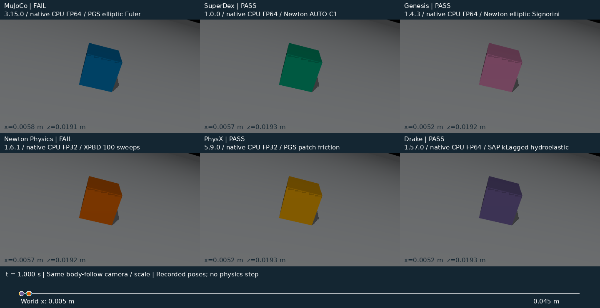
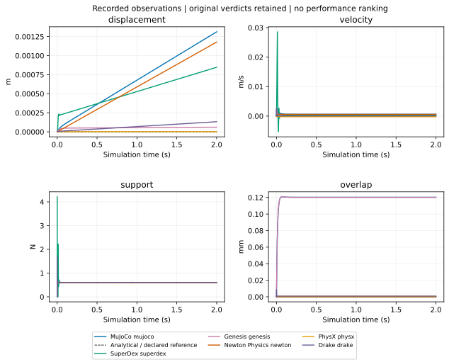
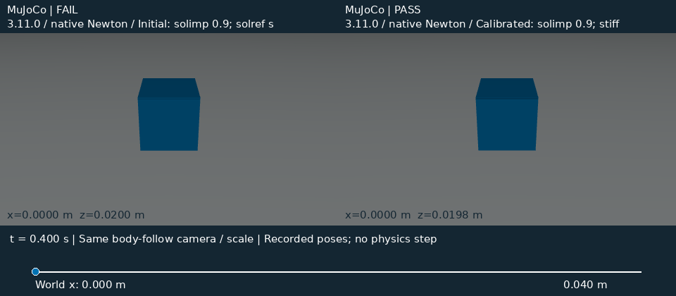
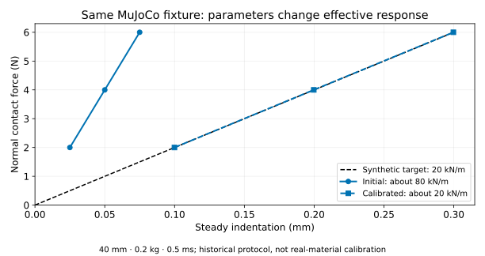
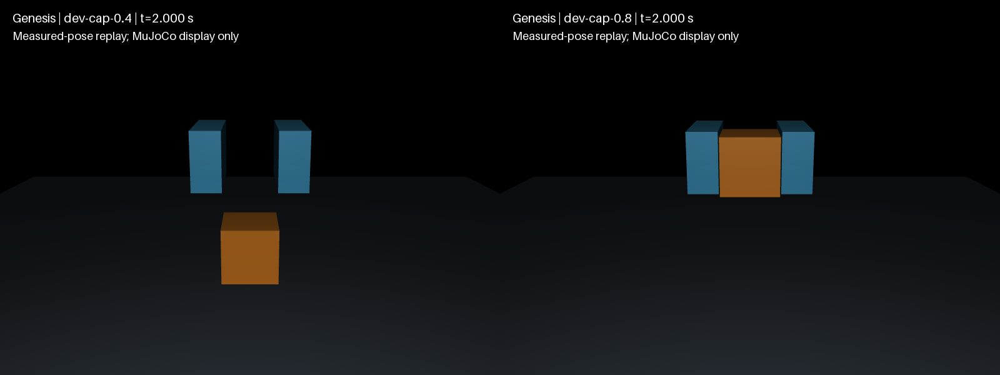
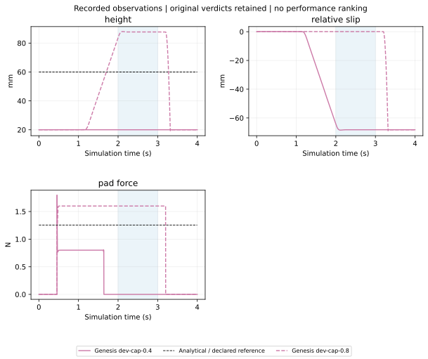
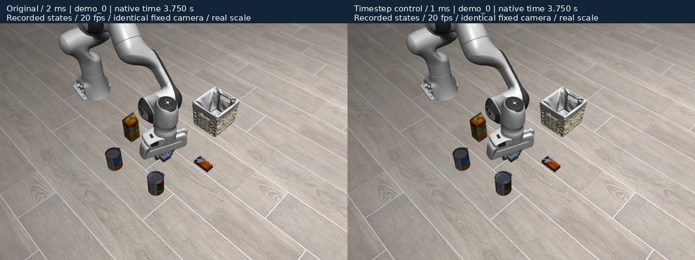
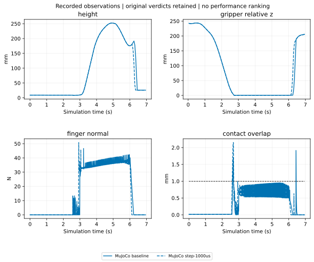

# DexLab

**Use established physical laws and empirical relations in reproducible experiments to study how contact and friction affect robotic grasping, and assess the trustworthiness of physics simulation.**

The research serves two goals:

| Your question | What DexLab provides |
| --- | --- |
| **A scene performs poorly. What should improve?** | Locate departures from physical expectations, separate parameters, integration, model assumptions and solving mechanisms, and identify evidenced configuration fixes and solver improvement directions. |
| **A new scene needs an engine/solver. Where should I start?** | Use evidence from similar contact/friction conditions to choose candidate configurations, understand sensitivity, limits, stability and cost, and build practical scenario-selection knowledge. |

[简体中文](https://huangkiki.github.io/Dexlab/zh-cn/latest/index.html) · [Documentation](https://huangkiki.github.io/Dexlab/en/latest/index.html) · [Research experience](experience.md) · [Diagnosis and trials](diagnosis.md) · [Scenario guide](selection.md)

<!-- visual-research:start -->
## Which engines and solvers are compared?

| Engine | Registered comparison configurations | Experiment versions and paths |
| --- | --- | --- |
| **MuJoCo** | CG · Newton · PGS; elliptic / pyramidal | 3.11.0, 3.14.0, 3.15.0; native / historical paths in matrix |
| **SuperDex** | BFGS · Newton · SR1; ASYNC_CG / AUGMENTED_CG / AUTO / C1_REGULARIZED / CG / CINF_REGULARIZED / GMRES / LDLT / LU / MINRES / PARALLEL_CG / GPU → matrix | 1.0.0; native / historical paths in matrix |
| **Genesis** | CG · Newton · PBD; convex / elliptic / pyramidal / rigid coupling / signorini | 1.4.3; native / historical paths in matrix |
| **Newton Physics** | Featherstone · ImplicitMPM · Kamino · SemiImplicit · Style3D · VBD · VBD compliant · VBD legacy · XPBD; DVI / PADMM | 1.6.1 / Warp 1.18.0, 1.7.0.dev0 @ 2dee3234; native / historical paths in matrix |
| **PhysX** | PGS · TGS · surface cloth; external forces every iteration / friction every iteration / patch friction | 5.9.0; native / historical paths in matrix |
| **Drake** | SAP; hydroelastic / kLagged / kSap / kSimilar / point | 1.57.0; native / historical paths in matrix |

Native and framework **MJWarp** are separate paths with their actual core identified. Newton Physics is an engine project; Newton is also an algorithm name. Tested SuperDex BFGS/SR1 with assembly period=1 execute Newton-equivalent steps; configuration names are not independent algorithm counts.

This is a research inventory including failures and unqualified entries. Execution, CPU/GPU, precision, full profiles and unsupported reasons:  [完整矩阵 / Full matrix](coverage.md)。

**MJWarp path comparison (MuJoCo core)**

| Runtime path | Actual physics core | Solver / contact path | Task acceptance |
| --- | --- | --- | --- |
| Isaac Sim6.1.0 local tag build / Newton1.5.0 / vendor Warp1.16.0 | MuJoCo 3.11.0 | MJWarp Newton / pyramidal / Newton contacts | [not-run](coverage.md) |
| Isaac Sim6.1.0 local tag build / Newton1.5.0 / vendor Warp1.16.0 | MuJoCo 3.11.0 | MJWarp Newton / pyramidal / MJWarp contacts | [not-run](coverage.md) |
| Native matched core / vendor Warp1.16.0; original and four-field aligned | MuJoCo 3.11.0 | MJWarp Newton / pyramidal / MJWarp contacts | [not-run](coverage.md) |

Model/clock diagnostics already exist; task acceptance retains the matrix state. [Path differences #152](https://github.com/huangkiki/Dexlab/issues/152) remain a separate research question.

(visual-experiment-catalogue)=
## What experiments have we run?

```{raw} html
<div class="experiment-grid">
<article class="experiment-card"><a href="libero-workflow.html"></a><div class="card-copy"><h3><a href="libero-workflow.html">Native LIBERO: diagnosis and change</a></h3><p class="engines">LIBERO / robosuite 1.4.0 / MuJoCo 2.3.7 · Newton / elliptic</p><p>How can an existing benchmark expose and validate a change?</p><p>Stale observations identified; timestep trials retain successes, failures and regressions.</p></div></article>
<article class="experiment-card"><a href="experience.html#normal-response"></a><div class="card-copy"><h3><a href="experience.html#normal-response">Normal &amp; transient response</a></h3><p class="engines">MuJoCo · SuperDex · historical PhysX</p><p>How do parameters change loading, unloading and transients?</p><p>Static calibration works; dynamics and mass transfer need separate checks.</p></div></article>
<article class="experiment-card"><a href="visual-comparisons.html#incline"></a><div class="card-copy"><h3><a href="visual-comparisons.html#incline">Six-engine incline &amp; friction</a></h3><p class="engines">MuJoCo · SuperDex · Genesis · Newton Physics · PhysX · Drake</p><p>Where do static, sliding and low-friction cases differ?</p><p>Fixed-profile outcomes and observation validity are separate; failures remain.</p></div></article>
<article class="experiment-card"><a href="results.html"></a><div class="card-copy"><h3><a href="results.html">Impact &amp; contact onset</a></h3><p class="engines">MuJoCo · SuperDex</p><p>How do timestep, stiffness and impact phase affect transients?</p><p>Existing phase/stiffness sweeps; smaller steps do not automatically remove model differences.</p></div></article>
<article class="experiment-card"><a href="visual-comparisons.html#pinch"></a><div class="card-copy"><h3><a href="visual-comparisons.html#pinch">Fixture pinch, lift &amp; release</a></h3><p class="engines">Genesis · MuJoCo · SuperDex (separate protocols)</p><p>Why does the grasp hold or slip?</p><p>Genesis 0.4 N and 0.8 N configurations have different retention outcomes.</p></div></article>
<article class="experiment-card"><a href="experiments.html#apple-replays"></a><div class="card-copy"><h3><a href="experiments.html#apple-replays">Apple-stem grasp · SDF contact</a></h3><p class="engines">MuJoCo · SuperDex · historical PhysX</p><p>Can a grasp maintain contact on complex geometry?</p><p>Native continuous replays and historical independent checks; cohorts stay separate.</p></div></article>
<article class="experiment-card"><a href="coverage.html"></a><div class="card-copy"><h3><a href="coverage.html">Cloth mechanics &amp; robot grasp</a></h3><p class="engines">MuJoCo · SuperDex · Newton Physics · Genesis · historical PhysX</p><p>When do deformation, contact and retention fail?</p><p>Historical compliant-grasp frame; mechanics, drop and grasp retain separate protocols and failures.</p></div></article>
<article class="experiment-card"><a href="experience.html#mass-size-transfer"></a><div class="card-copy"><h3><a href="experience.html#mass-size-transfer">Mass / size transfer</a></h3><p class="engines">MuJoCo · SuperDex</p><p>Do fixed parameters transfer to nearby scenes?</p><p>30 historical transfer records, 0/30 joint passes; failures guide selection.</p></div></article>
<article class="experiment-card"><a href="experience.html#transient-cost"></a><div class="card-copy"><h3><a href="experience.html#transient-cost">Response error &amp; cost</a></h3><p class="engines">MuJoCo · SuperDex</p><p>What does lower error cost?</p><p>27 records separate native computation, recording and scoring costs.</p></div></article>
<article class="experiment-card"><a href="experience.html#framework-path"></a><div class="card-copy"><h3><a href="experience.html#framework-path">Native &amp; framework paths</a></h3><p class="engines">MuJoCo / MJWarp · Newton / Isaac Sim</p><p>Why can matching cores still produce different trajectories?</p><p>GPU field differences remain after CPU alignment; parameter-map thumbnail is not trajectory evidence.</p></div></article>
</div>
```

**Pending / incomplete:** pushing, in-hand rotation, active folding and broader grasp transfer remain in their existing Issues. Folded drop is not active folding; repeats, timestep sweeps and framework switches do not add task types.

## What we already know

(visual-highlight-incline)=
### Six-engine incline: shared conditions, different responses

A 40 mm, 64 g cube; static, sliding and nominal-zero-friction conditions at three timesteps. Curves and replays retain the original passes, failures and invalid records.





[Synchronized replay, full-rate curves, parameters and original evidence](incline)

(visual-highlight-normal)=
### Normal response: change parameters or the solver?

The same MuJoCo fixture moves from about 80 kN/m toward the synthetic 20 kN/m target. Inspect loaded-window indentation, then the complete unloading trace; success belongs to the stated checks and conditions.





[Synchronized replay, full-rate curves, parameters and original evidence](normal)

(visual-highlight-pinch)=
### Pinch: 0.4 N slips, 0.8 N holds

The same Genesis fixture and object, changing the finger-joint force limit. Compare complete closing, lifting, holding and release, with an open-gripper negative control retained.





[Synchronized replay, full-rate curves, parameters and original evidence](pinch)

(visual-highlight-libero)=
### LIBERO: native task, timestep control and observation fix

Same actions, initial state, Panda and native success; original 2 ms versus unqualified 1 ms control. Heldout task success stays 10/10, screens change from 5/10 to 3/10, and cost doubles. Policy effects of observation refresh remain unverified.





[Synchronized replay, full-rate curves, parameters and original evidence](libero)

<!-- visual-research:end -->

## How to diagnose a poorly performing scene

For an abnormal contact, declare the physical reference and assumptions, then check geometry, mass/inertia, frames, control epochs, effective parameters and contact readbacks. Fix the scene and objective, propose a testable hypothesis, run bounded parameter trials and independently score improvements and costs. Study the remaining differences through contact generation, friction representation, constraints, stopping rules, integration and precision.

One PhysX case exposed incorrect negative-control mass caused by the order of inertia initialization and collision disabling. Correcting the integration left other numerical residuals unresolved. Record configuration improvements, integration fixes, algorithm research directions and open questions separately. [Diagnosis method and commands](diagnosis.md)

**AI parameter exploration is a research method.** AI uses prior experience to propose hypotheses and candidates; existing execution, accounting and independent scoring retain every attempt, failure, effective configuration and cost. An unsuccessful finite search establishes only that its tested range did not succeed. Freeze new transfer conditions beforehand; historical logs cannot become new holdouts.

## How to choose for a new scene

Describe contact scale and load, sticking/sliding, contact switches, geometry and compliance, then find nearby experiments. Every starting candidate states version/path, parameter sources, errors and failure boundaries, plus the first checks required in your scene.

| Main difficulty | Starting evidence |
| --- | --- |
| Normal compliance, loading/unloading or transients | [Normal/transient experience](selection.md): check the synthetic target and contact law, then mass/size transfer. |
| Support, incline sliding or low friction | [Six-engine inclines](six-engine-incline): validate observations before comparing nearby configurations. |
| Finite-pad pinch, lift and release | [Pinch and SDF starting points](selection.md): check drives, inertia, slip and negative controls. |
| Framework changes or asset import | [Native/framework comparison](framework-path): inspect conversion, effective parameters and epochs. |

Recommendations depend on evidence relevant to the target scene, considering **physical credibility, stability and cost** together. Broader validated coverage extends known scope; the coverage table alone does not choose the best solution for a new scene.

## Research scope and reproduction

| Existing scope | Evidence |
| --- | --- |
| Six-engine basic contact/inclines and applicable solvers; collision, fixture pinch and robot grasp | [Full configuration matrix and protocol states](coverage.md) |
| Cloth mechanics, folded drop and robot cloth grasp | [Historical protocols and failures](coverage.md); folded drop is not successful active folding. |
| Pushing, in-hand rotation and grasp extensions | [Research roadmap](dexterity.md); not run, blocked and unsupported remain distinct. |

The matrix preserves core, solver, runtime path, version, passed/partial/failed/not-run/blocked/unsupported states and evidence. Repetitions, step scans and framework changes do not add task types; historical protocols are not pooled. New coverage-v1 reliability is not yet admitted; historical capabilities retain their original scope.

[Installation and reproduction](https://github.com/huangkiki/Dexlab/blob/main/docs/installation.md) · [All reports](results.md) · [Raw data and releases](https://github.com/huangkiki/Dexlab/releases) · [Research Project](https://github.com/users/huangkiki/projects/4)

This round reuses evidence and fills concrete diagnosis gaps before transfer to pinch/grasp. The six-engine matrix and 594-episode pinch study remain. **Scheduled development stays paused.** [Development and acceptance](https://github.com/huangkiki/Dexlab/blob/main/docs/autoresearch.md)

```{toctree}
:hidden:
:maxdepth: 1

Visual comparisons <visual-comparisons>
Native LIBERO workflow <libero-workflow>
Findings <experience>
Diagnosis <diagnosis>
Selection <selection>
Coverage <coverage>
Quickstart <quickstart>
Experiments <experiments>
Results <results>
Engines <engines>
Roadmap <dexterity>
Ledger <research-ledger>
Benchmark <benchmark>
Contributing <contributing>
```
