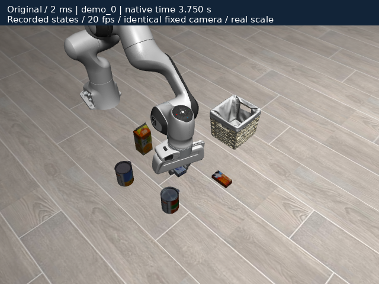

# LIBERO: from a native task to a verifiable change

**First case: LIBERO-Object, “pick up the cream cheese and place it in the basket.”** Panda, assets, controller, demonstration initial states and the native success predicate remain intact. Complete action sequences include release and final state. Only this task dataset is used. mjlab is deferred; scheduled development remains paused.

## What this round establishes

- **Reproduction:** the original configuration completes all three development and ten heldout demonstrations. Lift-and-slip was not reproduced. These are action-execution outcomes, not learned-policy benchmark scores.
- **Verified workflow defect:** the independent evaluator discards five settling observations, while the training evaluator refreshes them. During a native 0.25 s audit, the largest end-effector position-component change is **4.481 mm**, and one finger-joint position changes **12.143 mm**. A reversible one-line patch refreshes the observation without changing the five zero actions.
- **An unsuccessful optimization:** smaller timesteps do not consistently reduce penetration. Heldout numerical screens pass **3/10** at 1 ms versus **5/10** at the original 2 ms, with about **2.00×** native stepping cost. This change is not recommended; screening limits remain fixed.
- **A concrete remaining question:** the 12.163 mm maximum occurs at `floor ↔ cream_cheese_1_g1` in demo_8 at native time 2.940 s, before the first measured lift. Its mixed time constant is 10.5 ms, so the 4 ms refsafe floor at h=2 ms is inactive. Geometry, drive and contact-response attribution continue in [#174](https://github.com/huangkiki/Dexlab/issues/174).

[Synchronized replay, frame-linked curves and three conditions](libero) · [All results JSON](https://huangkiki.github.io/Dexlab/en/latest/_static/libero/summary.json) · [Full records](https://github.com/huangkiki/Dexlab/releases/download/v0.60.0/libero-native-v1.tar.gz)

The modified video is a timestep control, not a successful optimization. Refreshing observations cannot change prerecorded demonstration actions; these videos do not establish improved policy success from the patch.

## Frozen execution and physical reference

| Item | Executed configuration |
| --- | --- |
| Native path | LIBERO `8f1084e3132a39270c3a13ebe37270a43ece2a01` → robosuite 1.4.0 → MuJoCo 2.3.7 |
| Solver / contact / integration | Newton / elliptic / Euler; 100 iterations, tolerance=1e-8, impratio=20 |
| Control | Native OSC_POSE at 20 Hz; original servos, friction, mass and geometry |
| Target mass | 0.012337579236976485 kg; full inertia, COM offset, actuation and contact readbacks retained |
| Dataset | One official HDF5 with pinned revision and SHA-256; demo_0..2 development, demo_3..12 unseen validation, from 50 demonstrations |
| Initialization | Published states[0] time/qpos/qvel plus native controller reset; not exact recovery of historical controller memory |
| Acceptance | Original task, observation integrity, numerical screening, stability and cost are separate; reliable coverage unchanged |

Independent scoring compares **world COM momentum change with contact plus gravity impulse**, accounting for local free-joint angular velocity and COM offset. Declared screens are maximum target overlap ≤1 mm and p99 momentum residual ≤5% of weight. They are numerical diagnostics, not official LIBERO success criteria or measured material accuracy. Full rotational balance is not certified. Gripper-frame relative height includes rotation and release; it is not pure slip.

Constraint forces read after `mj_step` belong to the pre-integration epoch; states are post-integration. Curves retain actual timestamps and every peak. Videos display recorded states at 20 Hz without advancing physics. [Full units, frames and control semantics](https://github.com/huangkiki/Dexlab/blob/main/demos/libero-contact/semantics.json).

## All development controls and failures

| Development configuration | Step | Positive reference floor | Native task | Physics screen | Maximum overlap | Native stepping, three demos |
| --- | --- | --- | --- | --- | --- | --- |
| baseline | 2 ms | original | 3/3 | 0/3 | 4.882 mm | 0.694 s |
| step-1000us | 1 ms | original | 3/3 | 0/3 | 4.997 mm | 1.360 s |
| step-500us | 0.5 ms | original | 3/3 | 0/3 | 5.011 mm | 2.710 s |
| aligned-2000us | 2 ms | 4 ms | 3/3 | 0/3 | 5.304 mm | 0.710 s |
| aligned-1000us | 1 ms | 4 ms | 3/3 | 0/3 | 5.407 mm | 1.387 s |
| aligned-500us | 0.5 ms | 4 ms | 3/3 | 0/3 | 6.362 mm | 2.780 s |

Recording-off and settling audits bring the total to eight candidates, not eight solvers or task types. The original timestep sweep changes integration and some contact responses: positive-format MuJoCo references with refsafe enabled use `max(timeconst, 2h)`. [Pinned 2.3.7 implementation](https://github.com/google-deepmind/mujoco/blob/2.3.7/src/engine/engine_core_constraint.c#L1045-L1048)

The aligned family floors positive geom/pair time constants at 4 ms before varying h. It is a **different contact configuration**; within-family timestep attribution does not imply material equivalence to the original. Geometry, mass, friction, control period, drive limits and native success remain unchanged.

Before heldout execution, selection requires valid observations and task success on every development demonstration, preferring all-screen-pass configurations and then the smallest worst overlap and cost. If none passes all screens, the least-overlap nonbaseline candidate becomes an **unqualified diagnostic challenger**, not a recommendation. This rule selected 1 ms to test transfer of the negative development result.

| Heldout demo_3..12 | Native final success | Physics screen | Maximum overlap | Native stepping total |
| --- | --- | --- | --- | --- |
| Original 2 ms | 10/10 | 5/10 | 12.163 mm | 2.239 s |
| Control 1 ms | 10/10 | 3/10 | 12.212 mm | 4.481 s |

These are ten paired demonstrations at one fixed seed. No fitting follows heldout inspection. Costs are serial same-host native stepping; import, recording and scoring costs remain separately recorded. They are not training throughput or a cross-engine ranking. The JSON and archive retain every success, failure and regression.

## From observations to a change

1. Execute the full original action prefix, recording goals, actual actuator output, contacts, states and effective parameters; localize contact, lift, release and basket events.
2. Validate instrumentation: control-rate states, actions, observations, controller targets and success sequences are exactly equal with recording enabled/disabled. Independent-process baseline repeats also match exactly.
3. Inspect actual peak-contact pairs and epochs. The demo_0 peak is object/basket contact during placement; the demo_8 peak is object/floor contact during grasp preparation. They need separate explanations.
4. Six configurations and independent scoring do not support “reduce the timestep to fix it.” Preserve this negative result and bound further mechanism research.
5. Deliver the [reversible observation-refresh patch](https://github.com/huangkiki/Dexlab/blob/main/demos/libero-contact/patches/refresh-settle-observation.patch), supported by source and native observation differences. A compatible fixed checkpoint is still needed to test closed-loop consequences; **neither a changed first policy action nor higher policy success is claimed**.

Event labels localize hypotheses rather than assign causes: no finger contact, no measured lift, transport contact and placement failure are distinct. Post-lift contact loss still requires action/geometry review to distinguish slip from intentional release. No simplified fixture or mid-episode restore is qualified; this round executes full tasks.

## Reproduction and boundaries

[Setup, run, independent score, patch/undo and render commands](https://github.com/huangkiki/Dexlab/blob/main/demos/libero-contact/README.md) · [Frozen candidates and selection rule](https://github.com/huangkiki/Dexlab/blob/main/demos/libero-contact/protocol.json) · [Independent evaluator](https://github.com/Lifelong-Robot-Learning/LIBERO/blob/8f1084e3132a39270c3a13ebe37270a43ece2a01/libero/lifelong/evaluate.py#L260-L273) · [Training evaluator](https://github.com/Lifelong-Robot-Learning/LIBERO/blob/8f1084e3132a39270c3a13ebe37270a43ece2a01/libero/lifelong/metric.py#L117-L136)

Native simulation uses an isolated Python 3.10 diagnostic environment. Upstream’s complete Python 3.8 / PyTorch 1.11 learning installation is not claimed as a qualified policy runtime here. The HDF5 lacks embedded historical BDDL text: task identity/language are verified against the pinned upstream BDDL, with that provenance boundary retained. Dataset terminal reward/done values do not supply success evidence; runtime native queries do.

DexLab now connects a benchmark observation to a concrete time, contact and code path, tests a plausible intervention, and delivers verified workflow corrections separately from unsuccessful physics tuning. For a new scene, check observation freshness, actual contact forces and actuation before recommending a configuration. This cohort does not establish a new recommended physics profile.

Resources and recovery: the native batch froze 16 GiB hard / 15 GiB high, four CPU equivalents, swap disabled and an additional 8 GiB desktop reserve. Maximum measured cgroup memory was about 1.218 GiB; limits did not change within the batch. The inherited ledger accounts for 46/64 starts and 363.07/21600 s of charged runtime, including early failures/diagnostics; this is not total development or tool time. A future comparable batch can admit the measured workload at the 8 GiB tier. Native package files were checked against wheel RECORD hashes after execution; this integrity check is not presented as pre-run binary telemetry.
