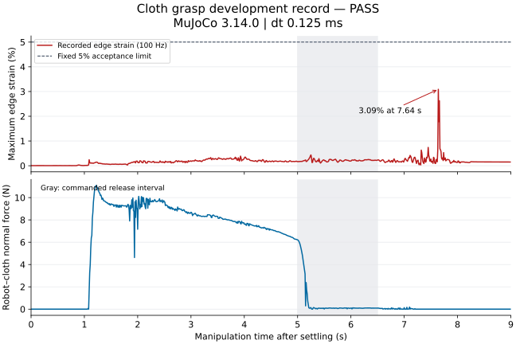
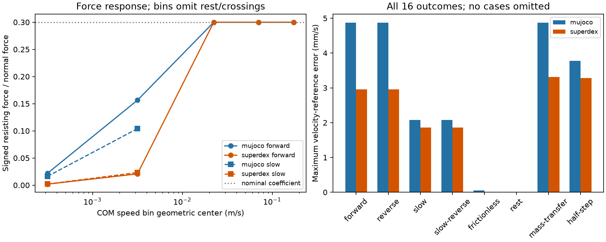
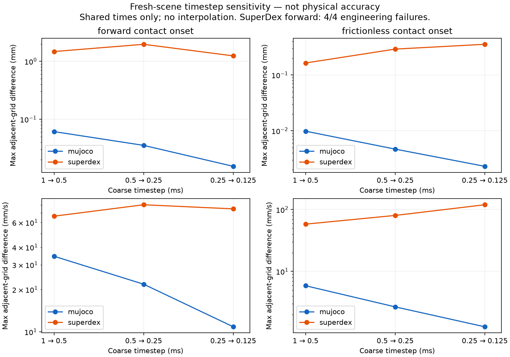

# Results and failures

## What standard judges an experiment?

Lifting an object is a task outcome, not a reference answer for physical accuracy. Report three separate levels.

| Level | Independent reference and check | Supported claim |
|---|---|---|
| Implementation consistency | Analytical references under stated assumptions, force/momentum balances, no-contact/zero-friction/release negatives | Detect implementation and recording errors; does not establish real-material accuracy |
| Numerical reliability | Hold the physical model fixed; refine timestep and solver accuracy while recording errors, residuals and cost | Characterize numerical sensitivity over tested settings; self-convergence does not validate the physical model |
| Physical validity | Same-apparatus force-displacement, slip threshold and release measurements with uncertainty | Measure error relative to reality; currently unknown without hardware data |

Before each new experiment, freeze the hypothesis, reference and its assumptions, controlled and varied quantities, metrics and units, rejection criterion and rationale, budget and retention of all failures. Without a justified accuracy tolerance, report error/response curves rather than inventing an accuracy pass after observing results. Existing engineering thresholds define task acceptance; latest-stable admission is not physical validation.

Apple-stem grasp is a downstream integrated task. The historical ten scenes describe specific configurations on a specific perturbation set; their difference cannot be attributed to the engine. Parameter readback establishes what was used, not whether the contact law is physically accurate. The next contact study should hold physical assumptions fixed and examine timestep/solver refinement before error-cost interpretation; hardware calibration requires measurements tracked in #6.

## Current development evidence

The newest records answer narrower questions than the historical robustness cohorts below. They use official MuJoCo 3.14.0 and SuperDex 1.0.0 FP64 where applicable; a release regression pass does not requalify an older benchmark.

| Question | Observed result | Interpretation |
|---|---|---|
| Can the repaired cloth case complete pinch, lift and release? | One 9 s development case passes; maximum strain 3.5161%, self penetration 1.492 mm against a 1.5 mm limit | A working candidate with only 7.95 µm penetration margin; robustness remains untested |
| Do equal nominal friction coefficients give equal low-speed response? | All 16 development runs meet their fixed physical criteria; forward 1–10 mm/s median resisting ratios: MuJoCo 0.15641, SuperDex 0.02076 | Different effective response, not an engine-accuracy ranking or measured material fit |
| Has physical hardware accuracy been established? | No measured calibration dataset | The acquisition protocol is ready; hardware validation is not complete |

[Cloth metrics, continuous close-up, parameters and failed controls](https://github.com/huangkiki/Dexlab/blob/main/demos/cloth-folding/SETTLING.md) · [Friction curves, all 16 cases, frozen configuration and raw archive](https://github.com/huangkiki/Dexlab/blob/main/demos/contact-benchmark/FRICTION_RESPONSE.md) · [Hardware protocol](https://github.com/huangkiki/Dexlab/blob/main/docs/hardware/README.md)

The cloth maxima scan all 72,000 physics steps; force observations are 100 Hz and geometry checks cover 225 saved frames at 25 Hz. Zero sampled table/robot/floor crossings does not prove continuous finite-thickness separation. The friction ratio uses center-of-mass velocity and net contact force, excluding near-rest and direction-reversal intervals: it is not material-point slip. Bin medians do not match individual speeds across engines. Different settled heights are retained in the report.

Cloth plots sample at 100 Hz; the acceptance extrema use every physics step. The plotted strain peak is 3.0891%, not the 3.5161% per-step maximum.

The friction figure includes all 16 development outcomes; empty speed bins are missing coverage, not zero resistance. The linked reports contain exact source/configuration hashes and failed development controls.

### Contact onset: timestep and stopping-tolerance sensitivity

Sixteen timestep episodes fix observed starts, contact parameters and native solver profiles. Twelve additional SuperDex episodes independently tighten stopping tolerances. All failures remain. These values are **response differences, not errors against reality**.

| Control | Result | Supported interpretation |
|---|---|---|
| Timesteps1→0.5→0.25→0.125ms | Frictional maximum position differences: MuJoCo0.06117→0.03538→0.01539mm; SuperDex1.47480→1.96621→1.24122mm | Decreasing differences for the former in this range; the latter does not establish convergence |
| SuperDex tolerances tightened100/10,000× | Position differences between0.5 and0.125ms remain about3.206mm frictional and0.5545mm frictionless | Stopping-tolerance tightening alone does not remove timestep sensitivity; the mechanism is not fully identified |
| Engineering acceptance | Timestep batch12/16; tolerance batch6/12 | All10 failures retained; passing frictionless cases do not establish numerical or hardware accuracy |

[Protocol, assumptions, all per-run parameters and costs](https://github.com/huangkiki/Dexlab/blob/main/demos/contact-benchmark/REFINEMENT.md). The finest grid is not truth; no convergence order is fitted. All28 scores match offline rescoring with their original frozen sources. Raw-archive publication awaits this release.

### Cost and reproducibility

Cloth simulation-loop wall time was 618.86 s and service wall time 642.18 s, including preparation and recording. The friction report separates preparation and stepping-plus-observation time. Neither isolates native stepping, renderer, evaluator and transport costs under a shared speed benchmark; unmeasured components remain unknown. Replaying saved states or rescoring an archive does not rerun dynamics. Follow each linked report's exact configuration and version rather than replacing the historical runtime silently.

## How to read a pass

Task completion, physical validity and temporal coverage are distinct. An object reaching its target or a robot becoming still is not proof of sustained frictional support or nonpenetration. Following the [ManiSkill source review](research-ledger.md), report all three, and keep unsupported or incomplete checks visible.

The friction fixture has no learned controller: one prescribed initial velocity follows native settling, then the body evolves freely. Its eight declared cases vary direction, initial speed, mass, friction and timestep; these are development controls, not held-out object splits. All 16 outcomes are included. The apple cohort below freezes ten perturbations of the same apple asset, not ten unseen object geometries. The cloth candidate uses known-state IK and an explicit pinch prior; its failed development controls remain in the linked report. Actual initial states, native versions, solver settings, precision and source hashes are recorded with each raw record. The version inventory records when releases were checked; it is not a guarantee that those versions remain latest forever.

## Historical evidence

The following records retain their original versions and protocols. **They do not rank physical accuracy.**

## Apple grasp: fixed-configuration robustness

Ten frozen scenes vary mass, horizontal position and orientation: twenty runs across two backends, without retuning for these cases.

| Historical configuration | Complete acceptance | 95% Wilson interval |
|---|---:|---:|
| MuJoCo 3.11.0, 0.5 ms | 1 / 10 | 1.8–40.4% |
| SuperDex 1.0.0 FP64, 2 ms | 10 / 10 | 72.2–100% |

Crosses denote full-protocol failure. Native contact overlap is not independent surface penetration; wrist-relative displacement is not material-point slip. Timesteps, friction and drives differ, without matched calibration or tuning budgets. PhysX's default development case is separate from these twenty runs.

## Cloth: retain and explain failure

The original nine-second trajectory has cloth-triangle/table intersection in 176 of 225 saved frames, with maximum interior depth 3.00 mm. Correcting the missed detection does not repair the trajectory. The diagnostic checks zero-thickness triangles, not continuous finite-thickness separation.

[Geometry, plots and score comparison](https://github.com/huangkiki/Dexlab/blob/main/demos/cloth-folding/SCORING.md) · [Physics repair #32](https://github.com/huangkiki/Dexlab/issues/32)

## Historical cohorts

Each row has a different task and protocol. Retain failure, geometry review and unsupported outcomes; do not pool denominators into a global success rate or relabel development data as independent tests.

{download}`Per-case JSON <../../evidence/historical-v1.json>` · {download}`Metrics CSV <../../evidence/metrics.csv>` · {download}`Plot provenance <../../evidence/plot-provenance.json>`

## Missing evidence

- No formal hardware calibration set or independent measured accuracy.
- Historical timings do not share an isolated protocol; no speed ranking.
- Persistent material-point correspondences are unavailable; slip is unknown, not zero.
- MuJoCo 3.14.0 has the explicitly scoped development and regression evidence above. Genesis task qualification remains pending; none of these results establishes all-engine or all-task qualification.

## Synthetic response discrepancy and cost

All 27 fixed-profile, three-timestep, three-repeat episodes were independently rescored: nine original combined passes and eighteen retained failures. Worst positive-load window RMS decreases from 2.771 to 0.617 µm for the low-impedance MuJoCo profile; it increases from 9.209 to 13.751 µm for the current SuperDex load-damping profile, which fails unloading no-tension checks at every timestep. The reference is a specified linear spring–damper, not calibrated material data.

[Protocol, timing boundaries, failures and reproduction](https://github.com/huangkiki/Dexlab/blob/main/demos/contact-benchmark/RESPONSE_COST.md)
