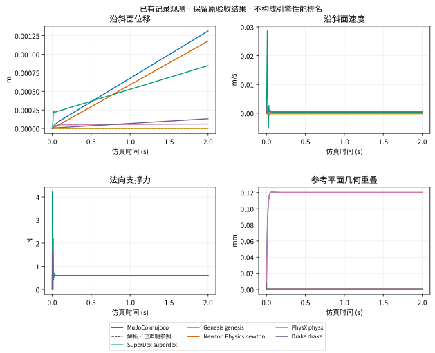
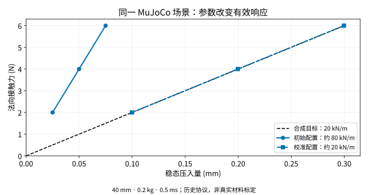
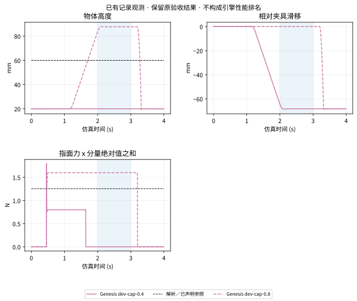

# DexLab

**以经典物理规律与已有经验公式为参照，通过可复现实验，研究接触与摩擦对机器人抓取的影响，评估物理仿真的可信度。**

这项研究服务于两个目标：

| 你面临的问题 | DexLab 提供的答案 |
| --- | --- |
| **场景表现不好，应该改什么？** | 找到偏离物理预期的位置，区分参数、接入、模型假设与求解过程的影响，给出有证据的配置修正和 solver 改进方向。 |
| **面对新场景，怎样选择引擎／solver？** | 根据相近接触与摩擦条件的实验，选择候选配置，了解参数敏感性、适用边界、稳定性和成本，逐步积累场景适配经验。 |

[English](https://huangkiki.github.io/Dexlab/en/latest/index.html) · [中文文档站](https://huangkiki.github.io/Dexlab/zh-cn/latest/index.html) · [研究经验](experience.md) · [诊断与试参方法](diagnosis.md) · [场景选型指南](selection.md)

<!-- visual-research:start -->
## 比较了哪些引擎与 solver

| 引擎 | 已登记比较对象 | 实验版本与路径 |
| --- | --- | --- |
| **MuJoCo** | CG · Newton · PGS; elliptic / pyramidal | 3.11.0, 3.14.0, 3.15.0; native / 历史路径详见矩阵 |
| **SuperDex** | BFGS · Newton · SR1; ASYNC_CG / AUGMENTED_CG / AUTO / C1_REGULARIZED / CG / CINF_REGULARIZED / GMRES / LDLT / LU / MINRES / PARALLEL_CG / GPU → matrix | 1.0.0; native / 历史路径详见矩阵 |
| **Genesis** | CG · Newton · PBD; convex / elliptic / pyramidal / rigid coupling / signorini | 1.4.3; native / 历史路径详见矩阵 |
| **Newton Physics** | Featherstone · ImplicitMPM · Kamino · SemiImplicit · Style3D · VBD · VBD compliant · VBD legacy · XPBD; DVI / PADMM | 1.6.1 / Warp 1.18.0, 1.7.0.dev0 @ 2dee3234; native / 历史路径详见矩阵 |
| **PhysX** | PGS · TGS · surface cloth; external forces every iteration / friction every iteration / patch friction | 5.9.0; native / 历史路径详见矩阵 |
| **Drake** | SAP; hydroelastic / kLagged / kSap / kSimilar / point | 1.57.0; native / 历史路径详见矩阵 |

原生与框架 **MJWarp** 另列运行路径及实际核心。Newton Physics 是引擎项目，Newton 也是求解算法名。SuperDex BFGS／SR1 在已测 assembly period=1 时执行 Newton 等价步；配置名不计作独立算法。

本表是研究对象概览，包含失败与未准入项；执行情况、CPU/GPU、精度、完整配置和不支持原因见 [完整矩阵 / Full matrix](coverage.md)。

**MJWarp 运行路径对照（归入 MuJoCo 核心）**

| 运行路径 | 实际物理核心 | solver／接触路径 | 任务验收状态 |
| --- | --- | --- | --- |
| Isaac Sim6.1.0 local tag build / Newton1.5.0 / vendor Warp1.16.0 | MuJoCo 3.11.0 | MJWarp Newton / pyramidal / Newton contacts | [not-run](coverage.md) |
| Isaac Sim6.1.0 local tag build / Newton1.5.0 / vendor Warp1.16.0 | MuJoCo 3.11.0 | MJWarp Newton / pyramidal / MJWarp contacts | [not-run](coverage.md) |
| Native matched core / vendor Warp1.16.0; original and four-field aligned | MuJoCo 3.11.0 | MJWarp Newton / pyramidal / MJWarp contacts | [not-run](coverage.md) |

已有模型与时钟诊断；可靠任务验收仍按矩阵状态记录。[路径差异 #152](https://github.com/huangkiki/Dexlab/issues/152) 保留独立研究范围。

(visual-experiment-catalogue)=
## 做了哪些实验

```{raw} html
<div class="experiment-grid">
<article class="experiment-card"><a href="experience.html#normal-response"></a><div class="card-copy"><h3><a href="experience.html#normal-response">法向与瞬态响应</a></h3><p class="engines">MuJoCo · SuperDex · historical PhysX</p><p>压入、卸载与动态响应如何随参数改变？</p><p>静态校准有效，动态响应和质量迁移须分别验证。</p></div></article>
<article class="experiment-card"><a href="visual-comparisons.html#incline"></a><div class="card-copy"><h3><a href="visual-comparisons.html#incline">六引擎斜面与摩擦</a></h3><p class="engines">MuJoCo · SuperDex · Genesis · Newton Physics · PhysX · Drake</p><p>静止、滑动和低摩擦有哪些差异？</p><p>原配置结果与观测有效性分列；全部失败保留。</p></div></article>
<article class="experiment-card"><a href="results.html"></a><div class="card-copy"><h3><a href="results.html">碰撞与接触起始</a></h3><p class="engines">MuJoCo · SuperDex</p><p>步长、刚度及碰撞相位怎样影响瞬态？</p><p>已有相位与刚度扫描；更小步长不自动消除模型差异。</p></div></article>
<article class="experiment-card"><a href="visual-comparisons.html#pinch"></a><div class="card-copy"><h3><a href="visual-comparisons.html#pinch">夹具夹持、抬升与释放</a></h3><p class="engines">Genesis · MuJoCo · SuperDex (separate protocols)</p><p>夹持为什么保持或滑脱？</p><p>Genesis 0.4 N 与 0.8 N 配置呈现不同保持结果。</p></div></article>
<article class="experiment-card"><a href="experiments.html#apple-replays"></a><div class="card-copy"><h3><a href="experiments.html#apple-replays">苹果抓梗 · SDF 接触</a></h3><p class="engines">MuJoCo · SuperDex · historical PhysX</p><p>复杂几何下能否连续保持？</p><p>已有原生连续回放与独立历史验收；不同批次分列。</p></div></article>
<article class="experiment-card"><a href="coverage.html"></a><div class="card-copy"><h3><a href="coverage.html">布料力学与机器人夹布</a></h3><p class="engines">MuJoCo · SuperDex · Newton Physics · Genesis · historical PhysX</p><p>柔性形变、接触与保持何时失效？</p><p>历史柔顺夹布画面；力学、下落与夹布按独立协议记录，保留失败。</p></div></article>
<article class="experiment-card"><a href="experience.html#mass-size-transfer"></a><div class="card-copy"><h3><a href="experience.html#mass-size-transfer">质量／尺寸迁移</a></h3><p class="engines">MuJoCo · SuperDex</p><p>固定参数能否迁移到邻近场景？</p><p>30 条历史迁移记录，联合验收 0/30；失败也是选型依据。</p></div></article>
<article class="experiment-card"><a href="experience.html#transient-cost"></a><div class="card-copy"><h3><a href="experience.html#transient-cost">响应误差与计算成本</a></h3><p class="engines">MuJoCo · SuperDex</p><p>更小误差需要什么计算代价？</p><p>27 条记录区分原生计算、记录和评分成本。</p></div></article>
<article class="experiment-card"><a href="experience.html#framework-path"></a><div class="card-copy"><h3><a href="experience.html#framework-path">原生与框架接入路径</a></h3><p class="engines">MuJoCo / MJWarp · Newton / Isaac Sim</p><p>相同核心为何仍可能出现轨迹差异？</p><p>对齐 CPU 模型后仍有 GPU 字段差异；参数概览图非轨迹证据。</p></div></article>
</div>
```

**待开展／未完成：** 推动、手内旋转、主动折布及更广抓取迁移分别见现有 Issue。预折叠下落不等于主动折布成功；重复、步长扫描和框架切换不增加任务类型。

(research-findings)=
## 我们已经知道什么

(visual-highlight-incline)=
### 六引擎斜面：相同工况，响应不同

40 mm、64 g 方块；比较静止、滑动及名义零摩擦，三个步长。曲线与回放保留原配置的通过、失败和无效记录。




[同步回放、逐步曲线、参数与原始证据](incline)

(visual-highlight-normal)=
### 法向响应：改参数，还是改 solver？

同一 MuJoCo 场景，从约 80 kN/m 到合成目标 20 kN/m。先看加载窗口的压入曲线，再看完整卸载；成功只属于规定的物理检查与条件。




[同步回放、逐步曲线、参数与原始证据](normal)

(visual-highlight-pinch)=
### 夹持：0.4 N 滑脱，0.8 N 保持

同一 Genesis 夹具与物体，只改变指关节驱动力限额。对照完整闭合、抬升、保持和释放，并保留张开负例。




[同步回放、逐步曲线、参数与原始证据](pinch)

<!-- visual-research:end -->

(research-diagnosis)=
## 场景表现不好时如何分析

以“接触表现异常”为例，先声明物理参照与假设，再检查几何、质量／惯量、坐标、控制时刻、有效参数和接触读回。随后固定场景与目标，提出可检验假设，做有限参数试验，用独立评分确认改善及成本。剩余差异再进入接触生成、摩擦表示、约束求解、停止条件、积分和精度的机制研究。

已有 PhysX 案例中，禁碰撞前后初始化质量的顺序导致负例质量错误；修正接入后，其他数值残差仍然存在。参数改善、接入修正、算法研究方向和未解问题分别记录。[完整诊断方法与命令](diagnosis.md)

**AI 自动试参是研究方法之一。** AI 利用已有经验提出假设与候选参数；现有执行器、预算账本和独立评分保留所有尝试、失败、有效参数与成本。有限搜索未找到配置时，结论是当前搜索范围尚未成功。新迁移条件事前冻结，历史日志不能充当新留出。

(research-selection)=
## 新场景如何选择

先描述接触尺度与载荷、粘着／滑动、接触切换、几何及柔顺性，再查找邻近实验。每个候选起点都附版本／路径、参数来源、误差与失败边界，并列出新场景首先要做的验证。

| 新场景的主要困难 | 从哪里开始 |
| --- | --- |
| 法向柔顺、加载卸载或瞬态响应 | [法向／瞬态经验](selection.md)；核对合成目标和接触律，验证质量／尺寸迁移。 |
| 支撑、斜面滑动、低摩擦 | [六引擎斜面证据](six-engine-incline)；先确认观测有效，再比较接近目标工况的配置。 |
| 有限指面夹持、抬升与释放 | [夹持与 SDF 起点](selection.md)；核对驱动力、惯量、滑移和负例。 |
| 更换框架或导入资产 | [原生／框架对照](framework-path)；比较转换来源、有效参数和时刻。 |

推荐依赖与目标场景相关的证据，兼顾**物理可信度、稳定性和成本**。覆盖更多任务意味着积累了更广的已验证范围；覆盖表本身不决定某个新场景的最佳方案。

(research-scope)=
## 研究范围与复现

| 已有研究范围 | 证据入口 |
| --- | --- |
| 六引擎基础接触／斜面及适用 solver；碰撞、夹具夹持和机器人抓取 | [完整配置矩阵与各协议状态](coverage.md) |
| 布料力学、预折叠下落、机器人夹布 | [历史协议与失败](coverage.md)；预折叠下落不等于主动折布成功。 |
| 推动、手内旋转与扩展抓取 | [研究路线](dexterity.md)；未运行、受阻和不支持分别标注。 |

矩阵保留引擎核心、solver、运行路径、版本、通过／部分通过／失败／未运行／接入受阻／不支持及证据。重复、步长扫描、更换框架不增加任务类型；不同历史协议不合并计数。新 coverage-v1 可靠覆盖尚未验收，历史能力仍以原协议为界。

[安装与复现](https://github.com/huangkiki/Dexlab/blob/main/docs/installation.zh-CN.md) · [全部报告](results.md) · [原始数据与版本](https://github.com/huangkiki/Dexlab/releases) · [研究与开发看板](https://github.com/users/huangkiki/projects/4)

本轮优先复用证据、补齐诊断案例所需缺口，再向夹持／抓取迁移；六引擎矩阵和 594 回合夹持研究继续保留。**定时开发保持暂停。** [开发与验收约定](https://github.com/huangkiki/Dexlab/blob/main/docs/autoresearch.zh-CN.md)

```{toctree}
:hidden:
:maxdepth: 1

可视对照 <visual-comparisons>
研究经验 <experience>
诊断方法 <diagnosis>
场景选型 <selection>
完整覆盖 <coverage>
安装复现 <quickstart>
实验目录 <experiments>
研究结果 <results>
引擎与模型 <engines>
研究路线 <dexterity>
研究账本 <research-ledger>
基准 <benchmark>
参与贡献 <contributing>
```
