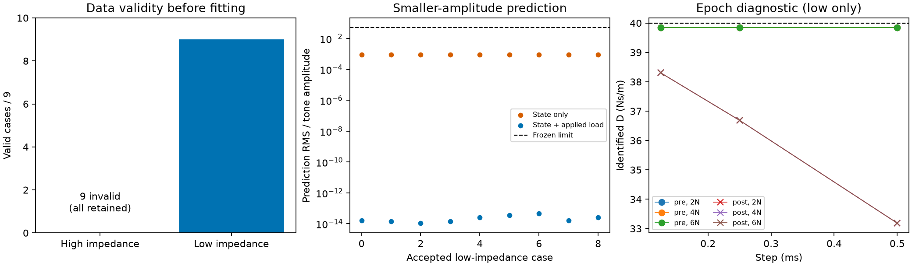

# 实验结果与失败

## Genesis PBD 薄布：保留失败结果

当前官方 PBD/刚体摩擦夹持配置不准入：同一步动量误差 3.2e-5 kg·m/s 超过 3.3e-7 判据；夹爪实际抬升 79.988 mm 后布料仍落在 4 mm，两个预登记偏移位置也失败。36 格等时长响应显示明显步长敏感性；连通折叠逐帧检查通过，不能替代连续碰撞或材料精度验收。[完整协议、全部结果与原始记录](https://github.com/huangkiki/Dexlab/blob/main/docs/genesis-cloth.zh-CN.md)。

## Newton XPBD：有界接触正负对照

CPU 球–平面配置通过预登记工程判据：最大穿透 0.000849 mm、保持期力误差 0.051353%。重建重复记录完全一致；禁碰撞负对照失去支撑并符合离散自由落体参考。这是合成基本几何检查，不代表抓梗、SDF 或真机精度。[完整曲线、阈值、原始数据与限制](https://github.com/huangkiki/Dexlab/blob/main/docs/newton-contact.zh-CN.md)。

## 实验用什么标准判断？

“能抓起来”是任务结果，不是物理准确性的参考答案。以下三层分别报告，不能互相替代。

| 层次 | 独立参考与检验 | 可以支持的结论 |
|---|---|---|
| 实现一致性 | 声明假设下的解析参考、力／动量平衡、无接触／零摩擦／释放负例 | 排查实现和记录错误；不证明真实材料准确性 |
| 数值可靠性 | 固定物理模型，细化步长与求解精度，记录误差曲线、残差和计算成本 | 在已测范围判断数值敏感性；自收敛仍不证明模型符合真实物理 |
| 物理有效性 | 同装置的实测力—位移、滑移阈值和释放行为，含测量不确定性 | 评价模型相对现实的误差；当前缺少实测数据，保持未知 |

每次新实验必须在执行前固定：假设、参考答案及其假设、控制量与变化量、指标和单位、否定条件及依据、预算和全部失败的保留方式。无合理精度阈值时只报告误差／响应曲线，不能事后制造“准确性通过”。现有工程阈值只界定任务验收，最新稳定版本准入也不等于物理验证。

苹果梗用于这些检查之后的综合任务验证。历史十场景只说明指定配置在指定扰动集合上的结果；不能将差异归因到引擎。参数读回仅确认实际采用的参数，不证明接触律真实准确。下一项接触研究应固定物理假设，检验步长与求解精度对响应的影响，再讨论误差—成本关系；真机校准另按 #6 获取数据。

## 当前开发实验的结论

最新记录回答的问题比下方历史鲁棒性批次更窄；适用时使用官方 MuJoCo 3.14.0 与 SuperDex 1.0.0 FP64。发版回归通过，不代表旧基准已在新版本重新验收。

| 研究问题 | 实测结果 | 能说明什么 |
|---|---|---|
| 修复后的夹布能否完成夹持、抬升和释放？ | 一个 9 秒开发场景通过；最大应变 3.5161%，自接触穿透 1.492 mm，阈值 1.5 mm | 得到可运行候选，但穿透余量仅 7.95 µm，尚未验证鲁棒性 |
| 相同名义摩擦系数是否带来相同低速响应？ | 16 次开发实验均通过各自固定物理标准；正向 1–10 mm/s 区间阻力比中位数：MuJoCo 0.15641、SuperDex 0.02076 | 有效响应不同，不能据此给引擎精度排名或宣称实测材料拟合 |
| 是否已经证明真机精度？ | 尚无实测标定数据集 | 已有采集协议，真机验证尚未完成 |

[夹布指标、连续近景、参数与失败对照](https://github.com/huangkiki/Dexlab/blob/main/demos/cloth-folding/SETTLING.zh-CN.md) · [摩擦曲线、全部 16 次实验、冻结配置与原始归档](https://github.com/huangkiki/Dexlab/blob/main/demos/contact-benchmark/FRICTION_RESPONSE.zh-CN.md) · [硬件采集协议](https://github.com/huangkiki/Dexlab/blob/main/docs/hardware/README.zh-CN.md)

夹布极值扫描全部 72,000 个物理步，力观测为 100 Hz，几何检查覆盖 25 Hz 的 225 个保存帧。采样帧内桌体、机器人与地面相交为零，不证明连续时间有限厚度分离。摩擦阻力比使用质心速度与合接触力，排除近静止和方向反转区间，不是材料点滑移；区间中位数也不是跨引擎逐速度匹配。报告保留了不同的实际静置高度。

夹布曲线为 100 Hz 采样，验收极值扫描每个物理步。图中的应变峰值为 3.0891%，不是逐步极值 3.5161%。

摩擦图覆盖全部 16 次开发实验；空速度区间表示缺少覆盖，不是零阻力。上方报告包含具体源码、配置哈希及失败开发对照。

### 接触起始：步长和求解容差是否足以解释差异？

固定初态、接触参数与原生求解器后，16次步长实验测量相邻网格响应差异；另12次SuperDex实验独立收紧求解容差。全部失败保留，以下数值是**响应差异，不是真实误差**。

| 对照 | 结果 | 判断边界 |
|---|---|---|
| 步长1→0.5→0.25→0.125ms | MuJoCo有摩擦最大位置差0.06117→0.03538→0.01539mm；SuperDex1.47480→1.96621→1.24122mm | 前者在此范围差异下降；后者不能据此证明收敛 |
| SuperDex容差收紧100／10,000倍 | 0.5与0.125ms之间位置差仍约3.206mm（有摩擦）、0.5545mm（零摩擦） | 仅收紧停止容差未消除步长敏感性，具体机制未完全识别 |
| 工程验收 | 步长批次12/16通过，容差批次6/12通过 | 10次失败保留；零摩擦通过仍不能证明数值或实物精度 |

[协议、假设、全部逐次参数与成本](https://github.com/huangkiki/Dexlab/blob/main/demos/contact-benchmark/REFINEMENT.zh-CN.md)。最细网格不是真值；不拟合收敛阶。原始28次评分已用各自冻结源码离线复算一致，归档发布尚待本次发版完成。

### 成本与复现边界

夹布仿真循环耗时 618.86 秒，含准备和记录的服务耗时 642.18 秒。摩擦报告分别给出准备、步进加观测耗时。这些记录未在统一测速协议下分离原生步进、渲染、评分和传输成本，未测部分保持未知。保存状态回放与离线重评分不等于重跑动力学。复现应使用各报告的具体配置及版本，不能静默替换历史运行环境。

## 怎样理解“通过”

任务完成、物理有效性与时间覆盖是三个不同维度。物体到达目标或机器人静止，不证明持续摩擦支撑或无穿透。参照 [ManiSkill 源码研究](research-ledger.md)，三者分别报告，不隐藏不支持或检查不完整的情况。

摩擦夹具没有学习控制器：原生静置后只设置一次初速度，随后自由演化。八个预先声明的场景改变方向、初速、质量、摩擦与步长，属于开发对照，不是未见物体测试集；全部 16 次结果均保留。下方苹果批次冻结同一苹果资产的十组扰动，不是十种未见物体几何。夹布候选使用已知状态 IK 和显式捏合先验，失败开发对照保留于链接报告。各原始记录包含实际初态、原生版本、求解器设置、精度与源码哈希。版本账本记录检查日期，不保证该版本永远最新。

## 历史证据

以下记录保留原版本与原协议。**当前结果不能给出引擎真实精度排行榜。**

## 苹果抓梗：固定配置的鲁棒性

10 个冻结场景改变质量、水平位置与朝向，两个后端共 20 次实验；未针对这些场景重新调参。

| 历史配置 | 完整验收通过 | 95% Wilson 区间 |
|---|---:|---:|
| MuJoCo 3.11.0，0.5 ms | 1 / 10 | 1.8–40.4% |
| SuperDex 1.0.0 FP64，2 ms | 10 / 10 | 72.2–100% |

叉号表示完整协议失败；原生接触重叠不是独立参考表面穿透，相对腕部位移不是材料点滑移。步长、摩擦及驱动不同，未完成公平标定与等预算比较。PhysX 默认开发场景另报，没有加入这 20 次测试。

## 夹布：保留并解释失败

原 9 秒记录的 225 个保存帧中，176 帧出现布三角面进入桌体，最大内部深度 3.00 mm。原评分漏检已经修正，但轨迹没有因此变成正确的物理抓取。检查零厚度三角面，不能证明有限厚度或帧间没有碰撞。

[几何检查、曲线与旧新评分](https://github.com/huangkiki/Dexlab/blob/main/demos/cloth-folding/SCORING.zh-CN.md) · [物理修复 #32](https://github.com/huangkiki/Dexlab/issues/32)

## 全部历史批次

图中每一行是不同任务与协议，保留失败、几何复核和不支持；不能合并分母构造总成功率，也不能将开发集当独立测试集。

{download}`逐场景结果 JSON <../../evidence/historical-v1.json>` · {download}`指标 CSV <../../evidence/metrics.csv>` · {download}`图表来源 <../../evidence/plot-provenance.json>`

## 尚缺哪些证据

- 没有正式硬件标定集与独立实测误差。
- 旧记录没有统一的隔离性能计时，不能比较仿真速度。
- 材料点对应不足，材料滑移未知，不能用零填补。
- MuJoCo 3.14.0 已有上述限定范围的开发与回归证据；Genesis 任务资格仍待验证，不能扩展为所有引擎或任务已通过。

## 合成响应偏差与成本

27次固定参数、三步长、三次重复的开发实验已完成并独立复算，9次通过原有联合标准，18次失败保留。低阻抗MuJoCo配置的最差正载荷窗口RMS从2.771降至0.617 µm；SuperDex当前载荷阻尼配置从9.209增至13.751 µm，且三种步长均违反卸载无拉力检查。参考是指定线性弹簧—阻尼模型，未实测标定。

[Protocol, timing boundaries, failures and reproduction](https://github.com/huangkiki/Dexlab/blob/main/demos/contact-benchmark/RESPONSE_COST.zh-CN.md)

## 成对质量与尺寸迁移

三个冻结的名义接触配置，在10组预登记质量/尺寸组合上完成30次运行：原工程检查1/30通过，瞬态目标0/30通过，联合0/30通过。所有结果独立复算，30次实际初态和声明范围内的表示检查完整。**名义场景通过不能证明参数可直接迁移。** 这里未做质量或面积补偿，失败说明固定映射不满足指定合成目标，不能归因成引擎算法错误。内部烘焙与组合律仍有不可观测项。

[Protocol and all outcomes](https://github.com/huangkiki/Dexlab/blob/main/demos/contact-benchmark/TRANSFER.zh-CN.md)

## 原生法向响应辨识

9组预注册载荷/步长工况使用双频小扰动辨识局部刚度与阻尼，再以较小幅度验证。
默认求解器批次全部未通过固定动量残差门禁。受控对照仅收紧求解器容差，
物理输入与验收阈值不变，9/9数据有效；2/4/6 N下局部阻尼约20/40/60 Ns/m。材料标定仍未完成。
[协议与全部结果](https://github.com/huangkiki/Dexlab/blob/main/demos/contact-benchmark/TANGENT_IDENTIFICATION.zh-CN.md)。

## 外加载荷响应

低阻抗9组通过数据有效性，高阻抗9组未稳定，保留失败判定。局部拟合分离载荷直接影响与状态系数，不代表材料标定完成。

[Protocol / 协议](https://github.com/huangkiki/Dexlab/blob/main/demos/contact-benchmark/FEEDTHROUGH.zh-CN.md)

## 接触诊断综合结论

静态匹配尚未建立共同动态物性。成对迁移30个工况全部未通过综合目标；局部力定律辨识不能替代卸载修复。[逐项验收证据与未完成承诺](https://github.com/huangkiki/Dexlab/blob/main/demos/contact-benchmark/CONCLUSIONS.zh-CN.md)。#10仍开放；本汇总不新增实验或引擎排名。

## 接触起始配置敏感性

24 个固定配置＋2 次精确重复全部通过工程检查；摩擦锥变化的影响方向并不统一。通过验收不等于材料准确。[完整图表、协议与指标](https://github.com/huangkiki/Dexlab/blob/main/demos/contact-benchmark/CONE_PROTOCOL.zh-CN.md)。

原六组阻尼消融归档已增加逐接触点诊断，保留原评分。没有发现总力掩盖的局部拉力；这不是新的物理实验或卸载修复。[逐点报告](https://github.com/huangkiki/Dexlab/blob/main/demos/contact-benchmark/DAMPING_ABLATION.zh-CN.md#逐接触点卸载诊断)。
