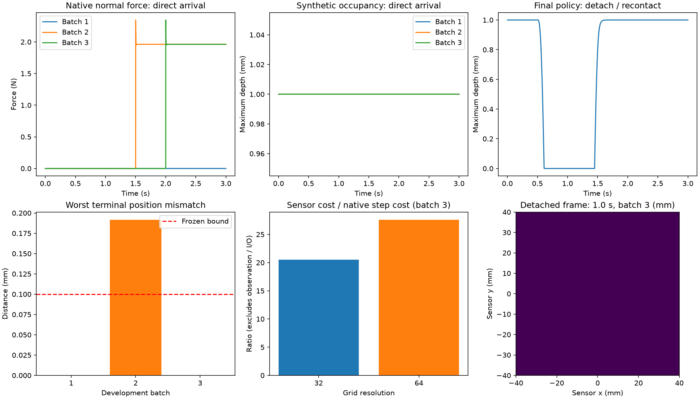
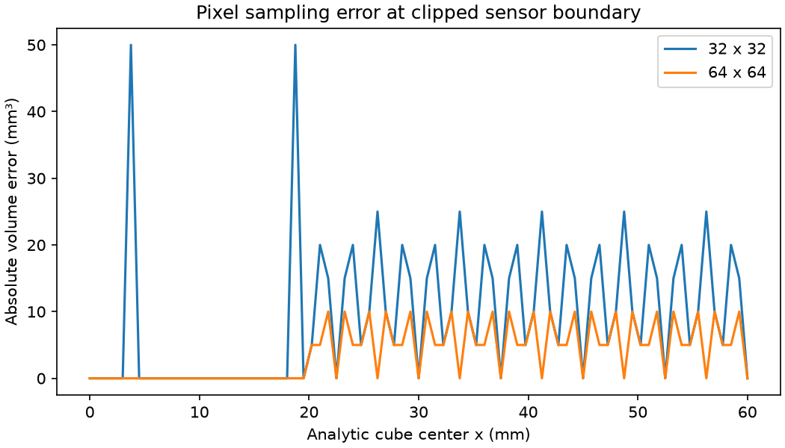

# Synthetic geometric tactile observation — frozen model v1

## Provenance and terms
Choose geometric depth, not history-dependent shear. Source of the dual-surface idea: Tacmap arXiv2602.21625v2, sectionIII-B (https://arxiv.org/html/2602.21625v2). Its arXiv paper license is not a software license. No upstream code/assets are adopted or redistributed; implement the analytical box/slab intersection independently under DexLab Apache-2.0. This is a restricted synthetic model, not an equivalent Tacmap implementation or reproduction of its real-world results. HydroShear v1 motivates same-state path tests; no hydroelastic/shear behavior is claimed.

## Formula and frames
Sensor fixed at world origin; x/y tangent axes, +z outward normal, physical rigid plane z=0. Virtual sensing slab0<=z<=h, h=1mm; pixel-center square grid x/y in[-40,40]mm, resolutions32and64. Cube halfsize20mm has measured center c and rotation R (body-to-sensor). For each vertical line p(z)=(x,y,z), transform R^T(p-c); intersect three box slabs to obtain occupied z interval[a,b]. Synthetic depth D=max(0,min(h,b)-max(0,a)), zero for a missed line. Units meters. This occupied-length specialization handles a ray origin inside the box explicitly; it is not a general deformable-gel ray renderer, optical image, pressure or force model. R must be finite/right-handed/orthonormal. Stateless function, no hidden history or shared mutable buffers. Virtual h/resolution never modify native collision geometry.

## Frozen native protocol before execution
Reuse DexLab controlled cube/plane fixture at base5e911ca1e5bbc25e12d11c3df653627c2e7519c7 (Apache2.0). Official latest stable MuJoCo admitted and wheel verified before run. Cube mass0.2kg/halfsize20mm, inertia2mb²/3, friction0.3, gravity9.81, dt0.5ms, Euler/Newton/elliptic,100iterations/tolerance1e-10, existing nominal contact parameters. One worker, at most8 trajectories in batch1, <=1800s, <=3developmentbatches overall. No physics result exists before this protocol.

Three paths plus reset repeat: direct hold atcenter(0,0,20mm); slide20mm alongx thenreturn; detach15mm inz thenrecontact; reset direct after other paths. Each3s, path excursion smooth sine-squared over t0.5–1.5s; end atsame commandedpose thenhold1.5s. Actual state is measured, never overwritten except declared initial/reset state. External position PD kp1000N/m,kd30Ns/m plusgravity compensation, normcap20N; rotational PD kp0.5Nm/rad,kd0.05Nms/rad,normcap0.1Nm. This known-state fixture controller is explicit, not learned. Repeat complete4pathsequence for eachmapresolution32/64; native settings and actions fixed, maps cannot feedcontroller. Native actual terminal poses need not be identical: report differences and require<=0.1mm/0.1degree for the matched-endpoint claim, otherwise mark that claim failed without retuning. Separately test EXACTsame recordedpose reachedafterdifferent observer call histories; this checksstatelessness, not physicalstateequivalence.

## Independent checks and evidence
Analytic flat/translated/rotated/missed/inside-box slab tests and frame covariance; frozengeometrycheck1e-12m. Every native state/force/contactdistance stored. Samepath32/64 physics arrays equalwithin1e-12 (and bitwise identityreported); driftcausedbyobservation isstopcondition. Direct/reset agreementwithin1e-12; interleavedtwoenvironmentsmatchisolatedmaps. Detached mapzero whenboxlowestz>h; recontactcomputedfresh. Fullmapmin>=0,max<=h+1e-12. Physics separately:finiteallstates,nativewarnings0,penetration<=1mm,terminalnormalforce within5%weight; report commandedexternalforce separately. Maps cannot satisfyphysicschecks. Use actualcontacts atsolveepoch, state/map atpoststep epoch; label timingdifference.

Save rawallsteps/nativeforce/pose, maps at50Hz, perstep mapstats, allfailedoutcomes, frozeninputs/sources/officialidentity and reset sequence. Record native stepping, native observation, sensor computation and totalwall separately; no rendering/transfers duringtiming. Publish resolutionerror against analytic area-integrated axisaligned square coverage (not hardwareerror), sampleddepthmaps, positive/negative traces and sensor/physics costs. No force reconstructedfromdepth or general realtactileprecision claim.

## Batch1 failure and batch2 correction

All8 first-batch native support checks fail: gravity compensation carries the weight, native force is0 while maps remain nonzero. Raw failure and frozen code remain evidence. Batch2 retains every threshold and changes only the final vertical external force: at t>=1.5s it becomes0, without changing actual state. Earlier movement and horizontal/rotation control stay fixed. This changes physical control across batches; within either batch only observation resolution differs. Batch2 is preregistered, not yet a success claim.

## Three-batch results: a map is not contact force

| Batch | Controller change | Physics / matched endpoint | Outcome |
|---|---|---|---|
| 1 | Gravity compensation throughout | Native support0, relative error100% | FAIL; nonzero depth does not prove support |
| 2 | Vertical force released at1.5s | Support passes; slide-return error0.191598mm exceeds0.1mm | Endpoint FAIL retained |
| 3 | Vertical force released at2.0s | Maximum penetration0.010122mm; maximum endpoint difference8.06e-12mm | Bounded synthetic fixture passes |

The last policy adds0.5s tracking before loading; all thresholds and target trajectories remain unchanged. Each batch has8trajectories; the three-batch development budget is exhausted. Across observation resolutions, native position/velocity/force/command arrays are bitwise identical; all resets pass. Batch3 terminal support relative error is at most1.70e-12. This qualifies only the tested development fixture and observer, not held-out robustness or real tactile fidelity.




The replay covers0.02–3.00s,150frames,20ms each, fixed sensor coordinates and0–1mm range. These are occupancy maps, not optical images or gel deformation. Detached maps clear to zero. All saved maps recompute from raw poses; exact-pose observations remain equal after interleaved unrelated environments and mutated return arrays.



The error plot is an additional offline analytic boundary test: cube center x0–60mm,z20.5mm; exact intersection volume versus pixel integral. It is not an extra native trajectory or hardware measurement. Grid-aligned cases can have zero error without general convergence. See audit.json for all timings: sensor computation, native stepping and native observation are separate. Python observation can cost more than this simple rigid-body step; no cross-engine throughput claim.

## Evidence and reproduction

[Raw hashes](evidence/synthetic-tactile/manifest.json) · [Scores, observation audits and costs](evidence/synthetic-tactile/audit.json) · [Replay provenance](evidence/synthetic-tactile/depth-replay.json)

```bash
DEXLAB_MUJOCO_PROFILE=qualification-3.15.0 .venv/bin/python -m dexlab.tactile_probe NEW_OUTPUT --controller settled-release
.venv/bin/python -m dexlab.tactile_score NEW_OUTPUT
.venv/bin/python -m unittest discover -s tests -p "test_tactile*.py"
```

Run native commands only inside a resource-qualified bounded worker after official stable-version admission. Each batch includes frozen sources, official package proof, every-step NPZ, compressed records and scores. Offline tests reproduce successes and failures. Shear memory, optical rendering and tactile hardware calibration are not implemented.
